# CNN

> Convolutional Neural Network


## 이미지와 Convolution 연산

### Fully-connected Layer와 이미지 데이터

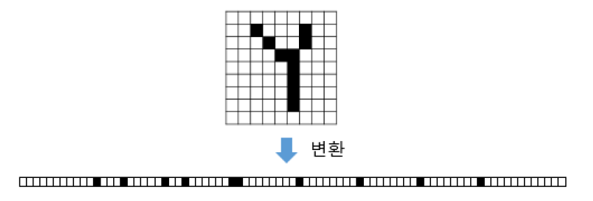

- FC Layer는 1차원 데이터를 요구
- 이미지를 단순하게 1차원으로 바꾸면 2차원 상에서 가지는 정보를 포기해야 함 즉, <u>공간 정보(Spatial Information)</u>가 무너짐
  - 이미지 내 사물 간의 거리 관ㄱ 등
  - 색의 변화 - 특히 세로로 변하는 상황

### Convolutional Neural Network

- 이미지 처리에 특화된 딥러닝 모델
- CNN의 대표적인 구성 요소
  - Convolutional Layer
  - Pooling Layer
  - Classifier(분류기): Fully-connected Layer로 구성

### Convolution 연산

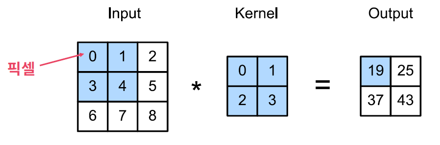

- CNN을 구현하는 핵심 연산
- <u>커널</u>과 <u>Convolution 연산</u>
  - 전통적인 이미지 처리 분야에서 커널(또는 필터)이란 것이 존재
  - 이미지와 커널 간의 Convolution 연산으로 처리

- 2차원 이미지 데이터와 Convolution 커널 모두 행렬로 표현 가능하기 때문에, 이미지 데이터를 변형 없이 그대로 사용 가능


## Convolution 연산 과정

### Convolution 연산 과정

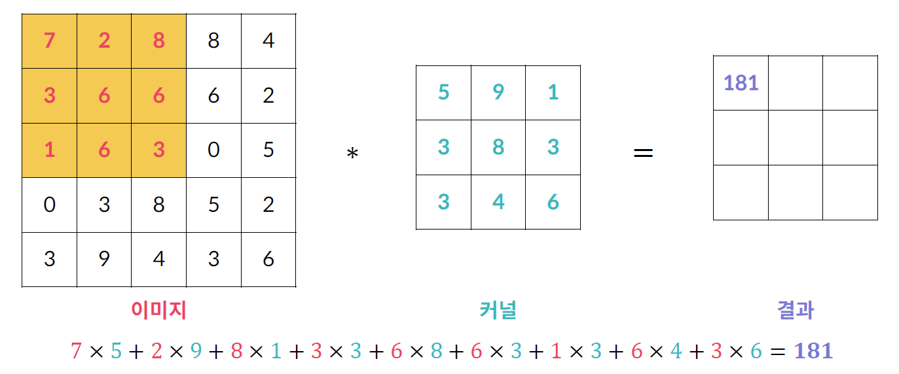

- 연산 과정: 커널이 이미지의 노란색 영역에 겹쳐짐

### Convolution 연산 용어


- 연산 결과: **Feature Map** 또는 Activation Map이라 부름
- 커널과 이미지가 겹치는 영역: 수용 영역(Receptive Field)

### 컬러 이미지의 Convolution 연산

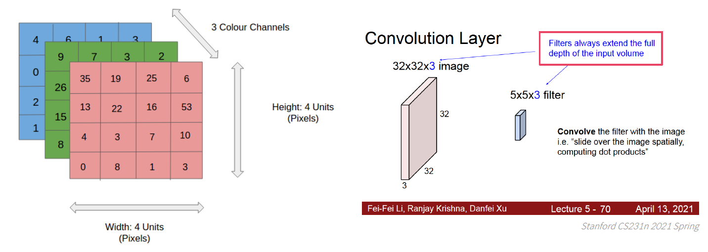

- 컬러 이미지는 채널이 3개, 이 경우 커널도 채널을 3개로 준비

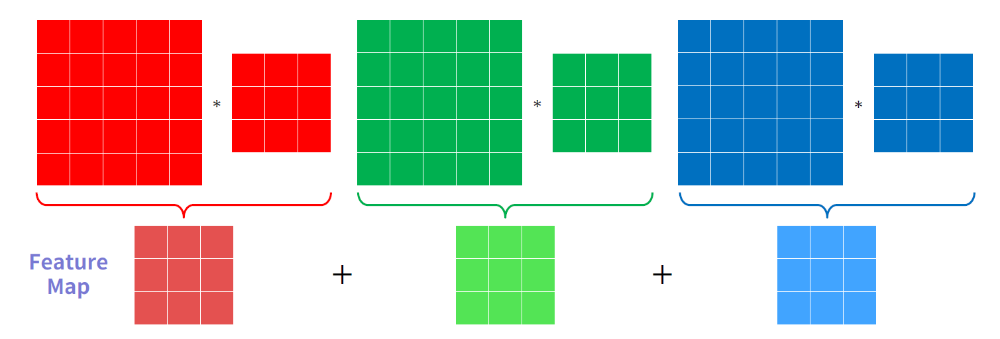

- 각 채널 별로 Convolution 연산을 수행하고 각 결과를 더해서 하나의 Feature Map을 생성

### Convolution 연산 확장

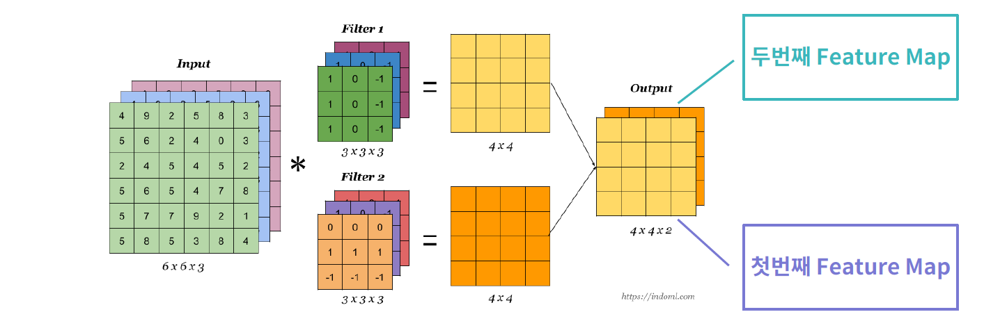

- 커널을 여러 개 두면 Feature Map도 여러 개 생성


## CNN(Convolution Neural Network)

### Convolutional Layer

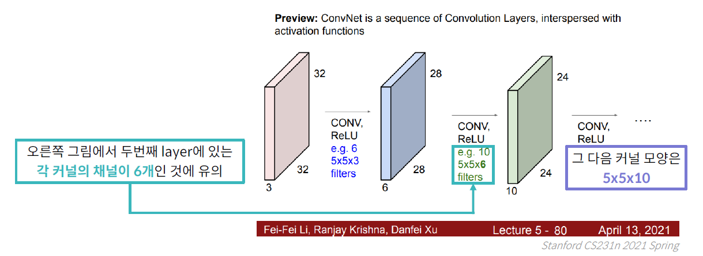

- 커널 행렬의 각 값들이 <u>가중치(Weight)</u>
- 이러한 커널들로 이루어진 Layer를 Convolutional Layer라고 부르고, 이 Layer들을 쌓아서 CNN을 구성

##### Layer의 역할

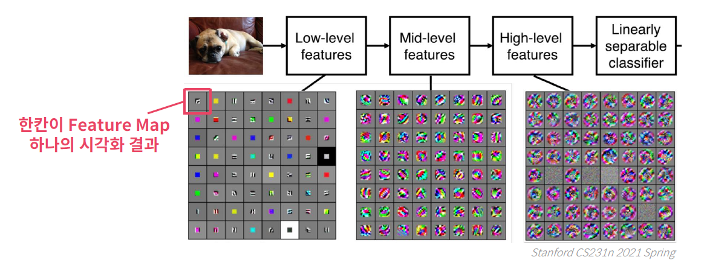

- 이미지가 가지는 특정 Feature를 뽑아내도록 커널을 학습
- 커널에 따라 추출하는 Feature를 다르게 학습
- 이미지 내의 대각선, 원형, 색조 등등이 이러한 Feature에 해당

##### Stride

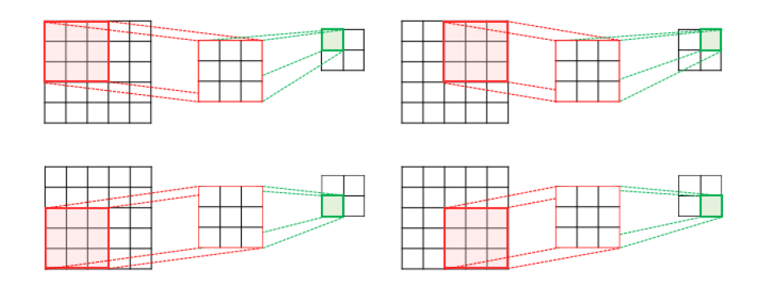

- Convolution 연산 과정을 조절하기 위한 Hyperparameter(사람이 직접 조절)
- 커널이 <u>이미지 내에서 이동하는 칸 수</u>를 조절
- 지금까지 Convolution 연산에서 보여준 예시는 모두 1칸
- 위의 그림은 Stride가 2칸일 경우의 예시

##### Padding

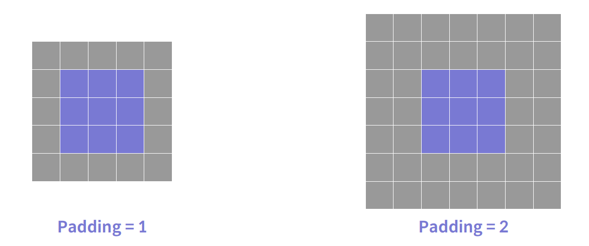

- 상하좌우에 Padding을 추가하여 <u>Feature Map 사이즈가 줄어드는 현상 방지</u>
- 또한 이미지의 테두리 정보도 균일하게 활용
- 일반적으로 0이 들어감 (Zero padding)

##### Convolution Layer 의의

왜 이미지 특징을 잘 뽑아내는가?

- Convolution 연산은 하나의 커널이 픽셀 간의 정보를 보게 만듦
- 하나의 커널이 이미지 전체 영역을 보고 학습

Parameter Sharing

- 커널이 가진 Parameter를 이미지의 모든 영역에서 공유
  - FC Layer의 경우 이미지와 Feature Map을 잇는 선 하나마다 하나의 가중치를 가짐
- Parameter 개수를 FC Layer에 비해 극적으로 줄임 - 과적합 방지에 유리

##### Convolutional Layer 활성화 함수

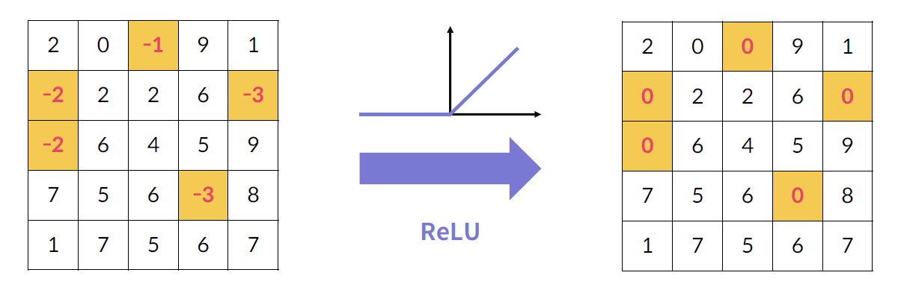

- Convolution 연산은 곰셉과 덧셈으로만 이루어져 선형 연산
- FC Layer처럼 비선형성을 추가하기 위해 활성화 함수를 사용
  - CNN은 주로 ReLU 함수 사용

### Pooling Layer

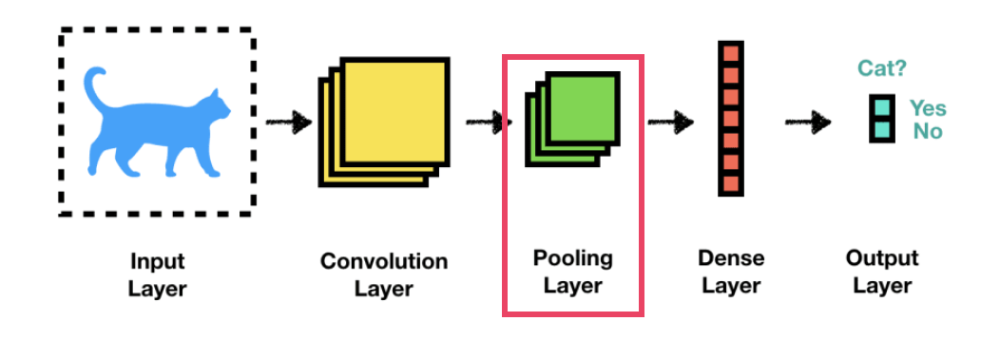

- CNN에서 거의 항상 같이 쓰이는 Layer
- Feature Map의 사이즈를 줄여서 Parameter 개수를 줄이는 것 - 과적합 조절

##### Max Pooling

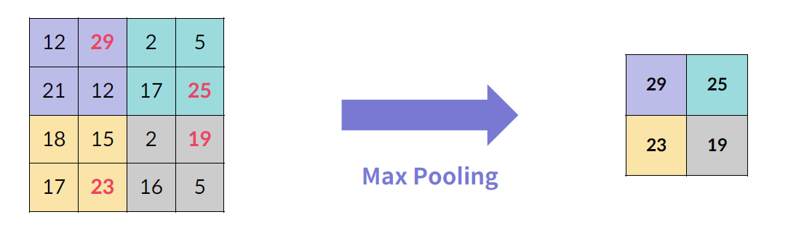

- 주어진 이미지나 Feature Map을 겹치지 않는 영역으로 분할
- 각 영역에서 최대값을 뽑아내어 새로운 Feature Map을 구성

##### Average Pooling

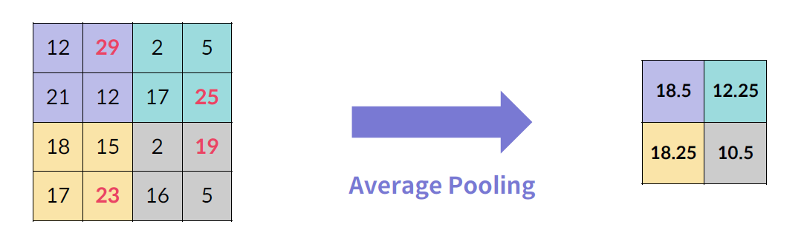

- 각 영역의 평균값을 계산하여 새로운 Feature Map을 구성

##### Pooling Layer

- 일반적으로 Max Pooling을 많이 사용
  - Feature Map에 존재하는 Feature 중 가장 영향력이 큰 Feature만 사용
- Feature Map의 채널이 여러 개면 각 채널별로 Pooling 연산 수행
  - Convolution Layer처럼 연산 결과를 다 더하지는 않음 
- 추가 Pooling Layer
  - Global Average Pooling: 전체 Feature Map에서 하나의 평균값을 계산
  - Global Max Pooling: 전체 Feature Map에서 하나의 최대값을 계산
  - 둘 다 마찬가지로 채널 별로 연산
  - 여기서는 Global Average Pooling을 많이 사용

### 분류기(Classifier)

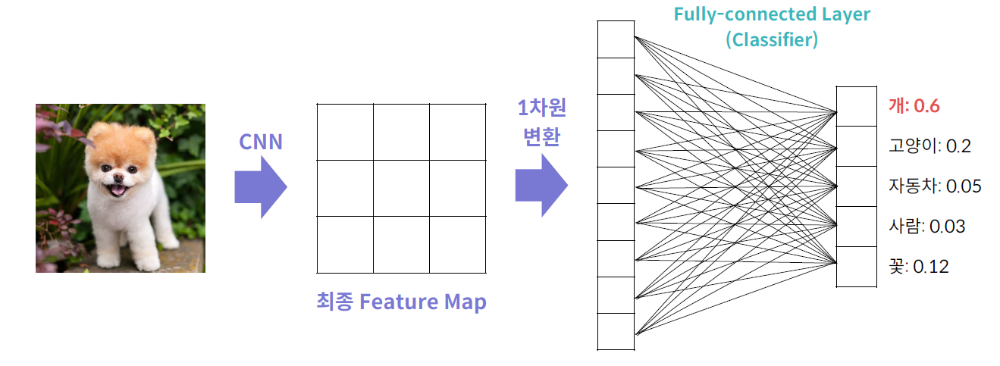

- CNN은 일반적으로 이미지 분류 목적으로 사용
- Feature Map을 Fully-connected Layer에 통과시켜 분류를 수행
- 이를 위해 Feature Map을 1차원으로 변형


## 대표적인 CNN 모델

### LeNet (1990)

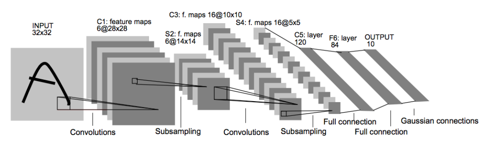

우편번호 인식을 위한 모델

### AlexNet (2012)

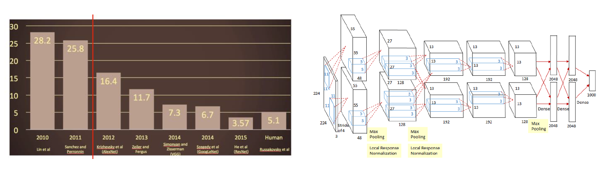

- 2012년 ImageNetChallenge 우승 - 기존 모델의 성능을 큰 폭으로 상회
- ReLU 활성화 함수 소개
- 딥러닝 모델 학습에 GPU를 활용 - 이후로 사실상 모든 딥러닝 모델은 GPU로 학습

### VGGNet (2014)

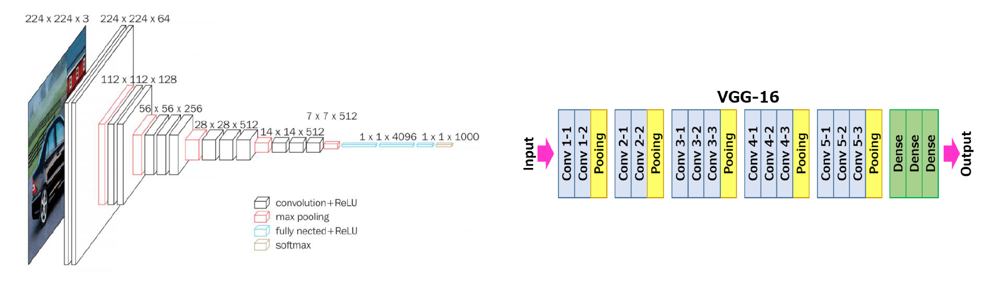

- 커널 사이즈를 모두 3x3으로 통일
- Parameter 수 증가를 억제하면서 모델 층을 더 많이 쌓을 수 있게 됨
- 층이 많을수록(즉, 모델이 깊을수록) 일반적으로 성능이 향상됨

```python
import tensorflow as tf
from tensorflow.keras import Sequential, layers

def build_vgg16():
    # Sequential 모델 선언
    model = Sequential()
    
    # 첫번째 Block.
    model.add(layers.Conv2D(filters=64, kernel_size=(3, 3), padding='same', activation='relu', input_shape=(224, 224, 3)))
    model.add(layers.Conv2D(filters=64, kernel_size=(3, 3), padding='same', activation='relu'))
    model.add(layers.MaxPooling2D(pool_size=(2, 2)))
    
    # 두번째 Block
    model.add(layers.Conv2D(filters=128, kernel_size=(3, 3), padding='same', activation='relu'))
    model.add(layers.Conv2D(filters=128, kernel_size=(3, 3), padding='same', activation='relu'))
    model.add(layers.MaxPooling2D(pool_size=(2, 2)))
    
    # 세번째 Block
    model.add(layers.Conv2D(filters=256, kernel_size=(3, 3), padding='same', activation='relu'))
    model.add(layers.Conv2D(filters=256, kernel_size=(3, 3), padding='same', activation='relu'))
    model.add(layers.Conv2D(filters=256, kernel_size=(3, 3), padding='same', activation='relu'))
    model.add(layers.MaxPooling2D(pool_size=(2, 2)))
    
    # 네번째 Block
    model.add(layers.Conv2D(filters=512, kernel_size=(3, 3), padding='same', activation='relu'))
    model.add(layers.Conv2D(filters=512, kernel_size=(3, 3), padding='same', activation='relu'))
    model.add(layers.Conv2D(filters=512, kernel_size=(3, 3), padding='same', activation='relu'))
    model.add(layers.MaxPooling2D(pool_size=(2, 2)))
    
    # 다섯번째 Block
    model.add(layers.Conv2D(filters=512, kernel_size=(3, 3), padding='same', activation='relu'))
    model.add(layers.Conv2D(filters=512, kernel_size=(3, 3), padding='same', activation='relu'))
    model.add(layers.Conv2D(filters=512, kernel_size=(3, 3), padding='same', activation='relu'))
    model.add(layers.MaxPooling2D(pool_size=(2, 2)))
    
    # Fully Connected Layer
    model.add(layers.Flatten())
    model.add(layers.Dense(4096, activation="relu"))
    model.add(layers.Dense(4096, activation="relu"))
    model.add(layers.Dense(1000, activation="softmax"))
    
    return model

def main():
    model = build_vgg16()
    model.summary()
    
if __name__ == "__main__":
    main()
```

### ResNet (2015)

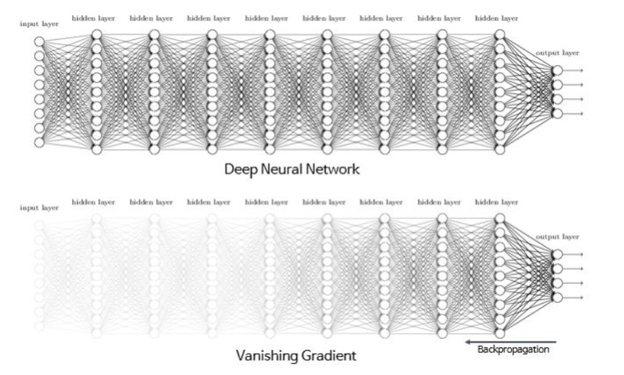

- Layer 개수를 최대 152개까지 늘림
- 깊은 모델에서 필연적으로 나타나는 현상: Vanishing Gradient
  - 역전파 과정에서 기울기 값이 점점 작아지다 0에 수렴하면서 발생
  - 모델 학습에 오랜 시간이 걸리거나 아예 학습이 멈추게 됨

##### Residual Connection

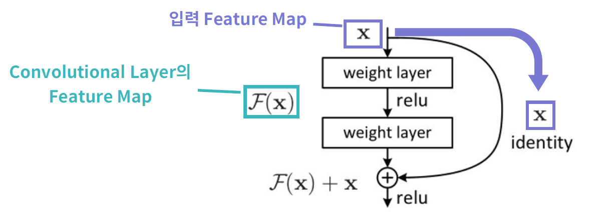

- Vanishing Gradient 문제를 해결하기 위한 구조
- 이를 통해 Layer 개수를 극적으로 늘림
- 기존 Convolutional Layer들을 우회하는 연결
  - 입력 Feature Map이 우회로를 통과하여 Convolutional Layer의 Feature Map과 더해짐
  - 기울기 값이 <u>항상 1 이상이 되어</u> 기울기 소실 문제를 방지

```python
import tensorflow as tf
from tensorflow.keras import layers, Model, Sequential

class ResidualBlock(Model):
    def __init__(self, num_kernels, kernel_size):
        super(ResidualBlock, self).__init__()

        # 2개의 Conv2D Layer
        self.conv1 = layers.Conv2D(filters=num_kernels, kernel_size=kernel_size, padding='same', activation='relu')
        self.conv2 = layers.Conv2D(filters=num_kernels, kernel_size=kernel_size, padding='same', activation='relu')
        
        self.relu = layers.Activation("relu")
        
        # Add Layer
        self.add = layers.Add()

    def call(self, input_tensor):
        x = self.conv1(input_tensor)
        x = self.conv2(x)

        x = self.add([x, input_tensor]) # 두 값을 더하는 과정
        x = self.relu(x)
        
        return x
        
def build_resnet(input_shape, num_classes):
    model = Sequential()
    
    model.add(layers.Conv2D(64, kernel_size=(3, 3), padding="same", activation="relu", input_shape=input_shape))
    model.add(layers.MaxPool2D(2))
    
    model.add(ResidualBlock(64, (3, 3)))
    model.add(ResidualBlock(64, (3, 3)))
    model.add(ResidualBlock(64, (3, 3)))
    
    model.add(layers.GlobalAveragePooling2D())
    model.add(layers.Dense(num_classes, activation="softmax"))
    
    return model
    
def main():
    input_shape = (32, 32, 3)
    num_classes = 10

    model = build_resnet(input_shape, num_classes)
    model.summary()

if __name__=="__main__":
    main()
```


### 분류 작업이 아닌 경우에 사용하는 모델


- 지금까지 나온 모델은 모두 분류 모델
- 분류 작업이 아닌 경우에 사용하는 모델은
  - 일반적으로 분류 모델과 유사하게 CNN을 구성
  - 모델의 출력값, 손실 함수, 데이터셋 구성 등이 완전히 다르게 이루어짐
  - YOLO/R-CNN(객체 인식), U-Net(이미지 분할) 등


## TensorFlow로 conv2d 사용하기

### TensorFlow로 conv2d 사용하기

```python
import tensorflow as tf
from tensorflow import keras
```

```python
inp = tf.ones((1, 3, 3, 1)) # (1, 높이, 너비, 1)
```

- 1로 구성된 3x3x1 이미지가 1개

```python
Filter = tf.ones((2, 2, 1, 1))
```

- Filter는 1로 구성된 2x2x1 짜리 필터가 1개

```python
strides = [1, 1] #[높이, 너비]
```

- strides는 1칸씩 이동하도록 지정

```python
output = tf.nn.conv2d(inp, Filter, strides, padding='VALID')
output = tf.nn.conv2d(inp, Filter, strides, padding='SAME')

# 패딩을 직접 지정
padding = [[0, 0], [1, 1], [1, 1], [0, 0]] # [[0, 0], [pad_top, pad_bottom], [pad_left, pad_right], [0, 0]]
output1 = tf.nn.conv2d(inp, Filter, strides, padding=padding)
```

- `tf.nn.conv2d` 이용
- padding을 `VALID`로 설정하여 패딩을 하지 않음
- padding을 `SAME`으로 설정하여 연산 후에도 크기를 동일하게 유지

```python
pad_inp = tf.pad(inp, padding)
output2 = tf.nn.conv2d(pad_inp, Filter, strides, padding='VALID')
```

- `tf.pad`를 이용해 패딩을 적용한 결과물을 반환

### Tensorflow.Keras로 Conv2D 사용하기

```python
input_shape = (1, 3, 3, 1)
x = tf.ones(input_shape)
```

`tf.keras.layers.Conv2D`와 `tf.nn.conv2d` 매개변수 이름이 다름

- `filters`: 필터의 개수
- `kernel_size`: kernerl의 크기 즉, filter의 형태를 (높이, 너비) 형태로 전달
- `strides`
- `padding`: `same`, `valid` 모두 소문자
- `activation`: 활성 함수
- `input_shape`: 입력 형태

```python
y = tf.keras.layers.Conv2D(filters=1,
                           kernel_size=[2, 2],
                           strides=(1, 1)
                           padding='same',
                           activation='relu',
                           input_shape=input_shape[1:])
```

### CNN 모델 예시

```python
import tensorflow as tf
from tensorflow.keras import layers, Sequential, Input
from tensorflow.keras.optimizers import Adam

import numpy as np
import matplotlib.pyplot as plt

SEED = 2021

def load_cifar10_dataset():
    train_X = np.load("./dataset/cifar10_train_X.npy")
    train_y = np.load("./dataset/cifar10_train_y.npy")
    test_X = np.load("./dataset/cifar10_test_X.npy")
    test_y = np.load("./dataset/cifar10_test_y.npy")
    
    train_X, test_X = train_X / 255.0, test_X / 255.0
    
    return train_X, train_y, test_X, test_y

def build_cnn_model(img_shape, num_classes=10):
    model = Sequential()

    # TODO: [지시사항 2번] CNN 모델을 완성하세요.
    model.add(layers.Conv2D(filters=16, kernel_size=(3, 3), padding='same', activation='relu', input_shape=img_shape))
    model.add(layers.Conv2D(filters=32, kernel_size=(3, 3), padding='same', activation='relu'))
    model.add(layers.MaxPool2D(pool_size=(2, 2), padding='valid'))
    model.add(layers.Conv2D(filters=64, kernel_size=(3, 3), strides=(2, 2), padding='same', activation='relu'))
    model.add(layers.Conv2D(filters=64, kernel_size=(3, 3), strides=(2, 2), padding='same', activation='relu'))
    model.add(layers.MaxPool2D(pool_size=(2, 2), padding='valid'))
    model.add(layers.Flatten())
    model.add(layers.Dense(128, activation='relu'))
    model.add(layers.Dense(num_classes, activation='softmax'))
    
    return model
    
def plot_history(hist):
    train_loss = hist.history["loss"]
    train_acc = hist.history["accuracy"]
    valid_loss = hist.history["val_loss"]
    valid_acc = hist.history["val_accuracy"]
    
    fig = plt.figure(figsize=(8, 6))
    plt.plot(train_loss)
    plt.plot(valid_loss)
    plt.title('Loss')
    plt.xlabel('epoch')
    plt.ylabel('loss')
    plt.legend(['Train', 'Valid'], loc='upper right')
    plt.savefig("loss.png")
    
    fig = plt.figure(figsize=(8, 6))
    plt.plot(train_acc)
    plt.plot(valid_acc)
    plt.title('Accuracy')
    plt.xlabel('epoch')
    plt.ylabel('accuracy')
    plt.legend(['Train', 'Valid'], loc='upper left')
    plt.savefig("accuracy.png")
    
def run_model(model, train_X, train_y, test_X, test_y, epochs=10):
    # Adam optimizer
    optimizer = Adam(learning_rate=0.001)
    
    model.summary()
    
    model.compile(optimizer=optimizer, loss='sparse_categorical_crossentropy', metrics=['accuracy'])
    
    hist = model.fit(train_X, train_y, epochs=epochs, batch_size=64, validation_split=0.2, shuffle=True, verbose=2)
    
    plot_history(hist)
    test_loss, test_acc = model.evaluate(test_X, test_y)
    print("Test Loss: {:.5f}, Test Accuracy: {:.3f}%".format(test_loss, test_acc * 100))
    
    return optimizer, hist

def main():
    tf.random.set_seed(SEED)
    np.random.seed(SEED)
    
    train_X, train_y, test_X, test_y = load_cifar10_dataset()
    img_shape = train_X[0].shape

    cnn_model = build_cnn_model(img_shape)
    
    print("=" * 30, "CNN 모델", "=" * 30)
    run_model(cnn_model, train_X, train_y, test_X, test_y)

if __name__ == "__main__":
    main()
```

