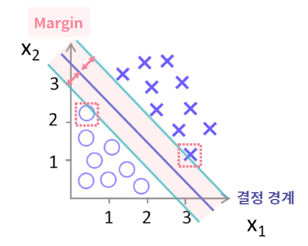

# Classification

> 주어진 입력값이 <u>어떤 클래스에 속할지</u>에 대한 결과값을 도출하는 알고리즘

## 1. 로지스틱 회귀

### 문제

기상 정보(구름양, 풍속)를 활용하여 해당 항공의 지연 여부를 예측하고 싶을 때 (일반적인 분류의 상황)

### 분류 문제에 회귀 알고리즘 적용하기

- 일반적인 회귀 알고리즘은 분류 문제에 그대로 사용할 수 없다. 왜냐하면 선형 회귀는 -∞~+∞의 값을 가질 수 있기 때문
- 따라서 해당 클래스에 속할 확률인 0또는 1사이의 값만 내보낼 수 있도록 선형 회귀 알고리즘 수정하기
- 이처럼 <u>분류 문제에 적용하기 위해 출력값의 범위를 수정한 회귀</u>를 **로지스틱 회귀(Logistic Regression)**라고 함

### Logistic Regression

- 이진 분류(Binary Classification) 문제를 해결하기 위한 모델
- 최소값 0, 최대값 1로 결과값을 수렴시키기 위해 **Sigmoid (logistic)** 함수 사용

### Sigmoid (logistic)

$$
g(x) = \frac{1}{1+e^{-x}}=\frac{e^{x}}{1+e^{x}}
$$

s자형 곡선을 갖는 함수

- x값이 커질 경우 g(x)의 값은 점점 1에 수렴하고
- x값이 작아질 경우 g(x) 값은 점점 0에 수렴함

### 확률 결과값 판별 방법, 결정 경계(Decision Boundary)

**결정 경계**: 데이터를 분류하는 기준

- 일반적으로 출력값(확률) <u>0.5</u>를 기준으로 클래스를 판별

### 로지스틱 회귀 특징

- 주로 2개 값 분류(이진 분류)를 위해 사용
- 선형 회귀를 응용한 분류 알고리즘이기 때문에 선형 회귀의 특징 보유

### 로지스틱 회귀 scikit-learn

`from sklearn.linear_model import LogisticRegression`

`LogisticRegression()`

`[Model].fit(X, y)`

`[Model].predict(X)`

## 2. Support Vector Machine(SVM)

### 문제

양성(1)과 음성(0) 두 개의 결과 값으로 분류되는 이진 분류 문제

지연 여부 판별, 이상 거래 판별

### SVM

딥러닝 기술 등장 이전까지 가장 인기있던 분류 알고리즘

**최적의 결정 경계(Decision Boundary)** 즉, 데이터를 분류하는 선을 정의하는 모델

### 최적의 결정 경계(Decision Boundary)

최적의 결정 경계는 데이터 군으로부터 최대한 멀리 떨어지는 것

### 서포트 벡터(Support Vector)

결정 경계와 가장 가까이 있는 데이터 포인트들

결정 경계와 평행하고 데이터와 가장 가까운 두 선 사이를 Margin이라고 한다.

### 결정경계 여유(Margin)

클래스를 분류하는 기준선에 여유(Margin)를 둘 수 있다

Margin: 결정 경계와 서포트 벡터 사이의 거리

Margin을 최대화 하는 결정 경계를 찾음

### Hard Margin vs Soft Margin

이상치(Outlier)의 허용 범위에 따라 Hard Margin과 Soft Margin으로 구분됨

### SVM 특징

- 선형 분류와 비선형 분류 모두 가능
- 고차원 데이터에서도 높은 성능의 결과를 도출
- 회귀에도 적용 가능 

### SVM scikit-learn 

`from sklearn.svm import SVC`

`SVC()`: SVM 모델을 정의

`[Model].fit(x, y)`

`[Model].predict(x)`

## 3. 나이브 베이즈 분류

### 문제

10만개의 메일 중 스팸 메일과 정상 메일은 분류하고 싶을 경우

이 때, 메일은 <u>독립 사건</u>으로 가정하는 텍스트 데이터이다.

### 나이브 베이즈 분류(Naive Bayes Classification)

각 특징들이 독립적 즉, 서로 영향을 미치지 않을 것이라는 가정 설정

**베이즈 정리(Bayes' Rule)**를 활용한 확률 통계학적 분류 알고리즘
$$
P(A|B) = \frac{P(A\cap B)}{P(B)} = \frac{P(B|A)P(A)}{P(B)}
$$

- P(A|B): 사건 B가 발생했을 때, A도 같이 발생할 확률

### 나이브 베이즈 분류 원리

베이즈 정리를 활용하여 입력값이 해당 클래스에 속할 확률을 계산하여 분류

**스팸 메일 분류 예시**

P(스팸|단어1, 단어2, 단어3, ...) > P(정상|단어1, 단어2, 단어3, ...) 이면 스팸으로 분류

### 베이즈 정리 예제: 암 검사 키트

**문제**

암 A에 대한 테스트 키트가 있다. 임의의 사람이 이 암에 걸릴 확률은 1%이다. 즉, 전체 인구 중 암에 걸린 사람은 1%이다. 이 암을 진단할 수 있는 키트가 있는데, <u>암에 걸린 사람은 99%의 확률로 양성 반응</u>이 나오고, <u>걸리지 않은 사람은 1%의 확률로 양성 반응</u>이 나온다. 키트 검사 결과 양성 반응이 나왔다면, 암에 걸렸을 확률은?

**해결**

암에 걸린 사건 `A`, 키트에서 양성 반응이 나온 사건을 `X`라 할 때
$$
P(X|A) = 0.99, P(A) = 0.01\\
P(X) = P(X|A)P(A) + P(X|¬A)P(¬A) = 0.0198\\
P(A|X) = \frac{P(X|A)P(A)}{P(X)} = \frac{0.99\times0.01 }{0.0198} = 0.5
$$
따라서, 키트에서 양성 반응이 나왔을 때 암에 걸렸을 확률은 50%이다.

### 나이브 베이즈 분류 특징

- 각 특징들이 독립이라면 다른 분류 방식에 비해 결과가 좋고, 학습 데이터도 적게 필요
- 각 특징들이 독립이 아니라면 즉, 특징들이 서로 영향을 미치면 분류 결과 신뢰성 하락
- 학습 데이터에 없는 범주의 데이터일 경우 정상적 예측 불가능

### 나이브 베이즈 분류 scikit-learn

`sklearn.naive_bayes.GaussianNB`

`GaussianNB`: 가우시안 나이브 베이즈 모델을 정의

`[Model].fit(X, y)`

`[Model].predict(X)`

## 4. KNN(K-Nearest Neighbor)

### 문제

고객이 평가한 영화 평점 데이터를 기준으로 기존 보유 고객을 분류한 이후 새로 유입된 고객을 기준에 따라 분류하고자 하는 경우

### KNN(K-Nearest Neighbor)

기존 데이터 가운데 가장 가까운 k개 이웃의 정보로 새로운 데이터를 예측하는 방법론

유사한 특성을 가진 데이터는 유사 범주에 속하는 경향이 있다는 가정 하에 분류

### KNN 원리

설정된 K값에 따라 가까운 거리 내의 이웃의 수에 따라 분류

새로운 고객 데이터(검정색)이 들어왔을 때 만약  K=1이면 주황색 클래스로, K=3이면 초록색 클래스로 분류

### KNN 특징

- 직관적이며 복잡하지 않은 알고리즘, 결과 해석이 쉬움
- K값 결정에 따라 성능이 크게 좌우됨
- 딱히 학습이랄 것이 없는 Lazy Model

## 5. 분류 알고리즘 평가 지표

### 혼동 행렬(Confusion Matrix)

분류 모델의 성능을 평가하기 위함

**True Positive**, **True Negative**, **False Positive**, **False Negative**

- False Positive: 실제 Negative인 값을 Positive라고 예측. **1형 오류**
- False Negative: 실제 Positive인 값을 Negative라고 예측. **2형 오류**

### 혼동 행렬 scikit-learn

`from sklearn.metrics import confusion_matrix`

`confusion_matrix(y_true, y_pred)`: Confusion matrix의 값을 `np.ndarray`로 반환

### 정확도 (Accuracy)

$$
Accuracy = \frac{TP+TN}{P+N}
$$

- 전체 데이터 중에서 제대로 분류된 데이터의 비율. 모델이 얼마나 정확하게 분류하는지를 나타냄 

- 그러나 클래스 비율이 **불균형**할 경우 평가 지표의 신뢰성을 잃음

### 불균형한 클래스에서의 Accuracy

만약 전체 100만개 항공 데이터 중 90만개가 정상 운행, 10만개만이 지연인 데이터를 예측하고자 할 때,

분류 모델 A가 전체 결과가 모두 지연되지 않았다고 예측할 경우 정확도는 <u>90%</u>이다.

### 정밀도(Precision)

$$
Precision = \frac{TP}{TP+FP}
$$

- 모델이 Positive라고 분류한 데이터 중에서 실제로 Positive인 데이터의 비율
- <u>Negative가 중요한 경우</u> 즉, 실제로 Negative인 데이터를 Positive로 판단하면 안되는 경우 사용되는 지표
  - 예를 들어, 일반 메일을 스팸 메일로 잘못 분류하면 중요한 메일을 전달받지 못할 수 있음

### 재현율(Recall, TPR)

$$
Recall = \frac{TP}{TP+FN}
$$

- 실제로 Positive인 데이터 중에서 모델이 Positive로 분류한 데이터의 비율
- <u>Positive가 중요한 경우</u> 즉, 실제로 Positive인 데이터를 Negative라고 판단하면 안되는 경우 사용되는 지표
  - 예를 들어, 악성 종양(Positive)을 양성 종양(Negative)으로 잘못 예측했을 경우 생명이 위급해질 수 있음

### FPR(False Positive Rate)

$$
FPR = \frac{FP}{FP+TN} = \frac{FP}{N}
$$

- 실제로 Negative인 데이터 중에서 모델이 Positive로 분류한 데이터의 비율
- 비정상적인 행동을 찾아낼 때 
  - 게임에서 비정상 사용자 검출 시 FPR이 높다 = 정상 사용자를 비정상 사용자로 검출하는 경우가 많다

### ROC Curve와 AUC

- **x축**을 <u>False Positive Rate</u>, **y축**을 <u>Recall(TPR)</u>로 두고 시각화 한 그래프

- ROC Curve 아래 면적인 AUC(Area Under Curve)를 이용해 모델의 성능을 평가
  - AUC가 위로 갈수록 (1에 가까울수록) 성능이 좋음

### 평가 지표 선정 방법

상황에 따라 선정해야 하는 평가 지표가 다르므로 다양한 평가 지표를 적용하여 결과 비교해보기

### 평가 지표 scikit-learn

`from sklearn.metrics import precision_score`

`from sklearn.metrics import recall_score`

`from sklearn.metrics import accuracy_score`

`precision_score(y, pred, average)`

`recall_score(y, pred, average)`

`accuracy_score(y, pred, average)`

- `y`: 실제 y값
- `pred`: 예측값
- `average`: 보통 다중 클래스 혹은 다중 레이블 문제일 경우 설정하는 매개 변수
  - None일 경우 각 클래스의 precision score값 반환. 아닐 경우 평균 계산 방법에 따라 변경.

## Probability 

> Early Probability Theory, Bayes' Rule, Naive Bayes Classification

### Early Probability Theory

**문제**

A와 B가 주사위 게임을 해서 <u>먼저 6번</u>을 이긴 사람이 80만원을 차지하기로 했다.

<u>A가 5번</u>, <u>B가 3번</u> 이긴 후 게임이 중단되었다면 판돈을 어떻게 나눠야 하는가?

**해결**

게임이 중단되기 전까지의 성적에 따라 나누면 ⅝, ⅜ 인데 생각해보면 합리적이지 못하다.

A와 B가 <u>현재 상태에서 먼저 6번을 이길 확률</u>로 나누면 더 합리적일 것이다.

A가 승리할 확률: ½ + ¼ + ⅛ = ⅞

B가 승리할 확률: ⅛

## 나이브 베이즈 분류기 (Naive Bayes' Classification)

### 분류기

주어진 데이터가 어떤 클래스에 속하는지 알아내는 방법을 자동으로 학습하는 알고리즘

### 예제: 사탕 기계

**문제**

사탕 기계 A, B가 있다. 이 둘은 같은 종류의 사탕을 내놓지만 들어 있는 사탕의 비율이 다르다. 사탕의 개수가 매우 많아 사탕을 뽑아도 이 비율은 유지된다. 두 기계중 하나가 선택될 확률은 각각 40%, 60%이다.

| 비율 | 빨강색 | 노랑색 | 초록색 |
| :--: | :----: | :----: | :----: |
|  A   |   2    |   2    |   1    |
|  B   |   1    |   1    |   1    |

이때, 사탕 10개를 뽑아서 <u>빨강색  4개</u>, <u>노랑색 5개</u>, <u>초록색 1개</u>를 뽑았다면 이 사탕은 어느 기계에서 뽑은 것일까?

**해결**

`X`: 사탕 10개를 뽑아 그 결과를 관측한 사건

`A`: 사탕 기계 A에서 사탕을 뽑은 사건

`B`: 사탕 기계 B에서 사탕을 뽑은 사건
$$
P(A|X) : P(B|X) = \frac{P(X|A)P(A)}{P(X)}:\frac{P(X|B)P(B)}{P(X)} = P(X|A)P(A):P(X|B)P(B)
$$
A에서 빨강 4개, 노랑 5개, 초록 1개를 꺼낼 확률 = (⅖)⁴ + (⅖)⁵ + (⅕)¹ = 5.243 x 10⁻⁵

B에서 빨강 4개, 노랑 5개, 초록 1개를 꺼낼 확률 = (⅓)⁴ + (⅓)⁵ + (⅓)¹ = 1.694 x 10⁻⁵

따라서, 0.674 : 0.326

### Bag of Words (BoW)

- 자연어 데이터에 속해있는 단어들의 가방
- 딕셔너리로 단어와 빈도를 함께 표현하면 유용함