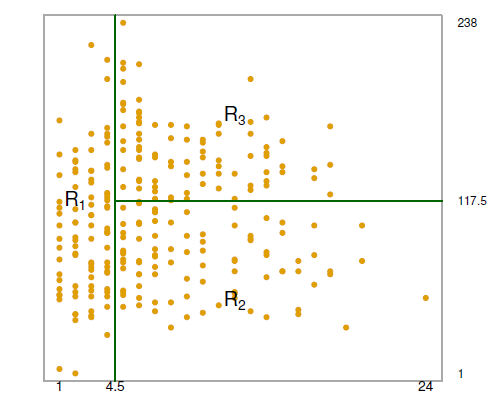
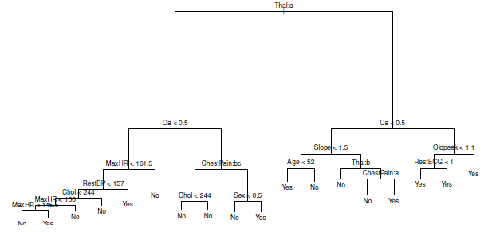
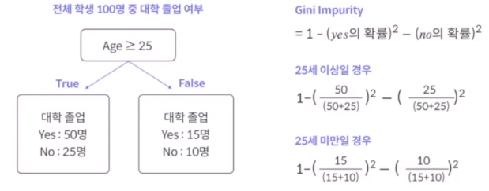
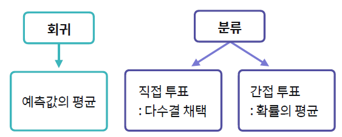
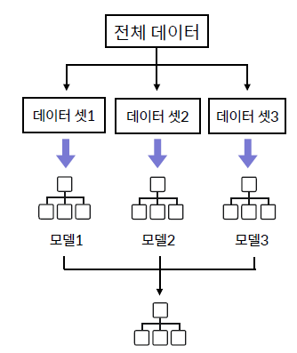
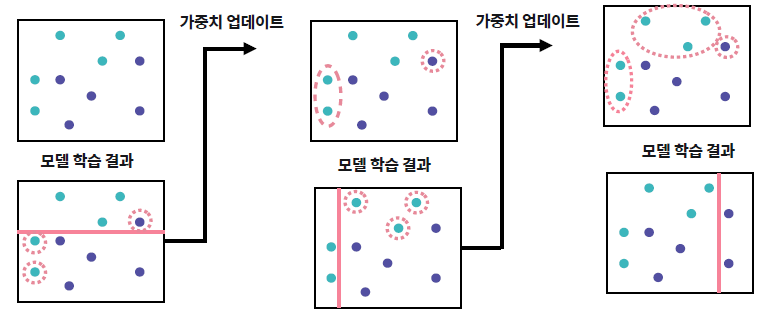

# Decision Tree

> 의사결정 나무


## 1. 의사결정 나무(Decision Tree)

### 문제

복잡하고 이해하기 어려운 모델 원리들(회귀, 분류, ...)을 시각적으로 쉽게 이해할 수 있는 모델은 없을까?


### 의사결정 나무란?

스무고개와 같이 특정 질문들을 통해 정답을 찾아가는 모델

최상단의 Root Node에서 마지막 Terminal Node까지 아래 방향으로 진행


### 회귀와 분류

회귀, 분류 모두 적용 가능

회귀냐 분류냐에 따라 다른 원리로 모델 학습 진행


## 2. 의사결정 나무 - 회귀

### 의사결정 나무 - 회귀

회귀를 위한 의사결정 나무 모델은 어떻게 학습을 진행하고, 결과값을 예측할까?

**아이디어**: 위에서 아래로 진행될수록 데이터의 구역을 나누자


### 의사결정 나무 원리 - 회귀



겹치지 않는 구역으로 데이터를 나눔

특정 구역에 데이터가 있으면, 그 데이터의 예측값은 해당 구역의 평균값임


### 어떤 구역 - 구역을 쪼개는 기준

해당 구역에 있는 <u>데이터들의 실제값(Y)과 예측값의 오차 제곱합</u>(RSS)을 최소화하는 구역


### 어떻게 나누어야 하는가?

RSS를 최소화하는 모든 구역을 한 번에 찾는 것은 계산적으로 불가능함

위에서부터 순간순간마다 가장 최선의 선택을 하자 (Top down + Greedy Approach)

루트노드: 최상단에 위치하며 전체 데이터를 포괄

최종노드: 최하단에 위치하며 결과(예측값)가 저장되어 있음


### Scikit-learn을 이용한 회귀 의사결정 나무

`from sklearn.tree import DecisionTreeRegressor`

`DecisionTreeRegressor(max_depth)`

- `max_depth`: 트리의 최대 깊이

`[Model].fit(X, y)`

`[Model].predict(X)`


## 2. 의사결정 나무 - 분류

### 문제

분류에서도 회귀 의사결정 나무를 그대로 적용할 수 있을까?

분류 문제에서 구하고자 하는 것은 해당 구역의 평균값이 아니기 때문에 <u>RSS를 사용할 수 없음</u>


### 어떤 구역 - 구역을 쪼개는 기준



데이터의 **불순도(Impurity)**를 최소화하는 구역으로 나누자


### 불순도(Impurity)

다른 데이터가 섞여 있는 정도

##### 지니 계수(Gini Impurity)

해당 구역 안에서 특정 클래스에 속하는 데이터의 비율을 모두 제외한 값 즉, 다양성을 계산하는 방법. 낮을수록 성능이 좋음

예를들어, Yes/No의 이진 분류 문제일 경우 <u>Gini Impurity = 1 - (yes의 확률)² - (no의 확률)²</u>

### 

### 트리 진행 - 지니 계수




### Scikit-learn을 이용한 분류 의사결정 나무

`from sklearn.tree import DecisionTreeClassifier`

`DecisionTreeClassifier()`

`[Model].fit(X, y)`

`[Model].predict(X)`


### 생각해보기

계속해서 나무가 깊어지며 분류/회귀를 진행할 경우, 데이터에 과도하게 맞춰지는 <u>과적합</u> 문제가 발생할 가능성이 높아짐


### 의사결정 나무 특징

- 결과가 직관적이며, 해석하기 쉬움
- 나무 깊이가 깊어질수록 과적합(Overfitting) 문제 발생 가능성이 매우 높음


## 4. 앙상블 기법

### 의사결정 나무의 한계

단일 모델을 사용하여 과적합이 나타날 가능성이 높다면 여러개의 의사결정 나무를 같이 사용해보면 어떨까?

= **앙상블 기법**


### 앙상블 기법이란?

과적합 방지 및 더 높은 성능의 결과를 도출하도록 여러 모델을 활용하는 기법

**Voting(투표)**, **Bagging(Bootstrap Aggregating)**, **Boosting**


### Voting(투표)



여러 모델의 예측 결과값을 활용하여 투표를 통해 최종 예측값 결정

결과가 직관적이며 해석이 쉽고, 평균, 다수결 채택 등의 간단한 연산을 사용함

#### Scikit-learn을 이용한 VotingClassifier

`from sklearn.ensemble import VotingClassifier` [문서](https://scikit-learn.org/stable/modules/generated/sklearn.ensemble.VotingClassifier.html#sklearn.ensemble.VotingClassifier)

`VotingClassifier(estimators, voting)`

- `estimators`: 앙상블 학습을 진행할 다양한 분류 모델을 설정
- `voting`: voting 방식을 설정

`[Model].fit(X, y)`

`[Model].predict(X)`

```python
eclf2 = VotingClassifier(estimators=[('lr', clf1), ('rf', clf2), ('gnb', clf3)], voting='soft')
```


### Bagging(Bootstrap Aggregating)

> Bootstrap + Aggregating



복원 추출을 통해 <u>랜덤 추출한 데이터 셋</u>을 생성(샘플링)하고, 샘플링 된 각 데이터를 모델 학습하여 결합한 후, 학습된 모델의 예측 변수를 활용하여 최종 모델을 생성하는 방법

- 내가 가진 데이터를 조금 더 잘 표현할 수 있는 데이터로 만들고자 할 때 Bagging을 사용하기도 함
- <u>페이스팅(Pasting)</u>: 비복원 추출. 데이터의 중복을 허용하지 않는 방법.

#### Bootstrap

데이터를 복원 추출하는 통계학적 방법

데이터를 추출한 이후, 다시 원 데이터로 복원한 후, 다시 데이터 셋을 추출함

#### Bagging 특징

- Bootstrap을 활용한 랜덤 샘플링으로 과적합 방지
- 복원 과정이 있어 불균형하거나 충분하지 않은 데이터에 적용 가능

#### Scikit-learn을 이용한 BaggingClassifier

`from sklearn.ensemble import BaggingClassifier` [문서](https://scikit-learn.org/stable/modules/generated/sklearn.ensemble.BaggingClassifier.html#sklearn.ensemble.BaggingClassifier)

`BaggingClassifier(base_estimator, n_estimators)`

- `base_estimator`: 앙상블 학습을 진행할 분류 모델 설정(동일한 분류 모델)
- `n_estimators`: 사용하고자 하는 분류 모델의 개수

`[Model].fit(X, y)`

`[Model].predict(X)`


### Boosting

여러 개의 약한 모델(Weak Learner)을 수정하여 <u>강한 모델(Strong Learner)</u>을 만드는 방법

독립적인 모델을 합산하여 산출하기 보다는 기존의 모델을 개선시키는 방향의 앙상블 기법

약한 모델: 상대적으로 예측 성능이 떨어지는 모델


### 의사결정 트리와 앙상블 기법을 활용한 다양한 모델

의사결정 트리에 앙상블 기법을 활용한 다양한 모델이 존재함

랜덤 포레스트, 부스팅 계열 모델 (Ada Boost, Gradient Boosting, XGBoost, LGBM, CatBoost)


## 5. 랜덤 포레스트와 Boosting 알고리즘

### 문제

개별 데이터에 대해서만 복원 추출을 하는 것이 아니라 입력 변수에 대해 복원 추출을 할 수는 없을까?

= **랜덤 포레스트(Random Forest) 알고리즘**


### 랜덤 포레스트(Random Forest)

> 의사결정 트리 + Bagging 알고리즘

부트스트랩 데이터를 생성할 때, 변수들도 임의로 샘플링을 진행함

데이터 셋에서 Bootstrap을 통해 <u>N개의 훈련 데이터셋</u>을 생성하고, 생성한 <u>N개의 의사결정 나무</u>들을 학습함

- 학습된 나무들의 예측 결과값의 평균(회귀) 또는 다수결 투표 방식(분류) 이용하여 결합
- 개별 데이터에 대해서 복원 추출을 할 뿐만 아니라 입력 변수에 대해서도 복원 추출을 함

#### 특징

- Accuracy가 높은 편
- 변수의 중요성을 파악할 수 있음
- 변수 일부를 사용하기 때문에 과적합을 방지할 수 있음


### Ada Boost

> Adaptive Boosting (적응 부스팅)

이전 학습 과정에서 오분류한 데이터를 다음 학습 과정에서는 잘 분류할 수 있도록 하여, Weak Learner를 Strong Learner로 수정하는 Boosting 알고리즘

이전 모델이 오분류한 데이터의 **가중치**를 바꾸어가며 다음 학습에서는 해당 데이터에 더 집중할 수 있도록 함



#### 특징

- 오분류 데이터에 대해 모델을 적합할 수 있음
- 과적합 발생 가능성이 높으며, 계산 과정에 있어 병렬 수행이 불가능함

#### Scikit-learn 라이브러리 

`from sklearn.ensemble import RandomForestClassifier` [문서](https://scikit-learn.org/stable/modules/generated/sklearn.ensemble.RandomForestClassifier.html#sklearn.ensemble.RandomForestClassifier)

`RandomForestClassifier(n_estimators, max_depth, min_samples_leaf, min_samples_split, random_state)`

- `n_estimators`: 결정 나무 모델의 개수 지정
- `max_depth`: 나무의 최대 깊이(depth) 지정
- `min_samples_leaf`: 마지막 노드의 최소 샘플 수
- `min_samples_split`: 내부 노드를 분할하는데 필요한 최소 샘플 수
- `random_state`: 일관된 결과 확인을 위한 설정값

`[Model].fit(X, y)`

`[Model].predict(X)`


### Gradient Boosting

> Gradient Descent + Boosting

Ada Boost와 동일한 원리

차이점은 가중치 업데이트 과정에서 Gradient Descent를 사용한다는 것

- 가중치 업데이트: 오차는 손실함수로 표현되고, 이 손실함수를 최적화 하는 데 있어 Gradient Descent를 사용

#### 특징

- 계산량이 많이 필요하나 높은 성능을 도출하기 때문에 유용하게 활용됨
- 효율적인 연산이 가능하도록 파이썬 라이브러리 정의
- Gradient Boosting을 응용한 다양한 모델들이 개발됨


## 6. Gradient Boosting 기반 모델 소개

### 다양한 응용 모델 소개

Gradient Boosting 기반의 성능이 향상된 다양한 모델이 개발되어 간단한 모듈 불러오기만으로 사용이 가능함 

- eXtreme Gradient Boosting(XGBoost)

- Light Gradient Boosting Model(LGBM)

- Categorical Boosting(CatBoost)


### eXtreme Gradient Boosting(XGBoost)

일반 Gradient Boosting 모델과 작동 원리는 동일하나, 과적합을 방지하기 위해 정규화된 모델 사용

불순도(impurity)를 감소하는 방향만 강조되는 기존 트리에서 **정규화(Ragularization)**을 추가하여 모델의 복잡성도 고려 

#### 특징

- 분산/병렬 처리를 통해 실행 속도를 보완하며, 대부분의 문제에서 양호한 예측 성능을 보임
- 다양한 하이퍼 파라미터 지원 및 조절을 통해 과적합 방지에 효율적


### Light Gradient Boosting Model(LGBM)

XGBoost에 비해 더 가볍고 빠른 실행 속도를 가진 모델

범주형 변수 처리 지원 기능 추가

- 범주형 변수: 배타적인 범주 변수 ex. 성별(남/여), 혈액형(A, B, AB, O)

#### 특징

- 대용량 데이터에서의 실행 속도 개선
- 기존 XGBoost 대비 적은 메모리 사용
- 적은 수의 데이터 적용 시 과적합 문제 발생 가능성


### Categorical Boosting(CatBoost)

> Categorical + Boosting model

2017년 등장, 범주형 변수를 위한 다양한 기능을 지원하는 부스팅 모델

#### 특징

- Category 변수에 대한 전처리 문제 해결
- 범주형 변수를 자동으로 처리해 타입 변환 오류를 피할 수 있음
- 범주형과 수치형 변수들의 combination을 처리
- 변수 간의 상관관계를 계산함과 동시에 속도 개선, Multiple-category 데이터를 다룰 때 유용