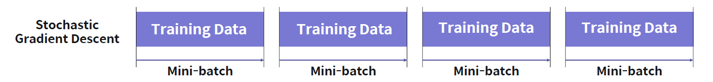
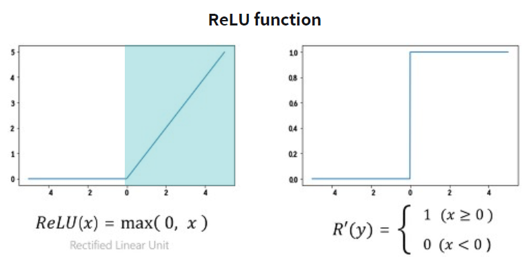
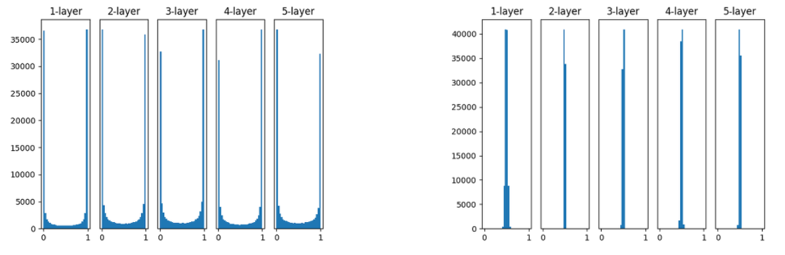
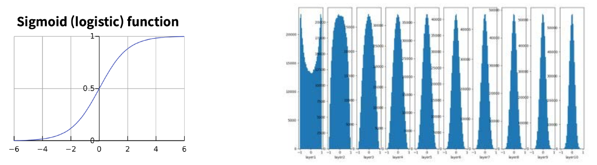

# Deep Learning Problems

> 딥러닝 모델 학습의 문제점

## 1. 딥러닝 모델 학습의 문제점

### 데이터의 증가와 딥러닝 모델의 한계점

실생활 문제 데이터의 차원이 증가하고, 구조가 복잡해짐

다양한 문제가 발생하게 되고 기술력의 부족으로 딥러닝 기술은 실질적인 한계를 마주하게 됨 (두 번째 AI 겨울)

### 다양한 문제점

**학습속도 문제**

- 데이터의 개수가 폭발적으로 증가하여 딥러닝 모델 학습 시 소요되는 시간도 함께 증가

**기울기 소실 문제**

- 더 깊고 더 넓은 망을 학습시키는 과정에서 출력값과 멀어질 수록 학습이 잘 안되는 현상 발생

**초기값 설정 문제**

- 초기값 설정 방식에 따른 성능 차이가 매우 크게 발생

**과적합 문제**

- 학습 데이터(training data)에 모델이 과하게 최적화되어 테스트 데이터(test data)에 대한 모델 성능이 저하

## 2. 학습 속도 문제와 최적화 알고리즘

### 학습 속도 문제의 발생 원인

전체 학습 데이터 셋을 사용하여 손실 함수를 계산하기 때문에 계산량이 너무 많아짐

### 학습 속도 문제 해결 방법

전체 데이터가 아닌 부분 데이터만 활용하여 손실 함수를 계산하자 **SGD(Stochastic Gradient Descent)**

### SGD(Stochastic Gradient Descent)

전체 데이터(batch) 대신 일부 조그마한 데이터의 모음인 미니 배치(mini-batch)에 대해서만 손실 함수를 계산 

### 빠른 시간에 더 많이 학습하는 SGD 알고리즘

다소 부정확할 수 있지만, 훨씬 계산 속도가 빠르기 때문에 같은 시간에 더 많은 step을 갈 수 있음

### SGD의 한계: Gradient 방향성 문제

SGD는 gradient 값 계산 시, mini-batch에 따라 gradient 방향의 변화가 큼

### SGD의 한계: Learning Rate 설정 문제

### 다양한 최적화 알고리즘의 등장

### Momentum

과거에 이동했던 방식을 기억하면서 그 방향으로 일정 정도를 추가적으로 이동하는 방식

##### Keras를 이용해 SGD에서 momentum 사용하기

`tf.keras.optimizers.SGD(lr, momentum)`

- `lr`: 학습률 (default=0.1)
- `momentum`: 진동을 막아주고 SGD를 가속하는 파라미터 (default=0.9)

### AdaGrad(Adaptive Gradient)

많이 변화하지 않은 변수들은 Learning rate를 크게 하고, 많이 변화했던 변수들은 Learning rate를 작게 하는 것

과거의 기울기를 제곱해서 계속 더하기 때문에 학습이 진행될수록 갱신 강도가 약해짐

##### Keras를 이용한 Adagrad

`tf.keras.optimizers.Adagrad(lr, epsilon, decay)` [문서](https://www.tensorflow.org/api_docs/python/tf/keras/optimizers/Adagrad)

- `lr`: 학습률 (default=0.1)
- `epsilon`: 연산 시 분모가 0이 되는 것을 막는, 0에 가까운 상수 (default=0.000001)
- `decay`: 업데이트마다 학습률을 비율만큼 줄여주는 파라미터 (default=0.0)

### RMSprop

무한히 학습하다 보면 순간 갱신량이 0에 가까워 학습이 되지 않는 Adagrad의 단점을 해결 

과거의 기울기는 잊고 새로운 기울기 정보를 크게 반영

##### Scikit-learn을 이용한 RMSProp

`tf.keras.optimizers.RMSprop(lr)` [문서](https://www.tensorflow.org/api_docs/python/tf/keras/optimizers/RMSprop)

- `lr`: 학습률 (default=0.1)

### Adam

<u>Momentum + RMSprop</u> 가장 발전된 최적화 알고리즘

##### Keras를 이용한 Adam

`tf.keras.optimizers.Adam(lr, beta_1, beta_2)` [문서](https://www.tensorflow.org/api_docs/python/tf/keras/optimizers/Adam)

- `lr`: 학습률 (default=0.01)
- `beta_1`: 모멘텀을 결정하기 위해 사용하는 파라미터 (default=0.9)
- `beta_2`: step size를 결정하기 위해 사용하는 파라미터 (default=0.999)

## 3. 기울기 소실 문제와 방지 기법 Vanishing Gradient

### 딥러닝 모델 학습 방법 되짚어보기

나의 목표 target 값과 실제 모델이 예측한 output 값이 얼마나 차이나는지 구한 후 오차값을 다시 뒤로 전파해가며 변수들을 갱신하는 알고리즘 

### 기울기 소실 문제(Vanishing Gradient)

깊은 층의 모델에선 역전파시에 전달되는 손실 함수(loss function)의 gradient 값에 활성화 함수인 sigmoid 함수의 0에 가까운 기울기 값이 계속해서 곱해지면서 결국 가중치 업데이트가 잘 안되는 문제가 발생

### 기울기 소실 문제 해결 방법: ReLU

**활성화 함수(Activation Function) 방식 변화**

기존에 사용하던 sigmoid 함수 대신 **ReLU** 함수를 사용하여 해결

### 기울기 소실 문제 해결 방법: Tanh

내부 <u>Hidden Layer</u>에는 **ReLU**를 적용하고, <u>Output Layer</u>에만 **Tanh**를 적용

## 4. 초기값 설정 문제와 방지 기법 Initialization

### 잘못된 초기값 설정 - 초기화의 중요성

### 가중치 초기화(Weight Initialization)

활성화 함수의 입력 값이 너무 커지거나 작아지지 않게 만들어주려는 것이 핵심

### 초기화 설정 문제 해결을 위한 Naive한 방법

- 표준 정규 분포를 이용해 초기화 (<u>평균 0, 표준편차 1</u>)

- 표준 편차를 0.01로 하는 정규분포로 초기화 (<u>평균0, 표준편차 0.01</u>)

### Xavier 초기화 방법 + Sigmoid 함수

표준 정규 분포를 입력 개수의 제곱근으로 나누어 줌 (<u>분산을 입력 개수로 나누어줌</u>)

- 표준 편차를 줄여야 함

Sigmoid와 같은 S자 함수의 경우 출력 값들이 정규 분포 형태를 가져야 안정적으로 학습 가능

### Xavier 초기화 방법 + ReLU 함수

ReLU 함수에는 Xavier 초기화가 부적함. 레이어를 거쳐갈 수록 값이 0에 수렴 

### He 초기화 방법

표준 정규 분포를 입력 개수 절반의 제곱근으로 나누어 줌 (<u>분산을 입력 개수의 절반으로 나누어줌</u>)

ReLU 함수와 He 초기화 방법을 사용했을 경우의 그래프는 위와 같음

10층 레이어에서도 평균과 표준편차가 0으로 수렴하지 않음

### 적절한 가중치 초기화 방법

- Sigmoid, tanh의 경우 Xavier 초기화 방법이 효율적

- ReLU계의 활성화 함수 사용 시 Xavier 초기화보다는 He 초기화 방법이 효율적

최근의 대부분의 모델에서는 **He 초기화**를 주로 선택

## 5. 과적합 문제와 방지 기법 Overfitting

### 딥러닝 모델 학습에서의 과적합 방지 기법

- 정규화(Regularization)
- 드롭아웃(Dropout)
- 배치 정규화(Batch Normalization)

### 정규화(Regularization)

모델이 복잡해질수록 parameter들은 많아지고, 절댓값이 커지는 경향이 발생함 (<u>weight의 합의 절댓값이 커짐</u>)

기존 손실함수에 **규제 항**을 더해 최적값 찾기 가능

### L1 정규화(Lasso Regularization)

가중치의 <u>절댓값의 합</u>을 규제 항으로 정의
$$
TotalLoss = Loss + \lambda \sum \abs{W}
$$

- 작은 가중치들이 거의 0으로 수렴하여 몇 개의 중요한 가중치들만 남음
- **Sparse Model을 만든다**라고도 함

##### Keras를 이용한 L1 정규화

`tf.keras.layers.Dense(kernel_regularizer=tf.keras.regularizers.l1(ratio))`

- `ratio`: 가중치에 L1 정규화를 적용하는 비율 (<u>0.001~0.005</u>)

### L2 정규화(Ridge Regularization)

가중치의 <u>제곱의 합</u>을 규제항으로 정의 
$$
TotalLoss = Loss + \lambda\sum W^2
$$

- L1 정규화에 비하여 0으로 수렴하는 가중치가 적음. 큰 값을 가진 가중치를 더욱 제약하는 효과
- 특정 가중치에 치중되지 않도록 가중치 값을 조율하게 되며 **가중치 감쇠** (**Weight Decay**)라고도 부름

##### Keras를 이용한 L2 정규화

`tf.keras.layers.Dense(kernel_regularizer=tf.keras.regularizers.l1\2(ratio))`

- `ratio`: 가중치에 L2 정규화를 적용하는 비율 (<u>0.001~0.005</u>)

### 드롭아웃(DropOut)

각 layer마다 일정 비율의 뉴런을 임의로 drop시켜 나머지 뉴런들만 학습하는 방법

드롭아웃을 적용하면 학습되는 노드와 가중치들이 매번 달라짐

### 드롭아웃의 적용 방법

- 다른 정규화 기법들과 상호 보완적으로 사용 가능

- drop된 뉴런은 backpropagation 때 신호를 차단
- Test 때는 모든 뉴런에 신호를 전달

### Keras를 이용한 드롭 아웃

`tf.keras.layers.Dropout(prob)`

- `prob`: 드롭 아웃을 적용할 확률 (<u>0.1~0.5</u>)
- 일반적으로 마지막 히든 층과 출력층 사이에 하나만 추가

### 배치 정규화(Batch Normalization)

각 feature의 range가 서로 다른 경우 학습이 제대로 되지 않음 => <u>Normalization</u>

Normalization을 처음 Input data 뿐만 아니라 신경망 내부 Hidden Layer의 input에도 적용

### 배치 정규화의 장점

- 매 Layer마다 정규화를 진행하므로 가중치 초기값에 크게 의존하지 않음(초기화 중요도 감소)

- 과적합 억제(Dropout, L1,L2 정규화 필요성 감소)
- 핵심은 <u>학습 속도의 향상</u>

### Keras를 이용한 배치 정규화

`tf.keras.layers.BatchNormalization()`: 배치 정규화 레이어

- Dense 레이어와 Activation 레이어 사이에 추가

`tf.keras.layers.Activation()`: 활성화 함수 레이어

- Activation 레이어를 사용하면 `Dense` 레이어에서 `activation`을 설정하지 않아도 됨

