# LSTM, GRU

## LSTM

> Long Short Term Memory

### LSTM 소개

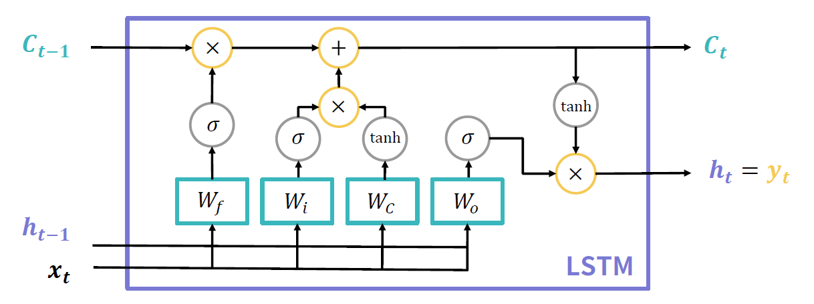

- Vanilla RNN의 기울기 소실 문제를 해결하고자 등장
- Long Short Term Memory(장단기 메모리)의 약자
  - 장기 의존성과 단기 의존성을 모두 기억할 수 있다는 의미
- 새로 계산된 hidden state를 출력값으로도 사용

### Cell State

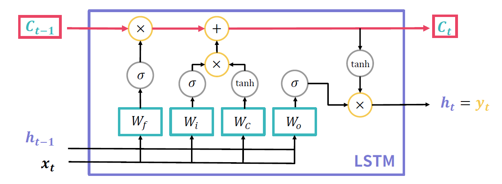

- 기울기 소실 문제를 해결하기 위한 핵심 장치
- 장기적으로 기억할 정보를 조절

### Gate

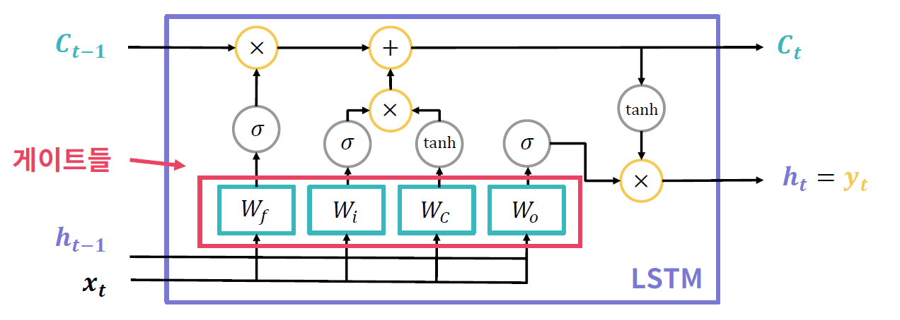

3종류의 게이트를 4개의 FC Layer로 구성

- W_f : 망각 게이트(Forget Gate)
- W_i, W_i :입력 게이트(Input Gate)
- W_o : 출력 게이트(Output Gate)

### Forget Gate

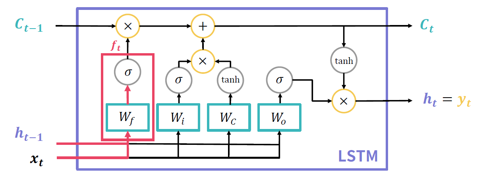

기존 cell state에서 어떤 정보를 잊을지 결정하는 게이트

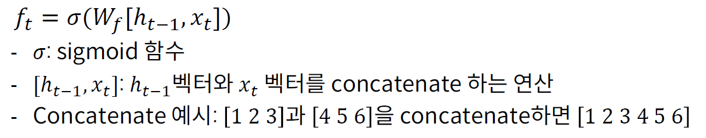

### Input Gate

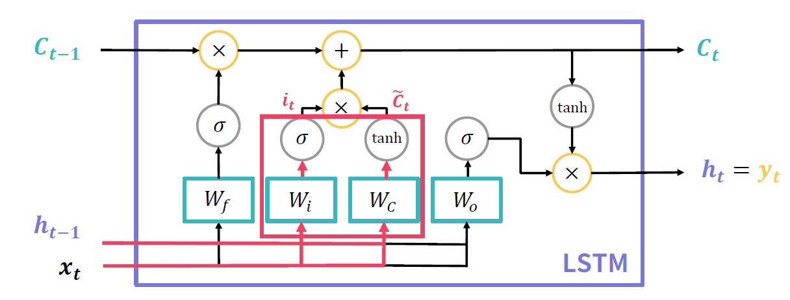

현재 입력 받은 정보에서 어떤 것을 cell state에 저장할지 결정

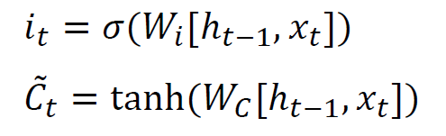

### 새로운 Cell State

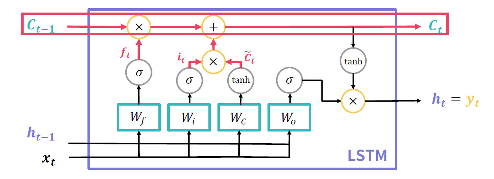

Forget Gate와 Input Gate의 정보를 통해 cell state 갱신

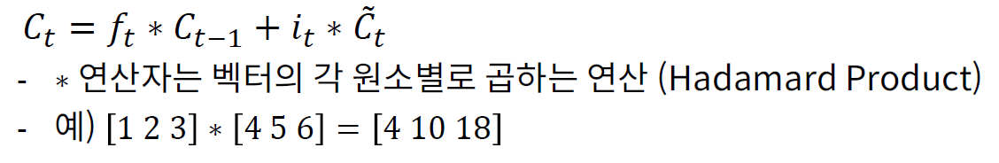

### Output Gate

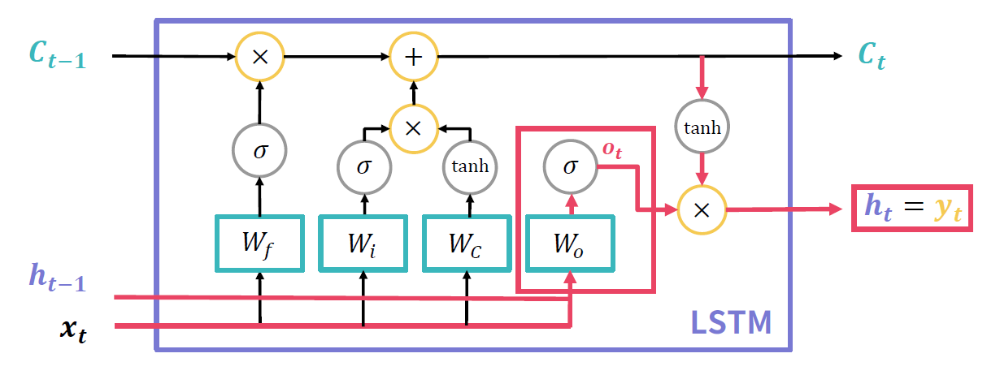

새로 계산된 cell state를 사용하여 다음 hidden state와 출력값을 계산

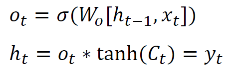

## GRU

> Gated Recurrent Unit

### GRU 소개

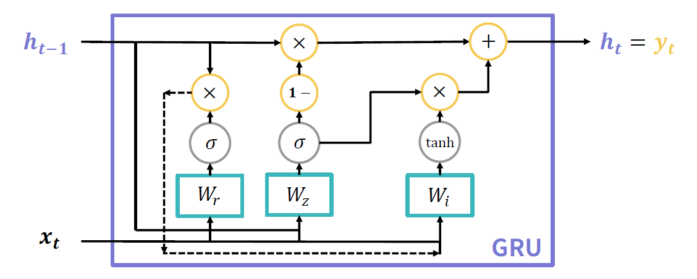

- Gated Recurrent Unit의 약자
- LSTM이 가지는 3개의 게이트를 2개로 간소화하고 Cell State를 없앰
  - 파라미터 수가 감소하여 LSTM보다 빠른 학습 속도를 가짐
  - 그럼에도 성능은 일반적으로 LSTM과 비슷한 수준
- 마찬가지로 새로 계산된 hidden state를 출력값으로도 사용

### GRU의 게이트

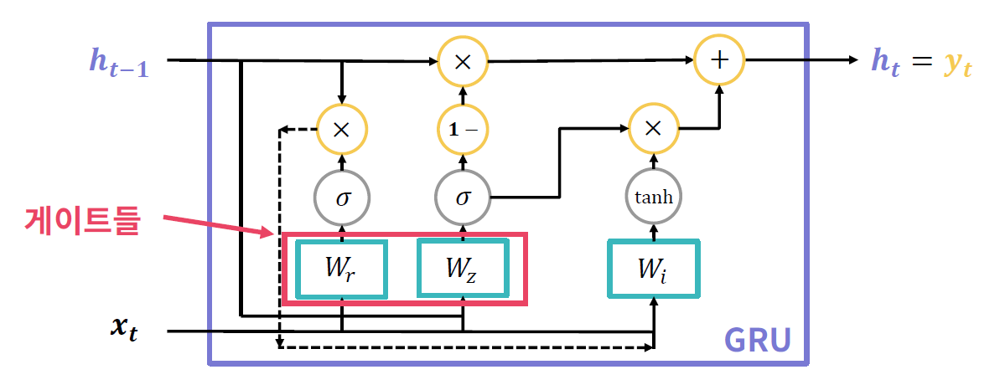

- 2종류의 게이트를 2개의 FC Layer로 구성
- W_r : 리셋 게이트(Reset Gate)
- W_z : 업데이트 게이트(Update Gate)

### Reset Gate

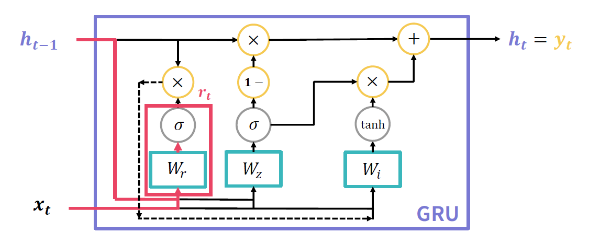

기존 hidden state의 정보를 <u>얼마나 초기화할지 결정</u>하는 게이트

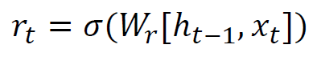

### Update Gate

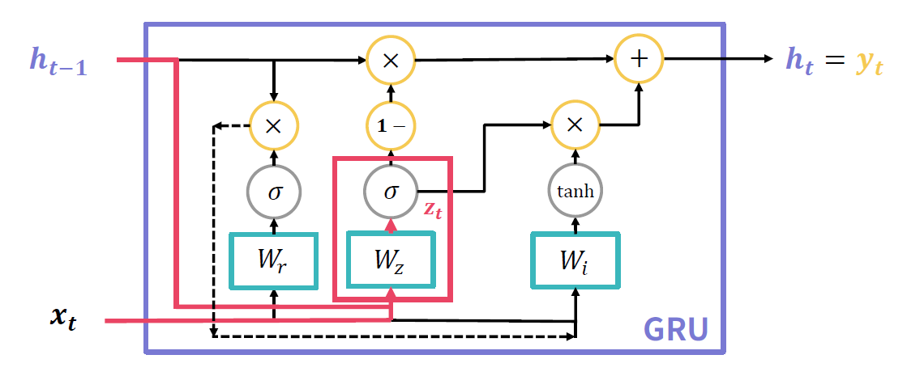

기존 hidden state의 정보를 <u>얼마나 사용할지 결정</u>하는 게이트

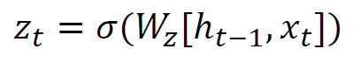

### 새로운 Hidden State 계산

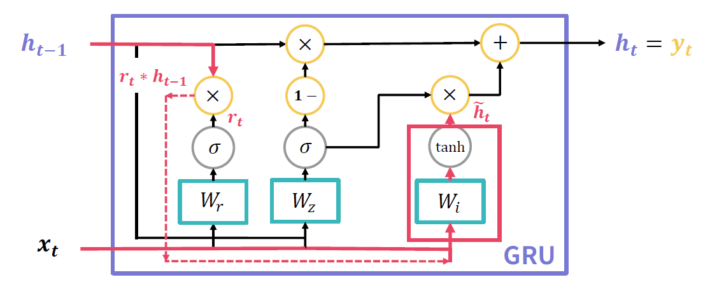

Reset Gate의 결과를 통해 새로운 hidden state의 후보를 계산

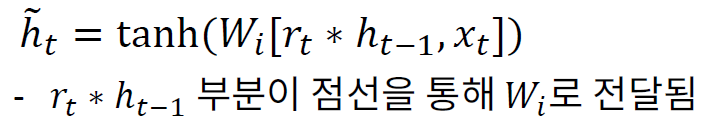

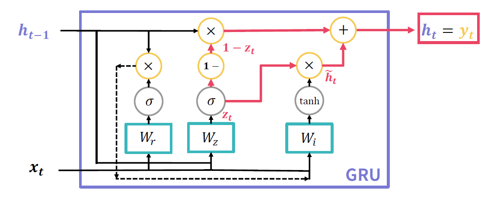

Update Gate의 결과를 통해 새로운 hidden state를 계산

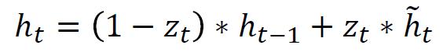

Update Gate의 정보만이 새로운 hidden state 계산에 사용됨

- Update Gate가 LSTM의 Forget Gate와 Input Gate를 하나로 합친 것과 유사한 역할

# RNN 모델 활용

### RNN 기반 모델 활용

- RNN/LSTM/GRU 모델은 회귀 분석과 분류 작업에 모두 활용 가능
- 회귀 분석: 각 시점의 출력값이 어느 정도일지 예측
- 분류 작업: 각 시점의 데이터가 어느 클래스일지 예측

### 모델 학습을 위한 손실 함수 계산

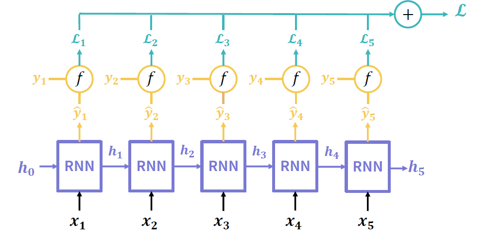

- 각 시점별 예측값 y_t^와 실제값 y_t를 통해 시점별 손실 함수값 계산 - L_t
- L_t를 모두 더하여 최종 손실값 계산 

- 주로 사용하는 손실 함수
  - 회귀 분석: Mean Squared Error(MSE)
  - 분류 작업: Cross Entropy

### 활용 예시

회귀 분석 

- 주가 예측
- 기온 예측

분류 작업

- 문장에서 다음 단어 예측
- 각 단어의 품사 예측