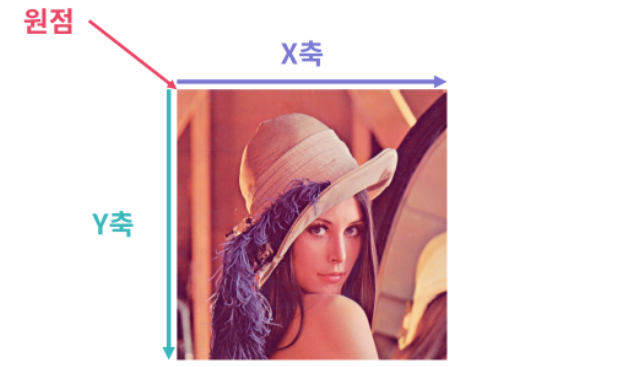

# PIL

> Python Imaging Library


## PIL(Pillow) 소개

Python에서 자주 사용하는 이미지 처리 라이브러리

기존 PIL 라이브러리 개발은 2011년에 중단, PIL을 Fork하여 만든 **Pillow**라는 프로젝트가 개발되고 있음


## 시작하기

#### 설치

```python
python3 -m pip install Pillow
```

#### 불러오기

```python
from PIL import Image
```

- `Image` 모듈 불러오기

#### 이미지 불러오기

```python
img = Image.open('Lenna.png')
```

- `img`에 `Image` 클래스 객체 저장
- 위의 `Image` 모듈과 이름만 같고 서로 다른 존재

#### 시각화

```python
img.show()
```

- `Image` 클래스의 `show` 메소드를 사용하면 됨

```python
from matplotlib.pyplot import imshow
imshow(img)
```

- `matplotlib`을 이용할 수 있음

#### 사이즈 확인

```python
print('Size: {}, Mode: {}'.format(img.size, img.mode))
```

#### 경로 합치기

`os.path.join()`

- python 내에서 하나의 경로명으로 합쳐주는 메소드

#### 대용량 데이터셋 불러오기

대용량의 데이터셋을 한번에 메모리에 불러오는 것은 불가능하다. 대용량의 데이터셋을 학습에 사용할 경우에는 해당 데이터를 사용할 때만 메모리에 불러오는 방법을 사용하는데 Tensorflow에서 이 기능을 수행하는 함수를 제공한다. [API 문서](https://www.tensorflow.org/api_docs/python/tf/keras/preprocessing/image/ImageDataGenerator)

```python
from tensorflow.keras.preprocessing.image import ImageDataGenerator
ImageDateGenerator()
```


## 이미지 형태 변환

> crop, rotate, resize

#### 잘라내기 (Crop)

전체 이미지 안에서 특정 영역만 잘라내는 작업

```python
img.crop((x1, y1, x2, y2))
```

- `Image` 클래스의 `crop` 메소드를 사용. 이미지 내의 4개의 좌표를 tuple 형태로 넣어주면 됨.



- 왼쪽 위가 원점, 가로가 X축, 세로가 Y축

#### 회전하기

이미지 자체를 <u>반시계 방향</u>으로 일정 각도만큼 돌리는 것

```python
imshow(img.rotate(60))
```

- 잘림 없이 회전하고 싶다면 `expand=True` 

#### 크기와 비율 변환

가로, 세로의 길이를 변화시키는 작업

```python
img_resized = img.resize((128, 128))
```

#### 전단 변환(Shearing)

전단 변환, 밀림 변환, 사각형 이미지를 평행사변형 꼴로 만드는 변환 

`img.transform(size, method=Image.AFFINE, data, ...)` [문서](https://pillow.readthedocs.io/en/stable/reference/Image.html#PIL.Image.Image.transform)

- `size`: 출력될 이미지의 크기 Tuple
- `method`: 전단 변환을 위해서 `Image.AFFINE`
- `data`: 전단 변환의 정도를 조절 ex) `(1, -0,5, 0, 0, 1, 0)`


## 이미지 색상 변환

> Brightness, Contrast, Grayscale

```python
from PIL import ImageEnhance
```

밝기와 대조 변화를 위해선 Pillow의 `ImageEnhance` 모듈이 필요

#### 밝기 변화

```python
bright_enhancer = ImageEnhance.Brightness(img)
imshow(bright_enhancer.enhance(2))
```

- `ImageEnhance` 모듈의 `Brightness` 클래스
  - `image`: 밝기를 변화할 이미지

- `enhance` 메소드
  - 2배로 밝게 함

#### 대조 변화

```python
contrast_enhancer = ImageEnhance.Contrast(img)
imshow(contrast_enhancer.enhance(2))
```

- `ImageEnhance` 모듈의 `Contrast` 클래스
- `enhance` 메소드

#### 흑백 변화

컬러 이미지를 흑백 이미지로 변화시키는 작업

```python
img_gray = img.convert(mode='L')
```

- `Image` 클래스의 `convert` 메소드 사용 
  - `mode`: `L` 모드를 사용하여 흑백 사진으로 변환 [문서](https://pillow.readthedocs.io/en/stable/handbook/concepts.html#modes)


## 필터 변환

> Sharpening, Blur, Edge Detection

`Image` 클래스의 `filter` 메소드를 이용해 필터 변환 

`filter` 메소드에 적용할 필터 종류를 파라미터는 `ImageFilter`라는 별도 모듈에 구현 [문서](https://pillow.readthedocs.io/en/stable/reference/ImageFilter.html)

#### 샤프닝(Sharpening)

이미지의 질감을 날카롭게 만들어주는 작업

```python
from PIL import ImageFilter

img_sharpen = img.filter(ImageFilter.SHARPEN))
```

- `ImageFilter` 모듈의 `SHARPEN` 이용
- 효과를 극대화 하려면 `filter` 메소드를 여러번 사용하는 것도 가능

#### 블러(Blur)

이미지를 흐릿하게 만들어주는 작업

```python
img_blur = img.filter(ImageFilter.BLUR)
```

- `ImageFilter` 모듈의 `BLUR` 이용

#### 경계선 감지

이미지에서 경계선을 찾아주는 작업. 이미지 내의 색의 변화가 급격한 선을 찾아냄.

```python
img_blur = img.filter(ImageFilter.FIND_EDGES)
```

- `ImageFilter` 모듈의 `FIND_EDGES` 이용