# Perceptron


## 1. 딥러닝 개론

### 인공지능, 머신러닝, 딥러닝

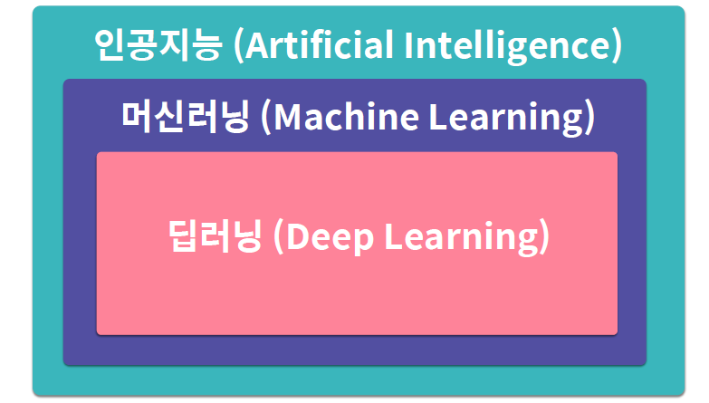


### 딥러닝의 정의

머신러닝의 여러 방법론 중 하나

**인공신경망**에 기반하여 컴퓨터에게 사람의 사고방식을 가르치는 방법


### 인공 신경망의 정의

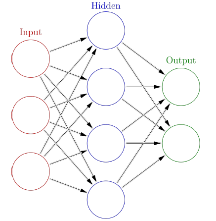

생물학의 신경망에서 영감을 얻은 학습 알고리즘

**사람의 신경 시스템**(뉴런)을 모방함


### 인공 신경망의 특징

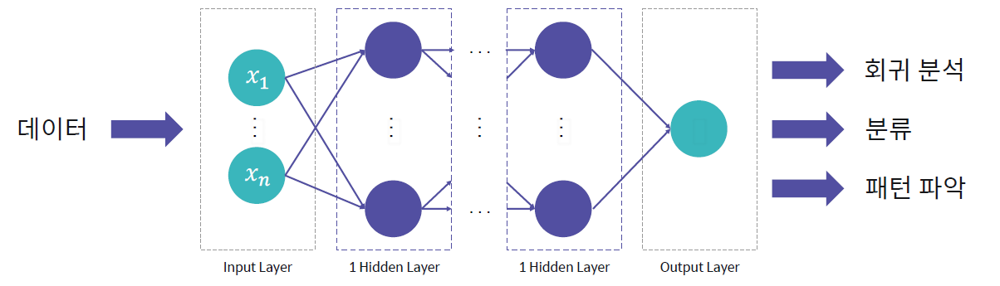

모델 스스로 데이터의 특성을 학습하여 <u>지도학습, 비지도학습 모두 적용 가능</u>


### 딥러닝의 역사

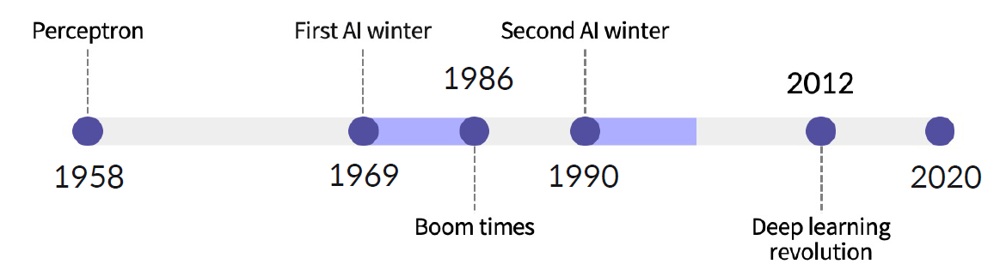

핵심이 되는 알고리즘의 발전에 따라 붐이 형성되기도 함


## 2. 퍼셉트론(Perceptron)

### 퍼셉트론의 기본 구조

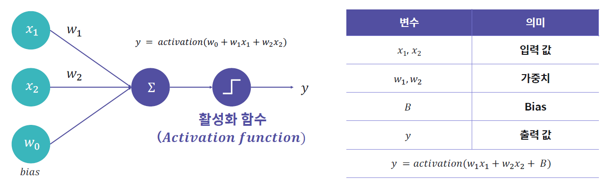


### 활성화 함수(Activation Function)

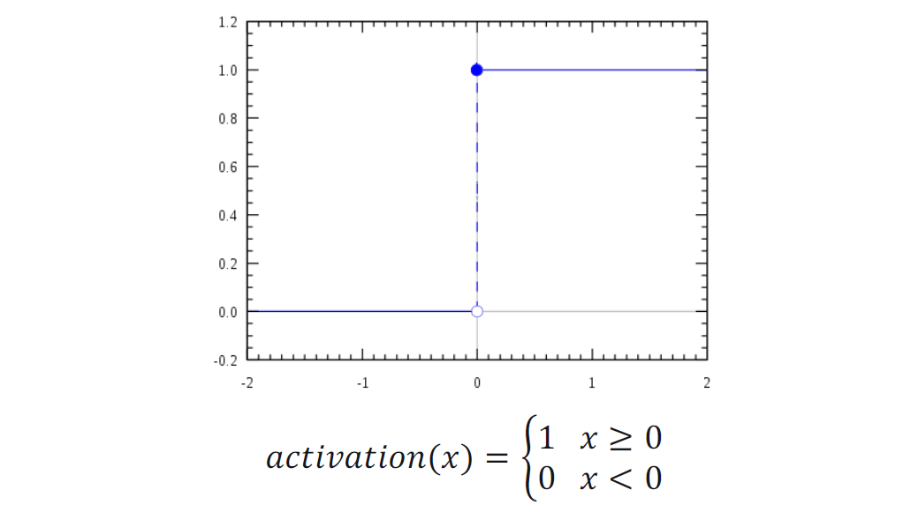


### 퍼셉트론 코드 예시

```python
def perceptron(x, weights):
    # bias
    sum_ = weights[0]
    for i in range(len(x)-1):
        pre_y += weights[i+1] * x[i]
    return 1 if pre_y >= 0 else 0
```


### Scikit-learn을 이용한 퍼셉트론 

`from sklearn.linear_model import Perceptron` [문서](https://scikit-learn.org/stable/modules/generated/sklearn.linear_model.Perceptron.html#sklearn.linear_model.Perceptron)

`Perceptron(max_iter, eta0)`

- `max_iter`: 모델 학습 최대 횟수
- `eta0`: 모델에 사용되는 가중치가 업데이트 되는 속도 (default=1)


## 3. 퍼셉트론 선형 분류기

### 논리 회로의 역할을 수행하는 퍼셉트론

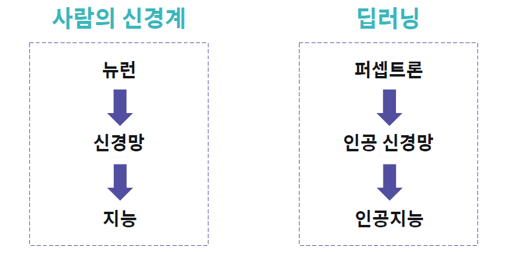


### 퍼셉트론과 논리 회로 

##### AND gate

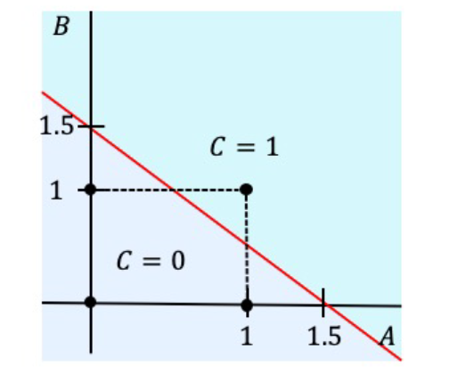

ex) C = activation(1 * A + 1 * B - 1.5)

##### OR gate

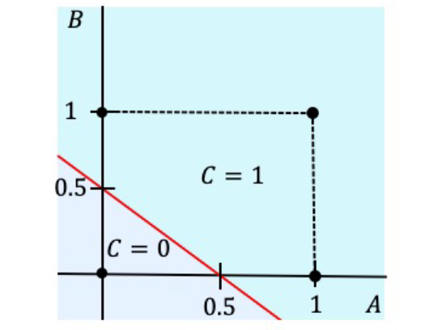

ex) C = activation(1 * A + 1 * B - 0.5)

##### NAND gate

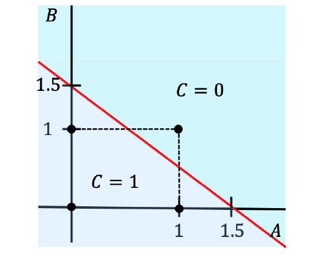

ex) C = activation((-1) \* A + (-1) \* B + 1.5)

##### NOR gate

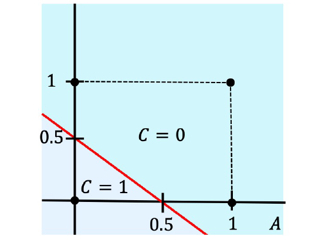

ex) C = activation((-1) \* A + (-1) * B + 0.5)


### 선형 분류를 위한 퍼셉트론: 단층 퍼셉트론(Single Layer Perceptron)

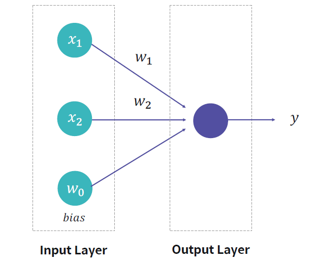

##### 입력층(Input Layer)

외부로부터 데이터를 입력 받는 신경망 입구의 Layer

##### 출력층(Output Layer)

모델의 최종 연산 결과를 내보내는 신경망 출구의 Layer


### 퍼셉트론을 활용한 선형 분류기

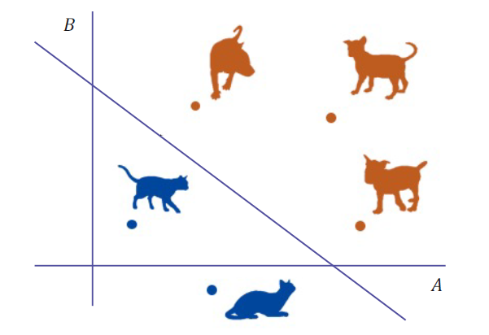

0, 1 데이터를 계산하던 퍼셉트론 논리 회로에서 확장. **선형 분류기**로써 데이터 분류 가능.


## 4. 비 선형적인 문제

> 하나의 선으로 분류할 수 없는 문제

### 비 선형적 논리 게이트

##### XOR gate

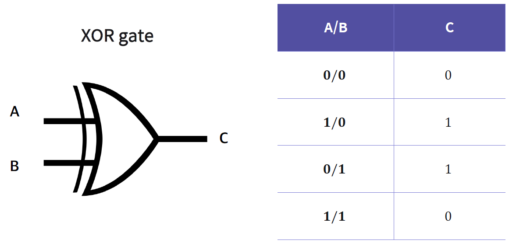

- 단층 퍼셉트론으로는 해결 불가능한 게이트
- 1969년 첫 번째 AI 겨울 도래


## 5. 다층 퍼셉트론

### 비 선형적인 문제 해결

- 1986년 첫 번째 빙하기가 끝나면서 비 선형적 문제가 해결되어야 했음
- 단층 퍼셉트론은 입력층과 출력층만 존재. 단층 퍼셉트론을 여러 층으로 쌓아보는 시도.


### XOR gate 예시

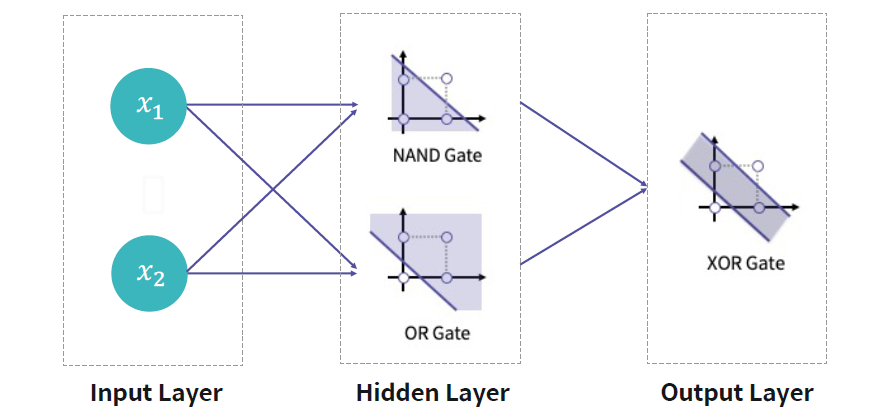

XOR 연산은 하나의 레이어를 사용하여 표현하는 것은 불가능 

하지만, <u>AND와 NOR 연산</u>을 함께 사용할 시 표현 가능

- 혹은 (NAND) AND (OR) 연산으로도 가능


### 다층 퍼셉트론(Multi Layer Perceptron)

단층 퍼셉트론을 여러개 쌓은 것을 다층 퍼셉트론(Multi Layer Perceptron)이라고 부름


### 히든층(Hidden Layer)

입력층과 출력층 사이의 모든 Layer


### 히든층의 개수와 딥러닝

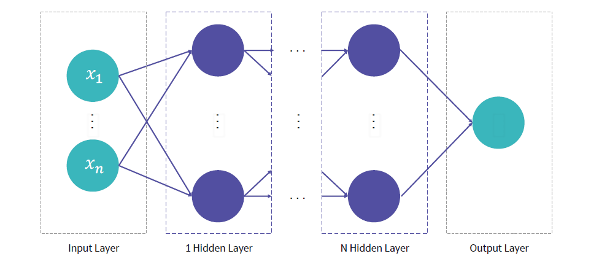

히든층이 3층 이상일 시 깊은 신경망이라는 의미의 Deep Learning 단어 사용

- Hidden layer가 많아지고, hidden layer의 노드 수가 많아질 수록 딥러닝 모델이 표현할 수 있는 파워가 높아짐


### 다층 퍼셉트론이 결정할 수 있는 영역

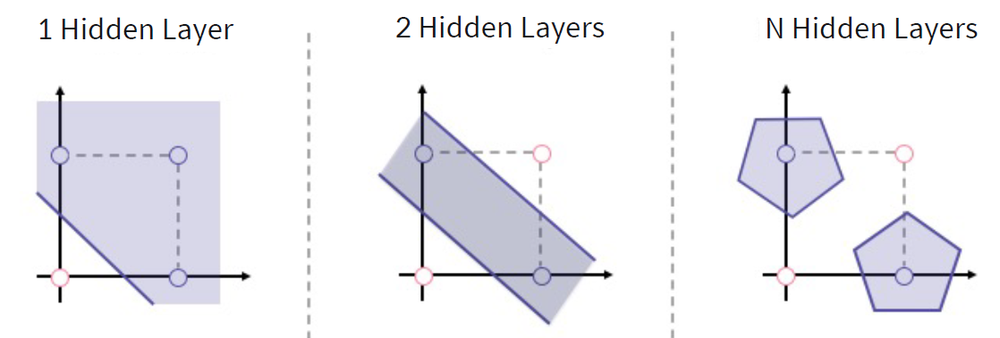


### Scikit-learn을 이용한 다층 퍼셉트론 모델

`from sklearn.neural_network import MLPClassifier` [문서](https://scikit-learn.org/stable/modules/generated/sklearn.neural_network.MLPClassifier.html#sklearn.neural_network.MLPClassifier)

`MLPClassifier(hidden_layer_sizes)`

- `hidden_layer_sizes`: 간단하게 hidden layer의 크기를 조절할 수 있는 인자

- `MLPClassifier`는 <u>역전파(backpropagation) 기법</u>을 사용하여 모델을 학습