# RNN

> Recurrent Neural Network


## 순차 데이터

### RNN과 순차 데이터

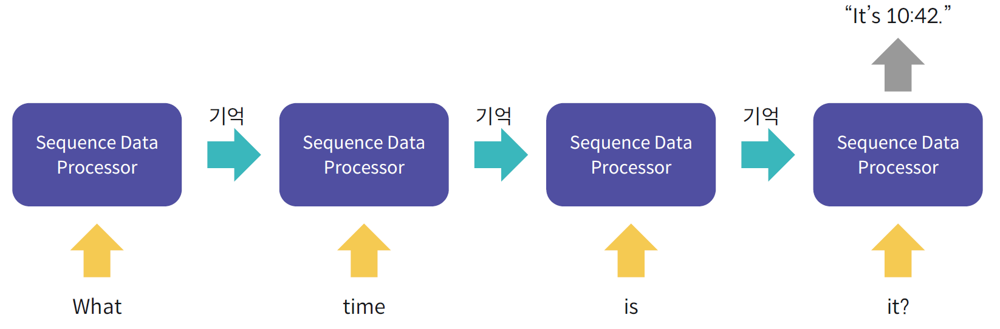

- RNN은 CNN과 함께 대표적인 딥러닝 모델
- 시계열 데이터 같은 순차 데이터(Sequential Date) 처리를 위한 모델
- RNN의 이해에는 순차 데이터가 가지는 특징의 이해 필요

### 순차 데이터란?

- 순서(Order)를 가지고 나타나는 데이터
- 날짜에 따른 기온 데이터나 단어들로 이루어진 문장 등
  - 데이터 내 <u>각 개체 간의 순서</u>가 중요

### 시계열 데이터(Time-Series Data)

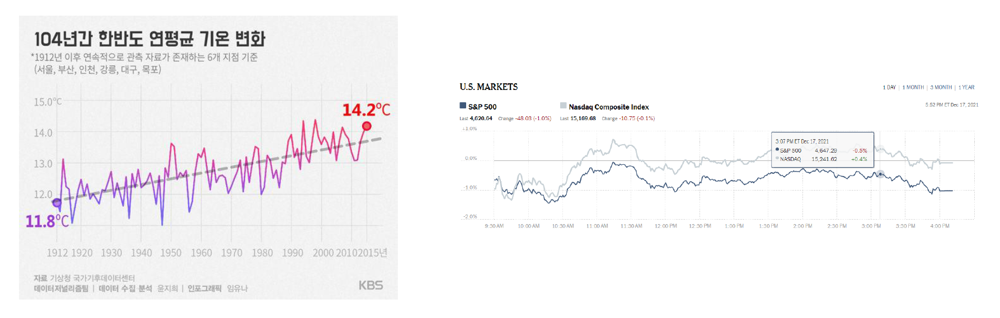

- 일정한 시간 간격을 가지고 얻어낸 데이터
- 연도별 대한민국의 평균 기온, 시간별 주식 가격 기록 등

### 자연어 데이터(Natural Language)

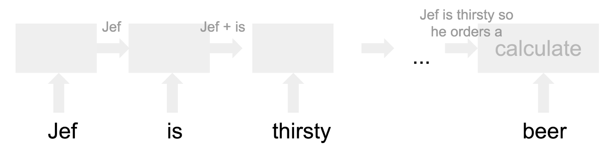

- 인류가 말하는 언어를 의미
- 주로 문장 내에서 <u>단어가 등장하는 순서</u>에 주목


## 딥러닝을 활용한 순차 데이터 처리 예시

### 경향성 파악

- 주가 예측, 기온 예측
- 이외에도 다양한 시계열 특징을 가지는 데이터에 적용 가능

### 음악 장르 분석

- 오디오 파일은 본질적으로 시계열 데이터
- 음파 형태 등을 분석하여 오디오 파일의 장르를 분석

### 강수량 예측

- 구글에서 이미지 처리 기술과 결함하여 주도적으로 연구 (ex. MetNet)

### 음성 인식

- 음성에 포함된 단어나 소리를 추출

### 번역기

- 두 언어 간 문장 번역을 수행
- 딥러닝의 발전 이후 번역의 자연스러움이 향상
- 이미지 처리와 결합하여 실시간 번역도 제공

### 챗봇

- 사용자의 질문에 사람처럼 응답하고자 하는 프로그램
- 사용자의 질문을 분석 후 질문에 적절한 응답을 생성


## RNN(Recurrent Neural Network)

### Fully-connected Layer와 순차 데이터

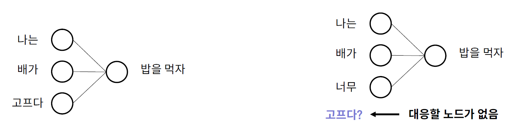

- FC Layer는 입력 노드 개수와 출력 노드 개수가 정해짐
- 순차 데이터는 하나의 데이터를 이루는 개채 수가 다를 수 있음
  - 문장은 모두 서로 다른 개수의 단어로 이루어짐
- 또한 FC Layer는 순서 고려가 불가능

### Recurrent Neural Network

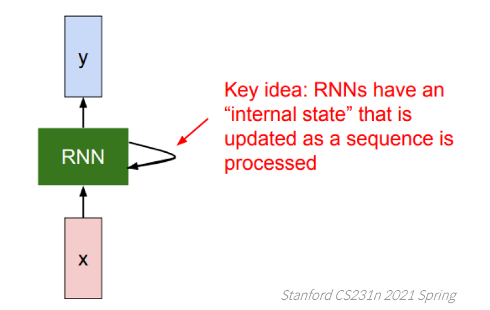

- 순차 데이터 처리를 위한 딥러닝 모델 
- RNN의 대표적인 구성 요소
  - Hidden State: 순환 구조를 구현하는 핵심 장치

### 입력 데이터 구조 

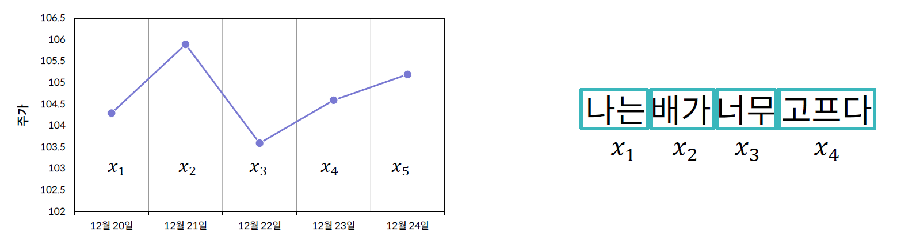

- x_1, x_2, x_3, ..., x_n과 같이 데이터의 나열
- 각 x_t의 의미
  - 시계열 데이터: 일정 시간 간격으로 나눠진 데이터 개체 하나
  - 자연어 데이터: 문장 내의 각 단어

### 시계열 데이터의 벡터 변환

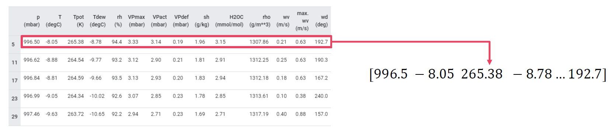

- 입력 데이터의 각 x_t는 벡터 형태
- 시계열 데이터의 경우 <u>각 데이터를 이루는 Feature 값들을 원소</u>로 하여 벡터로 변환

### 시계열 데이터를 이용한 RNN 기반 모델


**window size**: 모델을 한 번 학습할 때 사용할 데이터의 개수

- 위의 그림에서 window size는 4


### 자연어 데이터의 벡터 변환

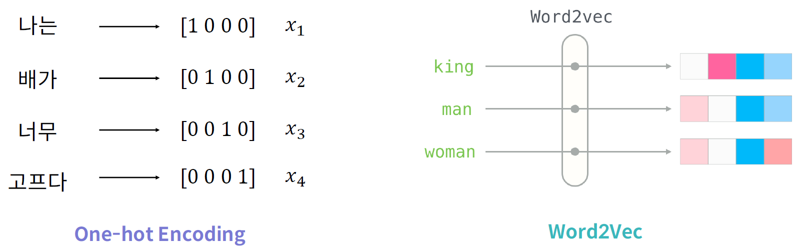

- **임베딩(Embedding)**: 각 단어들을 숫자로 이루어진 벡터로 변환
- 대표적인 임베딩 기법
  - One-hot Encoding: 데이터마다 벡터의 개수가 달라져 비효율적인 방식
  - Word2Vec: 주어진 단어들을 벡터로 변환하는 기계학습 모델 


## Vanilla RNN

### Vanilla RNN 소개

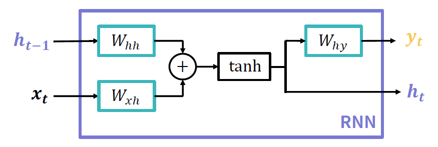

가장 간단한 형태의 RNN 모델: Simple RNN

내부에 세개의 FC Layer로 구성

- W_hh: hidden state를 변환하는 Layer의 가중치 행렬
- W_xh: 한 시점의 입력값을 변환하는 Layer의 가중치 행렬
- W_hy: 한 시점의 출력값을 변환하는 Layer의 가중치 행렬

### Vanilla RNN 연산 과정

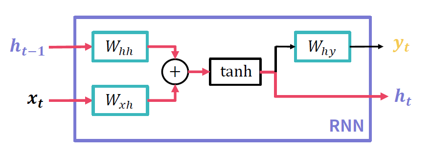

- 현재 입력값(x_t)에 대한 새로운 hidden state 계산
- h_t = tanh(h_t1\*W_hh + x_t\*W_xh)
  - tanh(tangent hyperbolic)를 사용하는 이론적인 이유는 없지만 RNN에서는 tanh의 성능이 좋아서 사용

### Vanilla RNN 연산 과정 

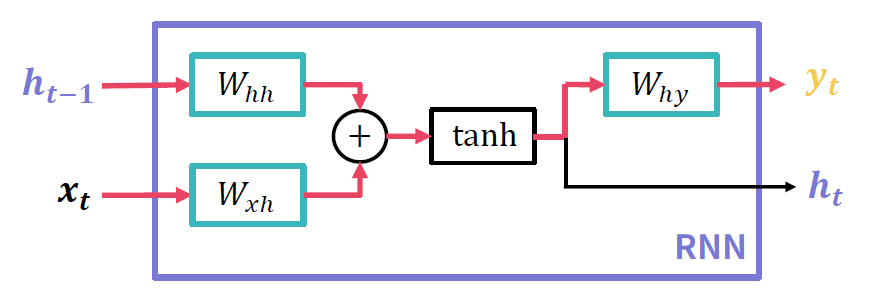

- 현재 입력값(x_t)에 대한 새로운 출력값 계산
- y_t = W_hy*h_t
  - 앞서 계산한 hidden state 이용

### 시간순으로 보는 Vanilla RNN의 연산 과정

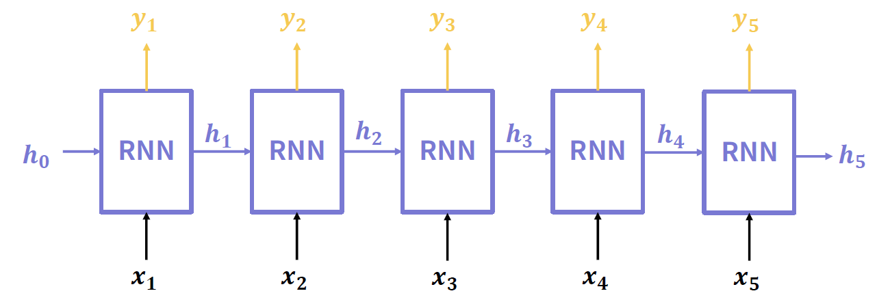

- 모델에 들어오는 각 시점의 데이터 x_t마다 앞서 설명한 연산 과정을 수행
- 입력값에 따라 반복해서 출력값과 hidden state를 계산
- **이전 시점에 생성된 hidden state를 다음 시점에 사용**

### Vanilla RNN 의의

##### Hidden state의 의미

- 특정 시점 t까지 들어온 입력값들의 상관관계나 경향성 정보를 압축해서 저장
- 모델이 내부적으로 계속 가지는 값이므로 일종의 메모리로 볼 수 있음
- 컴퓨터의 메모리와 일맥상통

##### Parameter Sharing

- Hidden state와 출력값 계산을 위한 FC Layer를 모든 시점의 입력값이 재사용
- FC Layer <u>세 개</u>가 모델 파라미터의 전부

### Vanilla RNN의 종류

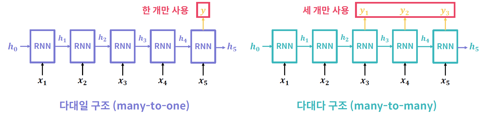

사용할 입력값과 출력값의 구성에 따라 여러 종류의 RNN이 존재

**다대일(many-to-one)**: 출력값을 한 시점의 값만 사용

**다대다(many-to-many)**: 여러 시점의 입력값과 여러 시점의 출력값을 사용

- 입력값과 출력값에 사용하는 시점의 개수는 같을 수도 있고 다를 수도 있음

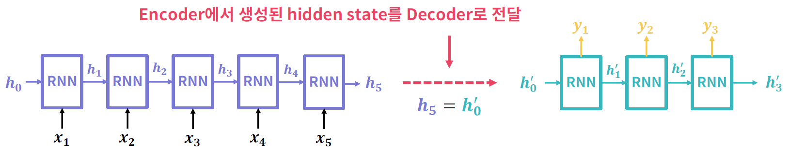

**인코더-디코더(Encoder-Decoder)**: 입력값들을 받아 특정 hidden state로 인코딩 후, 이 hidden state로 새로운 출력값을 만드는 구조

### Vanilla RNN의 문제점

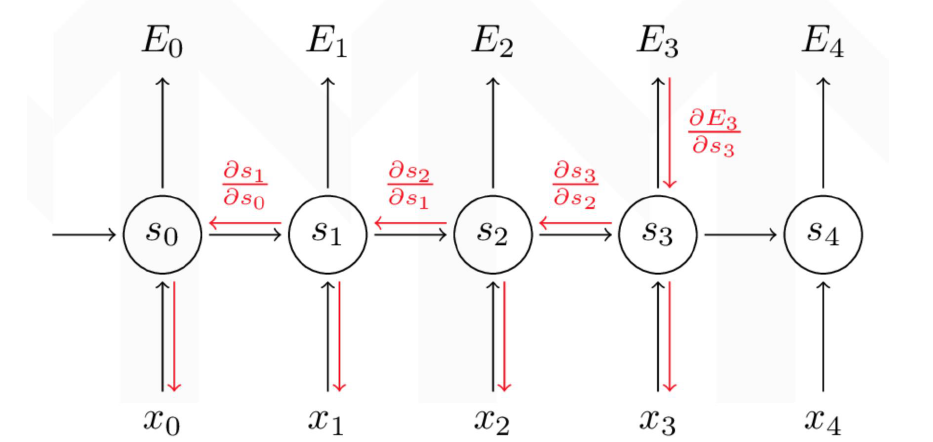

- RNN은 출력값이 시간 순서에 따라 생성
- 각 시점의 출력값과 실제값을 비교하여 손실(Loss)값을 계산
- 역전파 알고리즘이 시간에 따라 작동 - Back-propagation Through Time(BPTT)

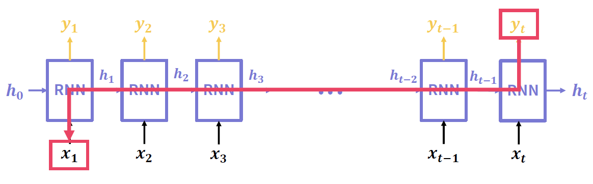

- 입력값의 길이가 매우 길어질 경우
  - 초기 입력값과 나중 출력값 사이에 전파되는 기울기 값이 매우 작아질 가능성이 높음
- 기울기 소실(Vanishing Gradient) 문제가 발생하기 쉬움
  - 다른 말로 장기 의존성(Long-term Dependency)을 다루기가 어려움

### Vanilla RNN 예시 코드

```python
import os
os.environ['TF_CPP_MIN_LOG_LEVEL'] = '2'

import tensorflow as tf
from tensorflow.keras import layers, Sequential

# 첫번째 모델
def build_model1():
    model = Sequential()
    
    model.add(layers.Embedding(input_dim=10, output_dim=5))
    model.add(layers.SimpleRNN(3))
    
    return model

# 두번째 모델
def build_model2():
    model = Sequential()
    
    model.add(layers.Embedding(input_dim=256, output_dim=100))
    model.add(layers.SimpleRNN(20))
    model.add(layers.Dense(10, activation='softmax'))
    
    return model
    
def main():
    model1 = build_model1()
    print("=" * 20, "첫번째 모델", "=" * 20)
    model1.summary()
    
    print()
    
    model2 = build_model2()
    print("=" * 20, "두번째 모델", "=" * 20)
    model2.summary()

if __name__ == "__main__":
    main()
```


## 자연어 처리를 위한 문자열 인코딩

```python
import tensorflow as tf
from tensorflow.python.keras.preprocessing.text import Tokenizer
from tensorflow.keras.utils import to_categorical
```

- `tokenizer`는 파이썬에서 제공하는 텍스트 데이터 전처리 모듈. 문자열로 구성된 데이터를 다양한 형태로 토근화할 수 있음

```python
def set_token(texts):
    tokenizer = Tokenizer()
    tokernizer.fit_on_texts(texts)
    return tokenizer
```

- `fit_on_texts`를 이용해 `tokenizer`에 텍스트 데이터들(리스트)을 세팅

``` python
def text2seq(text, tokenizer):
    return tokenizer.texts_to_sequences([text])[0]

def seq2onehot(seq, num_word):
    return to_categorical(seq, num_classes=num_word+1) # 예약된 토큰을 위해 1자리를 추가로 사용
```

- `texts_to_sequences`를 이용해 문자열을 시퀀스 정보로 변환
- `to_categorical`을 이용해 one-hot 인코딩

```python
text1 = "standing on the shoulder of giants"
text2 = "ain't no mountain high enough"

tokenizer = set_token([text1, text2])

print('단어 수:', len(tokenizer.word_index))
print('단어 인덱스:', tokenizer.word_index)

seq = text2seq(text2, tokenizer)
print(seq)

onehot = seq2onehot(seq, len(tokenizer.word_index))
print(onehot)
print('한 단어를 표현하는 길이:', len(onehot[0]))
```

