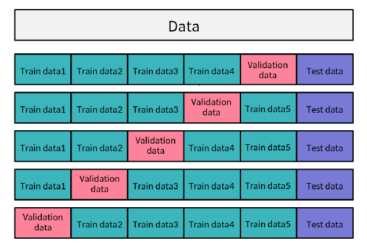

# Regression

> 회귀, 회귀 분석


## 1. 회귀 개념

### 머신러닝 분야

- 지도학습
  - **회귀분석(Regression)**
  - 분류(Classification)
- 비지도학습
  - 클러스터링(Clustering)
  - 차원 축소(Dimensionality Reduction)
- 강화학습


### 회귀 분석이란?

데이터를 가장 <u>잘 설명하는 선</u>을 찾아 입력값에 따른 미래 결과값을 예측하는 알고리즘

**예시**

```
Y ∽ β_0 + β_1 X
X = 평균 기온, Y = 아이스크림 판매량
⇒ 적절한 β\_0(y절편)과 β_1(기울기) 찾기
```


### 기울기와 절편 찾기

**아이디어**: 완벽한 예측은 불가능함

각 데이터의 실제 값과 모델이 예측하는 값의 차이를 최소한으로 하는 선을 찾자

즉, <u>Loss function</u>을 최소로 만드는 β\_0, β\_1 구하기


### Loss function

**전체 모델의 차이**

|예측값 - 실제값|
$$
\sum (y^{(i)}-(\beta_0x^{(i)} + \beta_1))^2
$$

- (+)와 (-) 값이 서로를 상쇄하지 못하도록 하기 위해 제곱값을 이용

$$
argmin_{\beta_0\beta_1}\sum (y^{(i)}-(\beta_0x^{(i)} + \beta_1))^2
$$

- Loss function을 최소로 하는 β\_0, β\_1를 구하기


### 산 정상 오르기

**문제**: 아무 곳에서나 시작했을 때, 가장 정상을 빠르게 찾아가는 방법은?


##### 가정

- 정상의 위치는 알 수 없다.
- 현재 나의 위치와 높이를 알 수 있다.
- 내 위치에서 일정 수준 이동할 수 있다.

##### 방법

- 현재 위치에서 가장 경사가 높은 쪽을 찾는다
- 오르막 방향으로 일정 수준 이동한다
- 더 이상 높이의 변화가 없을 때까지 반복


### Gradient Descent(경사하강법)


**거꾸로 된 산을 내려가기**

- 최적의 값을 찾기 위한 거꾸로 된 산을 내려가는 방법
- <u>Loss function</u>을 최소로 만드는 β\_0, β\_1을 선정함


### 회귀 분석 개념 정리하기

**Loss Function(실제 값과 모델이 예측하는 값의 오차)**을 최소화하는 **Gradient Descent(최적의 β\_0, β\_1를 찾는 알고리즘)**를 통해 데이터를 가장 잘 설명할 수 있는 선을 찾는 방법


### 알고리즘 구현

```python
# 데이터를 생성하고 반환하는 함수
def load_data():
    
    X = np.array([[8.70153760], [3.90825773], [1.89362433], [3.28730045], [7.39333004], [2.98984649], [2.25757240], [9.84450732], [9.94589513], [5.48321616]])
    y = np.array([[5.64413093], [3.75876583], [3.87233310], [4.40990425], [6.43845020], [4.02827829], [2.26105955], [7.15768995], [6.29097441], [5.19692852]])
    
    return X, y

# 예측값을 반환하는 함수
def prediction(beta_0, beta_1, X):
    
    y_pred = beta_0 + beta_1 * X
    
    return y_pred
    

# beta_1와 beta_1 값을 업데이트 하는 규칙을 정의하는 함수입니다.
def update_beta(X, y, y_pred, lr):
    
    delta_0 = -(lr * (2 / len(X)) * np.sum(y - y_pred))
    
    delta_1 = -(lr * (2 / len(X)) * (np.dot(X.T, (y - y_pred))))
    
    return delta_0, delta_1
    

# 반복 횟수만큼 오차(loss)를 계산하고 beta_0,beta_1의 값을 변경하는 함수
def gradient_descent(X, y, iters, lr):
    
    beta_0 = np.zeros((1,1))
    beta_1 = np.zeros((1,1))
    
    for i in range(iters):
        
        y_pred = prediction(beta_0, beta_1, X)
        loss = np.mean(np.square(y - y_pred))
        
        beta0_delta, beta1_delta = update_beta(X, y, y_pred, lr)
        
        beta_0 -= beta0_delta
        beta_1 -= beta1_delta
        
        # 100번의 학습마다 그래프 출력하기
        if i%100==0:
            print("학습 횟수 :",i)
            plotting_graph(X,y,beta_0,beta_1)
        
    return beta_0, beta_1


# 그래프를 시각화하는 함수
def plotting_graph(X,y,beta_0,beta_1):
    
    y_pred = beta_0 + beta_1[0,0] * X
    
    fig = plt.figure()
    
    plt.scatter(X, y)
    plt.plot(X, y_pred,c='r')
    
    plt.savefig("test.png")
    elice_utils.send_image("test.png")


# lr(learning rate): 학습률. 산을 내려가는 보폭.
lr = 1e-4
iteration = 1000

X, y = load_data()

beta_0, beta_1 = gradient_descent(X, y, iteration, lr)

print("{}번의 학습 이후의 회귀 알고리즘 결과".format(iteration))
print("beta_0:",beta_0[0], "beta_1:",beta_1[0])

plotting_graph(X,y,beta_0,beta_1)
```


### Scikit-learn

기계학습 라이브러리 scikit-learn을 사용해 Loss function을 최소로 하는 β\_0, β\_1을 쉽게 구할 수 있다. 

`LinearRegression` : 모델을 정의 [문서](https://scikit-learn.org/stable/modules/generated/sklearn.linear_model.LinearRegression.html#sklearn.linear_model.LinearRegression)

```python
import numpy as np
from sklearn.linear_model import LinearRegression

X = [8.70153760, 3.90825773, 1.89362433, 3.28730045, 7.39333004, 2.98984649, 2.25757240, 9.84450732, 9.94589513, 5.48321616]
Y = [5.64413093, 3.75876583, 3.87233310, 4.40990425, 6.43845020, 4.02827829, 2.26105955, 7.15768995, 6.29097441, 5.19692852]

train_X = np.array(X).reshape(-1, 1)
train_Y = np.array(Y).reshape(-1, 1)

lrmodel = LinearRegression()
lrmodel.fit(train_X, train_Y)

beta_0 = lrmodel.coef_[0]
beta_1 = lrmodel.intercept_
```

`train_test_split(X, Y, test_size=, random_state=)`: 학습용, 테스트용 데이터를 나누어 반환 [문서](https://scikit-learn.org/stable/modules/generated/sklearn.model_selection.train_test_split.html#sklearn.model_selection.train_test_split)

- random_state를 통해 데이터를 나누기 전 데이터를 섞음. random 함수의 seed값과 유사하여, 수행시마다 동일한 결과를 얻기 위해 사용.

```python
from sklearn.model_selection import train_test_split

x_train, x_test, y_train, y_test = train_test_split(X, Y, test_size=0.2, random_state=0)
```

`[Model].fit(X, y)`: X, y 데이터셋에 대해서 모델을 학습

`[Model].predict(X)`: X 데이터에 대한 예측값을 반환

`[Model].score(X, y)`: 테스트 데이터를 인자로 받아 학습이 완료된 모델의 평가 점수를 출력


## 2. 단순 선형회귀

> Simple Linear Regression

### 단순 선형 회귀 (Simple Linear Regression)

가장 기본적이고 간단한 방법의 회귀 알고리즘

입력값 X와 결과값 Y의 관계를 설명할 때 가장 많이사용되는 단순한 모델

**단순 선형회귀의 함수식**
$$
Y\approx\beta_0 + \beta_1X
$$
**단순 선형회귀의 Loss Function**
$$
\sum (y^{(i)}-(\beta_0 + \beta_1x^{(i)}))^2
$$


### 단순 선형회귀 특징

- 가장 기초적이나 여전히 많이 사용되는 알고리즘
- 입력값(X)이 1개인 경우에만 적용이 가능함
- 입력값과 결과값의 관계를 알아보는데 용이함
- 입력값이 결과값에 얼마나 영향을 미치는지 알 수 있음
- 두 변수 간의 관계를 직관적으로 해석하고자 하는 경우 활용


## 3. 다중 선형회귀와 다항 회귀

> Multiple Linear Regression, Polynomial Regression

### 다중 선형 회귀 (Multiple Linear Regression)

입력값 X가 여러개(2개 이상)인 경우 활용할 수 있는 회귀 알고리즘

각 개별 X_i에 해당하는 최적의 β\_i를 찾아야 함

**다중 선형회귀의 함수식**
$$
Y\approx\beta_0 + \beta_1X_1 + \beta_2X_2 + ... + \beta_iX_i
$$
**다중 선형회귀의 Loss Function**
$$
\sum (y^{(i)}-(\beta_0 + \beta_1x_1^{(i)} + \beta_2x_2^{(i)} + ... + \beta_nx_n^{(i)}))^2
$$


### 다중 선형 회귀 특징

- 여러 개의 입력값과 결과값 간의 관계 확인 가능

- 어떤 입력값이 결과값에 어떠한 영향을 미치는지 알 수 있음
- 여러 개의 입력값 사이의 **상관 관계**가 높을 경우 결과에 대한 신뢰성을 잃을 가능성이 있음

✅ 상관관계: 두 가지 것의 한쪽이 변화하면 다른 한쪽도 따라서 변화하는 관계


### 다항 회귀 (Polynomial Regression)

1차 함수 선형식으로 표현하기 어려운 분포의 데이터를 위한 회귀

복잡한 분포의 데이터의 경우 일반 선형 회귀 알고리즘 적용 시 낮은 성능의 결과가 도출됨

**다항 회귀의 함수식**
$$
Y\approx\beta_0 + \beta_1X_1 + \beta_2X_2^2 + ... + \beta_iX_i^i
$$


### 다항 회귀 특징

- 일차 함수 식으로 표현할 수 없는 복잡한 데이터 분포에도 적용 가능
- 극단적으로 높은 차수의 모델을 구현할 경우 과도하게 학습 데이터에 맞춰지는 과적합 현상 발생
- 데이터 관계를 선형으로 표현하기 어려운 경우 사용


### scikit-learn을 이용한 다항 회귀 전처리

`from sklearn.preprocessing import PolynomialFeatures`

`PolynomialFeatures(degree, include_bias)`: Polynomial 객체를 생성

- `degree`: 만들어줄 다항식의 차수
- `include_bias`: 편향 변수의 추가 여부를 설정 (True/False). True일 경우 해당 다항식의 모든 거듭제곱이 0일 경우 편향 변수를 추가. 이는 회귀 식에서 beta_0와 같은 역할을 함

`[PolynomialFeatures].fit_transform(X)`: 데이터 X와 <u>X의 degree제곱을 추가</u>한 데이터를 반환

- `fit`과 `transform`을 분리해서 진행할 수도 있음


## 4. 과적합과 정규화 

> Overfitting, Cross Validation, Regularization

### 과적합 (Overfitting)

모델이 주어진 훈련 데이터에 과도하게 맞춰져 <u>새로운 데이터</u>가 입력 되었을 때 잘 예측하지 못하는 현상

즉, 모델이 과도하게 복잡해져 <u>일반성</u>이 떨어진 경우를 의미함


### 과적합 방지 방법

모델이 잘 적합되어 실제 데이터와 유사한 예측 결과를 얻을 수 있도록 과적합 방지를 위해 다양한 방법을 사용

#### 교차 검증 (Cross Validation)

모델이 잘 적합되었는지 알아보기 위해 **훈련용 데이터**와 별개의 **테스트 데이터**, 그리고 **검증 데이터**로 나누어 성능 평가하는 방법

**K-fold 교차 검증**

훈련 데이터를 계속 변경하며 모델을 훈련시킴

데이터를 K등분으로 나누고 K번 훈련시킴



1. K를 설정하여 데이터 셋을 K개로 나눔
2. K개 중 한 개를 valid, 나머지를 훈련용으로 사용
3. K개 모델 평균 성능이 최종 모델 성능

##### K-fold 교차 검증을 위한 scikit-learn 함수, 라이브러리

`KFold(n_splits)`

- `n_splits`: 분리할 데이터 개수

`[KFold].split(X)`: 실제로 데이터를 분리하기 위한 인덱스를 반환

- `X`: 분리하고자 하는 데이터

```python
from sklearn.model_selection import KFold

def kfold_regression(train_X, train_y):
    
    # 반복문 내에서 횟수를 표시하기 위한 변수 설정하기
    n_iter = 0
    
    # 각 fold 마다 모델 검증 점수를 저장하기 위한 빈 리스트 생성하기
    model_scores = []
    
    kfold = KFold(n_splits=5)
    
    # train data idx, validation data idx
    for train_idx, val_idx in kfold.split(train_X):
        
        X_train, X_val = train_X[train_idx], train_X[val_idx]
        y_train, y_val = train_y[train_idx], train_y[val_idx]
        
        # 동일한 가중치 사용을 위해 각 fold 마다 모델 초기화 하기
        model = LinearRegression()
        
        model.fit(X_train, y_train)
        
        # 각 Iter 별 모델 평가 점수 측정
        score = model.score(X_val, y_val)
        
        # 학습용 데이터의 크기를 저장하기
        train_size = X_train.shape[0]
        val_size = X_val.shape[0]
    
        print("Iter : {0} Cross-Validation Accuracy : {1}, Train Data 크기 : {2}, Validation Data 크기 : {3}"
              .format(n_iter, score, train_size, val_size))
    
        n_iter += 1
        
        # 전체 모델 점수를 저장하는 리스트에 추가하기
        model_scores.append(score)
        
    return kfold, model, model_scores
```


#### 정규화(Regularization)

- 모델의 복잡성을 줄여 일반화된 모델을 구현하기 위한 방법

- 모델 beta_i에 패널티를 부여함 (선형 회기를 위한 정규화: L1, L2 정규화)

##### 선형 회귀를 위한 정규화 방법

L1 정규화(Lasso)

- 불필요한 입력값에 대응하는 beta_i를 <u>정확히 0</u>으로 만든다

L2 정규화(Ridge)

- 아주 큰 값이나 작은 값을 가지는 이상치에 대한 beta_i를 <u>0에 가까운 값</u>으로 만든다

##### 정규화 방법을 적용한 회귀 알고리즘

적용한 정규화 방법에 따라 Lasso, Ridgde, Elasticnet 회귀로 분류


## 5. 정규화를 적용한 회귀

### 1) Lasso Regression

회귀 학습에 사용되는 Loss Function에 L1 정규화 항을 추가

중요하지 않은 beta_i를 0으로 만들어 모델의 복잡성을 줄일 수 있음

**특징**

- 너무 많은 beta_i를 0으로 만들 수 있어 모델의 정확성이 떨어질 수 있음
- 몇 개의 중요 변수만 선택하기 때문에 정보 손실의 가능성이 있음

##### scikit-learn

`from sklearn.linear_model import Lasso`

`Lasso(alpha)`: 라쏘 회귀를 정의

- `alpha`: alpha값이 클수록 더 강한 정규화를 적용. 기본값은 1


### 2) Ridge Regression

회귀 학습에 사용되는 Loss Function에 L2 정규화 항을 추가

중요하지 않은 beta_i를 0에 가깝게 만들어 모델의 복잡성을 줄일 수 있음

**특징**

- beta_i를 0에 가깝게 만들지만 완전한 0은 아니기 때문에 모델이 여전히 복잡할 수 있음

##### scikit-learn

`from sklearn.linear_model import Ridge`

`Ridge(alpha)`: 릿지 회귀를 정의

- `alpha`: alpha값이 클수록 더 강한 정규화를 적용. 기본값은 1


### 3) Elastic Net Regression

Lasso 회귀, Ridge 회귀의 단점을 보완하기 위함

Lasso 회귀의 L1 정규화와 Ridge 회귀의 L2 정규화 적용 비율을 조정하여 모델 구현

##### scikit-learn

`from sklearn.linear_model import ElasticNet`

`ElasticNet(alpha, l1_ratio)`

- `alpha`: alpha값이 클수록 더 강한 정규화를 적용. 기본값은 1
- `l1_ratio`: L1 정규화를 반영할 비율


## 6. 회귀 알고리즘 평가 지표

### 회귀 알고리즘 평가

어떤 모델이 좋은 모델인지를 어떻게 평가할 수 있을까? <u>목표를 얼마나 잘 달성했는지 정도</u>를 평가해야 함


### 목표 달성 평가 방법

실제 값과 모델이 예측하는 값의 **차이**에 기반한 평가 방법 사용

RSS, MSE, MAE, MAPE, R²


### RSS - 단순 오차

##### RSS(Residual Sum of Squares)

1. 실제값과 예측값의 단순 오차 제곱 합
2. 값이 <u>작을 수록</u> 모델의 성능이 높음
3. 전체 데이터에 대한 실제 값과 예측하는 값의 오차 제곱의 총 합

##### 특징

- 가장 간단한 평가 방법으로 직관적인 해석이 가능함
- 그러나 오차를 그대로 이용하기 때문에 <u>입력값의 크기에 의존</u>적임

##### 코드

```python
def return_RSS(test_y, predicted):
    RSS = 0
    for i in range(len(test_y)):
        RSS += (predicted[i]-test_y[i])**2
    return RSS
```


### MSE, MAE - 절대적인 크기에 의존한 지표

##### MSE(Mean Squared Error) 평균 제곱 오차

RSS에서 데이터 수 만큼 나눈 값. <u>작을수록</u> 모델의 성능이 높다고 평가할 수 있음

##### MAE(Mean Absolute Error) 평균 절대값 오차

실제값과 예측값의 오차의 절대값의 평균. <u>작을 수록</u> 모델의 성능이 높다고 평가할 수 있음

##### 특징

- MSE: 이상치(Outlier) 즉, 데이터들 중 크게 떨어진 값에 민감함
- MAE: 변동성이 큰 지표와 낮은 지표를 같이 예측할 시 유용
- 가장 간단한 평가 방법들로 직관적인 해석이 가능함
- 그러나 평균을 그대로 이용하기 때문에 입력값의 크기에 의존적임

##### scikit-learn

`mean_squared_error(y_true, y_pred)` [문서](https://scikit-learn.org/stable/modules/generated/sklearn.metrics.mean_squared_error.html#sklearn.metrics.mean_squared_error)

`mean_absolute_error(y_true, y_pred)` [문서](https://scikit-learn.org/stable/modules/generated/sklearn.metrics.mean_absolute_error.html#sklearn.metrics.mean_absolute_error)

##### 코드

```python
from sklearn.metrics import mean_absolute_error
from sklearn.metrics import mean_squared_error

MAE = mean_absolute_error(test_y, predicted)
MSE = mean_squared_error(test_y, predicted)
```


### R² - 결정 계수

회귀 모델의 설명력을 표현하는 지표. <u>1에 가까울 수록</u> 높은 성능의 모델이라고 해석할 수 있음
$$
1 - \frac{RSS}{TSS}~(0\leq R^2\leq1)
$$

##### 특징

- 백분율로 표현하기 때문에 <u>크기에 의존적이지 않음</u>
- 실제값이 1보다 작을 경우, 무한대에 가까운 값 도출, 실제 값이 0일 경우 계산 불가

##### scikit-learn

`r2_score(y_true, y_pred)`

##### 코드

```python
from sklearn.metrics import r2_score

R_squared  = r2_score(test_y, predicted)
```


### 평가 지표 선정 방법

절대적인 평가 지표는 존재하지 않음. 다양한 평가 지표를 적용해보고, 결과값을 비교하며 모델의 성능을 다양한 측면에서 확인해봐야 함