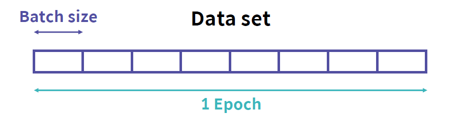

# Tensorflow

> 텐서플로우


## 1. 딥러닝 모델의 학습 방법

### 딥러닝 모델이란

히든층이 3층 이상일 시 깊은 신경망이라는 의미의 Deep Learning 단어 사용

### 딥러닝  모델의 구성 요소

- Layer: 모델을 구성하는 층
- Node/Unit: 각 층을 구성하는 요소
- Weight: 노드간의 연결 강도

### 딥러닝 모델의 학습 방법

Loss function을 최소화하기 위해 최적화 알고리즘을 적용

<u>예측값과 실제값 간의 오차값을 최소화</u>하기 위해 <u>오차값을 최소화하는 모델의 인자를 찾는</u> 알고리즘 적용

### 손실 함수(Loss function)와 최적화(Optimization)

- Loss Function: 예측값과 실제값 간의 오차값
- Optimization: 오차값을 최소화하는 모델의 인자를 찾는 것

### 가장 기본적인 최적화 알고리즘, Gradient Descent(GD)


신경망의 가중치들을 W라고 했을 때, 손실함수 Loss(W)의 값을 최소화하기 위해 기울기 ∇Loss(W)를 이용하는 방법

### 각 가중치들의 기울기를 구하는 방법

딥러닝에서는 역전파(Backpropagation)를 통해 각 가중치들의 기울기를 구할 수 있음

### 역전파(Backpropagation)의 정의


나의 목표 target 값과 실제 모델이 예측한 output 값이 얼마나 차이나는지 구한 후 오차값을 다시 뒤로 전파해가며 변수들을 갱신하는 알고리즘

### 순전파 예시


입력값을 바탕으로 출력값을 계산하는 과정

### 역전파 예시


## 2. TensorFlow

### 딥러닝 모델 구현을 위해 학습해야 할 분야

딥러닝 모델(파이썬), 좋은 연산 장치(하드웨어), 연산 장치 제어(C/C++)

### 프레임워크를 통한 딥러닝 모델 구현

딥러닝 모델의 학습과 추론을 위한 프로그램

딥러닝 모델을 쉽게 구현, 사용 가능

### 프레임워크 선택하기

가장 많이 사용되고, 빠른 성장율을 가진 프레임워크 TensorFlow 활용

딥러닝 연구원들은 PyTorch를 많이 사용

### TensorFlow

유연하고, 효율적이며, 확장성 있는 딥러닝 프레임워크

대형 클러스터 컴퓨터부터 스마트폰까지 다양한 디바이스에서 동작

### 텐서(Tensor) + 플로우(Flow)

딥러닝에서 데이터를 의미하는 **Tensor**와 데이터 플로우 그래프를 따라 연산이 수행되는 **Flow**의 합

- Tensor = Multidimensional Arrays = Data. 딥러닝에서 텐서는 다차원 배열로 나타내는 데이터를 의미.
- 플로우는 데이터의 흐름을 의미. 텐서플로우에서 계산은 데이터 플로우 그래프로 수행. 그래프를 따라 데이터가 노드를 거쳐 흘러가면서 계산.

### 텐서플로우 version.1


- 위와 같이 그래프 구조를 이용해 연산을 하도록 구성
- `tf.Session()`은 상수, 변수, 오퍼레이션을 선언하고 실질적으로 그래프를 실행하기 위한 객체
- **Session**에서 모든 학습과 계산을 진행

### 텐서플로우 version.2

- 2.0버전 이후부터는 즉시 실행(**Eager Execution**)기능을 통해 계산 그래프, 세션 생성 없이 실행 가능

### 코드

```python
# 1.x 버전
import tensorflow.compat.v1 as tf
tf.disable_v2_behavior()
# 2.0 버전
import tensorflow as tf
tf.compat.v1.enable_v2_behavior()
```


## 3. TensorFlow 기초 사용법

### 텐서 다뤄보기 

Constant Tensor, Sequence Tensor, Variable Tensor

##### Constant Tensor

```python
import tensorflow as tf

# 상수형 텐서 생성
tensor_a = tf.constant(value, dtype=None, shape=None, name=None)
tensor_b = tf.zeros(shape, dtype=tf.float32, name=None)
tensor_c = tf.ones(shape, dtype=tf.float32, name=None)
```

`value`: 반환되는 상수값, `shape`: Tensor의 차원, `dtype`: 반환되는 Tensor 타입, `name`: 텐서 이름

##### Sequence Tensor

```python
import tensorflow as tf

# start에서 stop까지 증가하는 num 개수 데이터를 가진 텐서 생성
tensor_d = tf.linspace(start, stop, num, name=None)
# start에서 limit까지 delta씩 증가하는 데이터를 가진 텐서 생성
tensor_e = tf.range(start, limit, delta, name=None)
```

`start`: 시작 값,`stop`: 끝 값, `num`: 생성할 데이터 개수, `name`: 텐서 이름

##### Variable Tensor

```python
import tensorflor as tf

# 변수형 텐서 생성
tensor_f = tf.Variable(initial_value=None, dtype=None, name=None)
# 모든 원소의 값이 1이고 (2,2) shape의 변수 텐서 생성
tensor_g = tf.Variable(tf.ones(shape=(2,2)), name='W')
# 모든 원소의 값이 0이고 (2,) shape의 변수 텐서 생성
tensor_h = tf.Variable(tf.zeros(shape=(2,)), name='b')
```


### 자료형

`tf.float32`, `tf.float64`, `tf.int8`, `tf.int16`, `tf.int32`, `tf.uint8`, `tf.string`, `tf.bool`


### 연산

`tf.add(x, y)`

`tf.subtract(x, y)`

`tf.multiply(x, y)`

`tf.truediv(x, y)`

`tf.square()`

`tf.reduce_mean()`


## 4. 텐서플로우로 딥러닝 모델 구현하기

### 딥러닝 모델 구현 순서

1. 데이터셋 준비하기
2. 딥러닝 모델 구축하기
3. 모델 학습시키기
4. 평가 및 예측하기


### 1. 데이터셋 준비하기: Epoch와 Batch



**Epoch**: 한 번의 epoch는 전체 데이터 셋에 대해 한 번 학습을 완료한 상태

**Batch**: 나눠진 데이터 셋 (보통 mini-batch라고 표현)

**iteration**: epoch를 나누어서 실행하는 횟수를 의미


#### 코드 예시

```python
data = np.random.sample((100, 2))
labels = np.random.sample((100, 1))

dataset = tf.data.Dataset.from_tensor_slices((data, labels))
dataset = dataset.batch(32)
```

- Dataset API를 사용해 딥러닝 모델용 데이터 셋을 생성


### 2. 딥러닝 모델 구축하기: Keras 메소드


텐서플로우의 패키지로 제공되는 고수준 API. 딥러닝 모델은 간단하고 빠르게 구현 가능.


#### 메소드

[문서](https://www.tensorflow.org/api_docs/python/tf/keras)

`tf.keras.models.Sequential()`: 모델 클래스 객체 생성

` tf.keras.layers.Dense(units, activation)`: 모델의 각 Layer 구성

- `units`: 레이어 안의 node의 수
- `activation`: 적용할 activation 함수 설정 (`sigmoid`, `relu`, `softmax`, `tanh` ...)


#### Input Layer의 입력 형태 지정하기


첫번째 즉, Input Layer는 입력 형태에 대한 정보를 필요로 함. `input_shape`/`input_dim` 인자 설정하기

#### 모델 구축하기 코드 예시1

```python
model = tf.keras.models.Sequential([
    tf.keras.layers.Dense(10, input_dim=2, activation='sigmoid')
    tf.keras.layers.Dense(10, activation='sigmoid')
    tf.keras.layers.Dense(1, activation='sigmoid')
])
```


#### 모델에 Layer 추가하기

`[model].add(tf.keras.layers.Dense(units, activation))`

#### 모델 구축하기 코드 예시2

```python
model = tf.keras.models.Sequential()

model.add(tf.keras.layers.Dense(10, input_dim=2, activation='sigmoid'))
model.add(tf.keras.layers.Dense(10, activation='sigmoid'))
model.add(tf.keras.layers.Dense(1, activation='sigmoid'))
```


### 3. 딥러닝 모델 학습시키기: Keras 메소드

[문서](https://www.tensorflow.org/api_docs/python/tf/keras/layers/Dense)

#### 모델 학습 방식을 설정하기 위한 함수

`[model].compile(optimizer, loss, metrics)` [문서](https://www.tensorflow.org/api_docs/python/tf/keras/Sequential#compile)

- `optimizer`: 모델 학습 최적화 방법 (adam, ...)
- `loss`: 손실 함수 설정 (mse, ...)
- `metrics`: 평가 방법 (binary_accuracy, binary_crossentropy, accuracy...)
  - `binary_crossentropy`: 두 확률 분포간의 차이를 측정하는 손실 함수


#### 모델을 학습시키기 위한 함수

`[model].fit(x, y, epochs, batch_size, validation_data, verbose)` [문서](https://www.tensorflow.org/api_docs/python/tf/keras/Sequential#fit)

- `x`: 학습 데이터
- `y`: 학습 데이터의 label
- `epochs`
- `verbose`: 모델 학습 과정 정보를 얼마나 자세하게 출력할지 설정 (0, 1, 2)
  - `0`: 기록을 나타내지 않음
  - `1`: 진행 바 형태의 학습 과정 기록을 나타냄
  - `2`: epoch 당 1줄의 학습 과정 기록을 나타냄 


#### 모델의 구조를 확인하기 위한 함수

`[model].summary()`

#### 모델의 성능을 측정하기 위한 함수

`[model].evaluate(test_data, test_labels)`

#### 코드 예시

```python
model.compile(loss='mean_squared_error', optimizer='SGD')
model.fit(dataset, epochs=100)
```


### 4. 평가 및 예측하기: Keras 메소드

#### 모델을 평가하기 위한 메소드

`[model].evaluate(x, y)`

- `x`: 테스트 데이터
- `y`: 테스트 데이터의 label

#### 모델로 예측을 수행하기 위한 함수

`[model].predict(x)`

- `x`: 예측하고자 하는 데이터

#### 코드 예시

```python
# 테스트 데이터 준비하기
dataset_test = tf.data.Dataset.from_tensor_slices((data_test, labels_test))
dataset_test = dataset.batch(32)

# 모델 평가 및 예측하기
model.evaluate(dataset_test)
predicted_labels_test = model.predict(data_test)
```


## 텐서플로우 활용 예시

### 텐서플로우를 활용하여 선형 회귀 구현하기

```python
import tensorflow as tf
import matplotlib.pyplot as plt
import matplotlib as mpl
import numpy as np
import os
os.environ['TF_CPP_MIN_LOG_LEVEL'] = '2'

from elice_utils import EliceUtils
elice_utils = EliceUtils()

np.random.seed(100)

'''
1. 선형 회귀 모델의 클래스를 구현합니다.

   Step01. 가중치 초기값을 1.5의 값을 가진 변수 텐서로 설정하세요.
   
   Step02. Bias 초기값을 1.5의 값을 가진 변수 텐서로 설정하세요.
   
   Step03. W, X, b를 사용해 선형 모델을 구현하세요.
'''

class LinearModel:
    
    def __init__(self):
        
        self.W = tf.Variable(1.5)
        
        self.b = tf.Variable(1.5)
        
    def __call__(self, X, Y):
        
        return tf.add(tf.multiply(self.W, X), self.b)

'''
2. MSE 값을 계산해 반환하는 손실 함수를 완성합니다. 
'''

def loss(y, pred):
    
    return tf.reduce_mean(tf.square(tf.subtract(pred, y), 2))

'''
3. gradient descent 방식으로 학습하는 train 함수입니다.
   코드를 보면서 어떤 방식으로 W(가중치)와 b(Bias)이
   업데이트 되는지 확인해 보세요.
'''

def train(linear_model, x, y):
    
    with tf.GradientTape() as t:
        current_loss = loss(y, linear_model(x, y))
    
    # learning_rate 값 선언
    learning_rate = 0.001
    
    # gradient 값 계산
    delta_W, delta_b = t.gradient(current_loss, [linear_model.W, linear_model.b])
    
    # learning rate와 계산한 gradient 값을 이용하여 업데이트할 파라미터 변화 값 계산 
    W_update = (learning_rate * delta_W)
    b_update = (learning_rate * delta_b)
    
    return W_update, b_update
 
def main():
    
    # 데이터 생성
    x_data = np.linspace(0, 10, 50)
    y_data = 4 * x_data + np.random.randn(*x_data.shape)*4 + 3
    
    # 데이터 출력
    plt.scatter(x_data,y_data)
    plt.savefig('data.png')
    elice_utils.send_image('data.png')
    
    # 선형 함수 적용
    linear_model = LinearModel()
    
    # epochs 값 선언
    epochs = 100
    
    # epoch 값만큼 모델 학습
    for epoch_count in range(epochs):
        
        # 선형 모델의 예측 값 저장
        y_pred_data=linear_model(x_data, y_data)
        
        # 예측 값과 실제 데이터 값과의 loss 함수 값 저장
        real_loss = loss(y_data, linear_model(x_data, y_data))
        
        # 현재의 선형 모델을 사용하여  loss 값을 줄이는 새로운 파라미터로 갱신할 파라미터 변화 값을 계산
        update_W, update_b = train(linear_model, x_data, y_data)
        
        # 선형 모델의 가중치와 Bias를 업데이트합니다. 
        linear_model.W.assign_sub(update_W)
        linear_model.b.assign_sub(update_b)
        
        # 20번 마다 출력 (조건문 변경 가능)
        if (epoch_count%20==0):
            print(f"Epoch count {epoch_count}: Loss value: {real_loss.numpy()}")
            print('W: {}, b: {}'.format(linear_model.W.numpy(), linear_model.b.numpy()))
            
            fig = plt.figure()
            ax1 = fig.add_subplot(111)
            ax1.scatter(x_data,y_data)
            ax1.plot(x_data,y_pred_data, color='red')
            plt.savefig('prediction.png')
            elice_utils.send_image('prediction.png')

if __name__ == "__main__":
    main()
```


### 텐서플로우와 케라스를 활용하여 비선형회귀 구현하기

```python
import tensorflow as tf
import numpy as np
from visual import *

import os
os.environ['TF_CPP_MIN_LOG_LEVEL'] = '2'

np.random.seed(100)
tf.random.set_seed(100)

def main():
    
    # 비선형 데이터 생성
    x_data = np.linspace(0, 10, 100)
    y_data = 1.5 * x_data**2 -12 * x_data + np.random.randn(*x_data.shape)*2 + 0.5
    
    '''
    1. 다층 퍼셉트론 모델을 만듭니다.
    '''
    model = tf.keras.models.Sequential([
        tf.keras.layers.Dense(20, input_dim=1, activation='relu'),
        tf.keras.layers.Dense(20, activation='relu'),
        tf.keras.layers.Dense(1)
    ])
    '''
    2. 모델 학습 방법을 설정합니다.
    '''
    model.compile(loss='mean_squared_error', optimizer = 'adam')
    '''
    3. 모델을 학습시킵니다.
    ''' 
    history = model.fit(x_data, y_data, epochs=500, verbose=2)
    '''
    4. 학습된 모델을 사용하여 예측값 생성 및 저장
    '''
    predictions = model.predict(x_data)
    
    Visualize(x_data, y_data, predictions)
    
    return history, model

if __name__ == '__main__':
    main()
```


### 텐서플로우로 XOR 문제 해결하기

```python
import numpy as np
import tensorflow as tf
from tensorflow.keras import layers
import os
os.environ['TF_CPP_MIN_LOG_LEVEL'] = '2'

def main():
    
    # XOR 문제를 위한 데이터 생성
    training_data = np.array([[0,0],[0,1],[1,0],[1,1]], "float32")
    target_data = np.array([[0],[1],[1],[0]], "float32")
    '''
    1. 다층 퍼셉트론 모델을 생성합니다.
    '''
    model = tf.keras.models.Sequential()
    model.add(tf.keras.layers.Dense(16, input_dim=2, activation='relu'))
    model.add(tf.keras.layers.Dense(1, activation='sigmoid'))
    
    '''
    2. 모델의 손실 함수, 최적화 방법, 평가 방법을 설정합니다.
    '''
    model.compile(optimizer='adam', loss='mse', metrics=['binary_accuracy'])
    
    '''
    3. 모델을 학습시킵니다. epochs를 자유롭게 설정해보세요.
    ''' 
    hist = model.fit(training_data, target_data, epochs=400)
    
    score = hist.history['binary_accuracy'][-1]
    
    print('최종 정확도: ', score*100, '%')
    
    return hist

if __name__ == "__main__":
    main()
```

