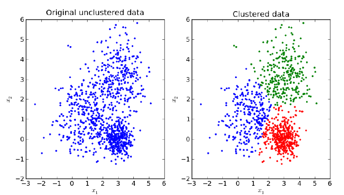

# Unsupervised Learning

> 비지도 학습


### 머신러닝

- 지도학습
  - 회귀분석 (Regression)
  - 분류 (Classification)
- **비지도학습**
  - **클러스터링(Clustering)**
  - **차원 축소(Dimensionality Reduction)**
- 강화학습


### 지도 학습(Supervised Learning)

얻고자 하는 답(Y)으로 구성된 데이터를 학습


### 비지도 학습(Unsupervised Learning)

정답이 주어지지 않는 데이터 내에서 <u>숨겨진 구조</u>를 파악하는 학습


### Hard vs. Soft Clustering

**Hard clustering**

- 데이터 포인트들은 비슷한 것들끼리 뭉쳐있다

- 강아지와 고양이 구분하기 (100% 강아지, 100% 고양이)
- Hierarchical Clustering, **K-Means**, DBSCAN, OPTICS
- 비슷한 데이터 포인트끼리 모으는 것이 목표.

**Soft clustering**

- 한개의 데이터 포인트는 숨겨진 클러스터들의 결합이다

- 소설의 장르 구분하기 (60% 과학, 35% 판타지, 5% 역사)

- Topic Models, FCM, **Gaussian Mixture Models(EM)**, Soft K-Means

- 자연적인 현상은 Soft clustering에 해당되는 경우가 많음


### K 결정하기

1. 눈으로 확인
2. 모델이 데이터를 얼마나 잘 설명하는가
   - Elbow method
   - **Silhouette method**
   - Gap statistic method

고려할 것들

- 데이터의 특성
  - 어떻게 만들어진 데이터인가?
  - 데이터 포인트 외 다른 feature
- 분석 결과로 얻고자 하는 것
  - 고양이 vs 개 분류  (K=2)
  - 사람들의 행동 분석 (K=5, 6, ...)
  - 가격대비 효율성 분석


### 차원 축소

##### 와인 분석하기

178개의 와인들에 대한 13가지의 특성을 측정해 정리하고 이를 이용해 생산한 와인들을 종류별로 모아서 라인업으로 만들고 싶다


## 주성분 분석 (PCA: Principle Component Analysis)

### PCA: 왜 사용하는가?

1. 고차원의 데이터를 저차원으로 줄이기 위해 (예: 시각화)
   - 필연적으로 발생하는 데이터의 손실을 최소화 함

2. 데이터 정제
   - 데이터를 관찰할 때 생기는 필연적인 오류(Noise)를 차원을 줄임으로서 줄일 수 있다
   - 차원을 줄였을 때 모델이 잘 동작하는 경우가 많음


### Scikit-learn을 이용한 PCA

`sklearn.decomposition.PCA` [문서](https://scikit-learn.org/stable/modules/generated/sklearn.decomposition.PCA.html#sklearn.decomposition.PCA)

```python
import sklearn.decomposition

pca = sklearn.decomposition.PCA(n_components=2)
pca.fix(X)
# Apply dimensionality reduction to X.
pca_array = pca.transform(X)
```


### 정규화

각각의 데이터가 가진 스케일의 차이를 정규화를 통해 없앤다.

```python
def normalize(X):
    # 각각의 데이터에 해당하는 feature의 값이 최소 0, 최대 1이 되도록 선형적으로 데이터를 이동
    X -= np.min(X)
    X /= np.max(X) - np.min(X)
    return X
```


## 클러스터링 (Clustering)

### 클러스터링

주어진 데이터를 <u>비슷한 그룹</u>(클러스터)으로 묶는 알고리즘




### K-Means Clustering

클러스터의 개수 **K**를 주고, 반복을 이용해 클러스터링

- **중심 Centroid**: 각 클러스터의 '중심'을 의미

- **중심과의 거리 distance**: 중심과 데이터 포인트와의 거리


0. **중심**(Centroid)의 위치에 의해 클러스터링을 진행. 알고리즘을 시작할 때, 초기 중심값은 데이터 중 **임의로 선정**

1. 중심값이 정해지면, 각각의 데이터 포인트에 대해 '**가장 가까운 중심점**'을 계산하여 탐색
2. 정해진 클러스터에서 **중심점**을 다시 계산. 중심점은 **해당 클러스터** 내 데이터 포인터 **위치의 무게중심**(또는 평균)값


##### 일반적인 클러스터링

```python
def kmeans(X, num_clusters, initial_centroid_indices):
    import time
    N = len(X)
    centroids = X[initial_centroid_indices]
    labels = np.zeros(N)
    
    while True:
        '''
        Step 1. 각 데이터 포인트 i 에 대해 가장 가까운
        중심점을 찾고, 그 중심점에 해당하는 클러스터를 할당하여
        labels[i]에 넣습니다.
        가까운 중심점을 찾을 때는, 유클리드 거리를 사용합니다.
        미리 정의된 distance 함수를 사용합니다.
        '''
        for i in range(N):
            dists = []
            for centroid in centroids:
                dists.append(distance(centroid, X[i]))
            
            dists = np.array(dists)
            labels[i] = np.argmin(dists)
        '''
        Step 2. 할당된 클러스터를 기반으로 새로운 중심점을 계산합니다.
        중심점은 클러스터 내 데이터 포인트들의 위치의 *산술 평균*
        으로 합니다.
        '''
        is_changed = False
        for i in range(num_clusters):
            next_centroid = np.mean(X[labels==i], axis=0)
            if np.all(centroids[i] != next_centroid):
                is_changed = True
            centroids[i] = next_centroid
        '''
        Step 3. 만약 클러스터의 할당이 바뀌지 않았다면 알고리즘을 끝냅니다.
        아니라면 다시 반복합니다.
        '''
        if not is_changed:
            break
    
    return labels
```


##### 이미지 클러스터링

- `Pillow` 라이브러리를 이용

```python
```


### 