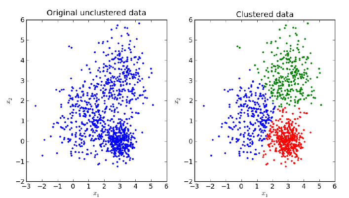
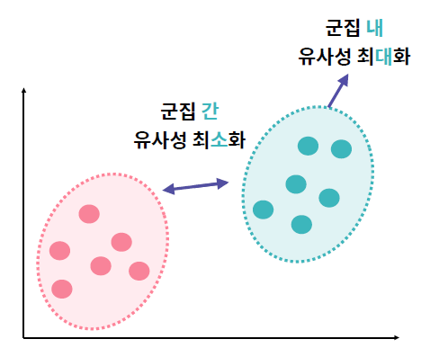
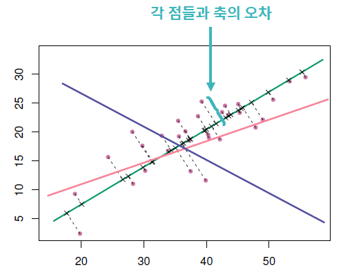

# Unsupervised Learning

> 비지도 학습


## 1. 비지도 학습

> Unsupervised Learning

### 머신러닝

- 지도학습
  - 회귀분석 (Regression)
  - 분류 (Classification)
- **비지도학습**
  - **클러스터링(Clustering)**
  - **차원 축소(Dimensionality Reduction)**
- 강화학습


### 지도 학습(Supervised Learning)

얻고자 하는 답(Y)으로 구성된 데이터를 학습


### 비지도 학습(Unsupervised Learning)

정답이 주어지지 않는 데이터 내에서 <u>숨겨진 구조</u>를 파악하는 학습


## 2. 클러스터링(Clustering)

### 클러스터링

주어진 데이터를 <u>비슷한 그룹</u>(클러스터)으로 묶는 알고리즘




### Hard vs. Soft Clustering

**Hard clustering**

- 데이터 포인트들은 비슷한 것들끼리 뭉쳐있다

- 강아지와 고양이 구분하기 (100% 강아지, 100% 고양이)
- Hierarchical Clustering, **K-Means**, DBSCAN, OPTICS
- 비슷한 데이터 포인트끼리 모으는 것이 목표.

**Soft clustering**

- 한개의 데이터 포인트는 숨겨진 클러스터들의 결합이다

- 소설의 장르 구분하기 (60% 과학, 35% 판타지, 5% 역사)

- Topic Models, FCM, **Gaussian Mixture Models(EM)**, Soft K-Means

- 자연적인 현상은 Soft clustering에 해당되는 경우가 많음


### 클러스터링 목표



- 군집 <u>간</u> 유사성 <u>최소화</u>: 다른 군집 간 데이터 간에는 서로 비슷하지 않게
- 군집 <u>내</u> 유사성 <u>최대화</u>: 동일 군집 내 데이터 간에는 서로 비슷하게


### 일반적인 클러스터링

```python
def kmeans(X, num_clusters, initial_centroid_indices):
    import time
    N = len(X)
    centroids = X[initial_centroid_indices]
    labels = np.zeros(N)
    
    while True:
        '''
        Step 1. 각 데이터 포인트 i 에 대해 가장 가까운
        중심점을 찾고, 그 중심점에 해당하는 클러스터를 할당하여
        labels[i]에 넣습니다.
        가까운 중심점을 찾을 때는, 유클리드 거리를 사용합니다.
        미리 정의된 distance 함수를 사용합니다.
        '''
        for i in range(N):
            dists = []
            for centroid in centroids:
                dists.append(distance(centroid, X[i]))
            
            dists = np.array(dists)
            labels[i] = np.argmin(dists)
        '''
        Step 2. 할당된 클러스터를 기반으로 새로운 중심점을 계산합니다.
        중심점은 클러스터 내 데이터 포인트들의 위치의 *산술 평균*
        으로 합니다.
        '''
        is_changed = False
        for i in range(num_clusters):
            next_centroid = np.mean(X[labels==i], axis=0)
            if np.all(centroids[i] != next_centroid):
                is_changed = True
            centroids[i] = next_centroid
        '''
        Step 3. 만약 클러스터의 할당이 바뀌지 않았다면 알고리즘을 끝냅니다.
        아니라면 다시 반복합니다.
        '''
        if not is_changed:
            break
    
    return labels
```


## 3. K-means Clustering

### 문제

100만 명 이상인 고객의 구매 상품 데이터를 활용하여 고객을 군집화 하고자 한다면?


### K-means Clustering이란?

제공된 데이터를 **K개**로 군집화 하는 알고리즘. EM(Expectation Maximization) 알고리즘 기반

군집화 할 개수 K는 직접 설정해야 하는 <u>하이퍼 파라미터</u>


### K 결정하기

1. 눈으로 확인
2. 모델이 데이터를 얼마나 잘 설명하는가
   - Elbow method: 다양한 K값을 시도해보고, 비용함수 그래프가 꺾이는 부분 즉, 클러스터 수를 증가시켜도 별 효과가 없는 지점의 K 선택
   - **Silhouette method**
   - Gap statistic method

**고려할 것들**

- 데이터의 특성
  - 어떻게 만들어진 데이터인가?
  - 데이터 포인트 외 다른 feature
- 분석 결과로 얻고자 하는 것
  - 고양이 vs 개 분류  (K=2)
  - 사람들의 행동 분석 (K=5, 6, ...)
  - 가격대비 효율성 분석


### K-Means Clustering 원리

클러스터의 개수 **K**를 주고, 반복을 이용해 클러스터링

- **중심 Centroid**: 각 클러스터의 '중심'을 의미

- **중심과의 거리 distance**: 중심과 데이터 포인트와의 거리


0. 데이터셋 중에서 K개를 **랜덤하게** 뽑아 해당 데이터를 **중심**으로 함 

1. 중심값이 정해지면, 각각의 데이터 포인트에 대해 '**가장 가까운 중심점**'을 계산하여 탐색
2. 정해진 클러스터에서 **중심점**을 다시 계산. 중심점은 **해당 클러스터** 내 데이터 포인터 **위치의 무게중심**(또는 평균)값


### K-means Clustering 특징 및 활용

- 랜덤 초기값 설정으로 인해 데이터 분포가 독특한 경우 원하는 결과 나오지 않을 가능성
- 시간 복잡도 가벼워 많은 계산량이 필요한 대용량 데이터에 적합
- 실제 문제에 적용할 때는 여러 번 클러스터링을 수행해 가장 빈번히 등장하는 군집에 할당


### Scikit-learn을 이용한 K-means clustering

`from sklearn.cluster import KMeans`

`KMeans(init, n_clusters, random_state)`

- `init`: 중심점 초기화 방법 설정 ('random'으로 설정할 경우 랜덤으로 중심점을 초기화함)
- `n_clusters`: 군집의 개수, 즉 군집 중심점의 개수
- `random_state`: 일관된 결과 확인을 위한 설정값

`[Model].fit(data)`

`[Model].labels_`: 각 데이터가 속한 군집 중심점 label을 반환

`[Model].cluster_centers_`: 군집의 중심값


## 4. Gaussian Mixture Model(GMM)

### 문제

클러스터에 속하는 정도를 표현하는 클러스터링 알고리즘


### Gaussian Mixture Model(GMM)


전체 데이터의 확률분포가 여러 개의 정규분포의 조합으로 이루어져 있다고 가정하고, 각 분포에 속할 확률이 높은 데이터끼리 클러스터링 하는 방법


### GMM 원리

1. 학습 데이터의 분포와 유사한 k개의 정규 분포를 추출
2. 개별 데이터가 어떤 정규 분포에 속하는지 결정 (k개의 정규 분포는 k개의 클러스터에 해당됨)


### GMM 진행 과정 

1. 각 클러스터마다 해당 클러스터가 선택될 **확률**과 **평균**, 그리고 **분산**을 랜덤하게 초기화
   - 클러스터가 선택될 확률 = 데이터가 어떤 클래스에 속하는지
   - 평균, 그리고 분산 = 클러스터의 형태
2. 변화가 없을 때까지 모든 **데이터**에 대해서 아래 과정 반복
   - 클러스터가 선택될 확률, 평균, 분산이 주어짐
   - 각 데이터가 어느 클러스터에 들어가는지 계산
3. 변화가 없을 때까지 모든 **클러스터**에 대해서 아래 과정 반복
   - 각 데이터가 어느 클러스터에 들어가는지가 주어짐
   - 각 클러스터마다 선택될 확률, 평균, 분산 계산


### Scikit-learn을 이용한 GMM

`from sklearn.mixture import GaussianMixture`

`GaussianMixture(n_components, random_state)`

- `n_components`: 군집의 개수
- `random_state`: 일관된 결과 확인을 위한 설정값

`[Model].fit(data)`

`[Model].predict(data)`


### 클러스터링 타당성 평가

정답이 없기 떄문에 실제값과 예측값의 오차 혹은 단순 정확도 지표로 평가할 수 없음

**군집 간 거리**, **군집의 지름**, **군집의 분산**을 고려하여 클러스터링 목표 달성 여부 확인

대표적 평가 지표

- Dunn Index

  클수록 높은 성능을 의미

  `(군집 간 거리의 최소값) / (군집 내 요소 간 거리의 최대값)`

- Silhouette 지표

  클러스터의 밀집 정도 계산. -1~1의 값을 가지며 1에 가까울 수록 높은 성능

  `[a(i) - b(i)] / max(a(i), b(i))`

  - a(i): i번째 데이터가 속한 군집과 가장 가까운 이웃 군집을 택해서 계산한 값
  - b(i): i번째 데이터와 같은 군집에 속한 요소들 간 거리의 평균


### K-Means vs GMM

- K-Means 클러스터링은 군집화 범위가 원형. 따라서 데이터 셋의 분포가 원형에 가까울수록 효율이 높아짐
- GMM은 데이터가 원형이 아니라도 사용할 수 있음. 분포 방향에 다라 군집화를 진행


### 타원형 분포 생성을 위한 scikit-learn lib

`make_blobs(n_samples, n_features, centers, cluster_std, random_state)`

- `n_samples`: 생성할 데이터의 총 개수
- `n_features`: 데이터의 변수 개수, 시각화를 위해 보통 2개로 설정
- `centers`: 군집의 개수
- `cluster_std`: 데이터의 표준편차
- `random_state`: 일관된 결과를 위한 설정값


## 5. 차원 축소(Dimensionality Reduction)

### 문제

데이터 변수의 개수를 줄여 데이터의 차원을 줄이면 어떨까?

178개의 와인들에 대한 13가지의 특성을 측정해 정리하고 이를 이용해 생산한 와인들을 종류별로 모아서 라인업으로 만들고 싶다


### 차원 축소란?

고차원의 데이터를 <u>저차원으로 줄이는</u> 알고리즘

엄청나게 많은 변수를 가지고 있는 고차원의 데이터에서는 **차원의 저주**가 발생할 가능성이 높아짐


### 차원의 저주

차원이 높을 수록 학습에 요구되는 데이터의 개수도 증가함

고차원일 때 적은 개수의 데이터로만 차원을 표현하는 경우 과적합 발생 가능


### 차원 축소의 필요성

차원의 저주 발생 방지와 모델 학습 속도 및 성능 향상을 위한 차원 축소 알고리즘

1. 주성분 분석(Principle Component Analysis)
2. t-SNE(t-Stochastic Neighborhood Embedding)


## 6. 주성분 분석(PCA)

### 주성분 분석(Principle Component Analysis)

고차원 데이터를 가장 잘 설명할 수 있는 **주성분**을 찾는 방법

차원을 축소하면서도 <u>원본 데이터의 특징</u>을 가지고 있을 수 있도록 함

- 원본 데이터와의 차이를 최소화 해야 함
- 원본 데이터와의 차이를 최소화 하는 축을 찾아야함


### PCA: 왜 사용하는가?

1. 고차원의 데이터를 저차원으로 줄이기 위해 (예: 시각화)
   - 필연적으로 발생하는 데이터의 손실을 최소화 함

2. 데이터 정제
   - 데이터를 관찰할 때 생기는 필연적인 오류(Noise)를 차원을 줄임으로서 줄일 수 있다
   - 차원을 줄였을 때 모델이 잘 동작하는 경우가 많음


### 주성분 분석 원리

**2차원 데이터를 1차원으로 차원 축소할 경우**



여러 갈래의 축을 확인해보며 각 점들과 축의 오차가 가장 작은 축을 중심으로 데이터를 모은다


### 주성분 분석 특징 및 활용

- 고차원의 데이터를 함축적으로 표현하기 때문에 직관적 해석이 어려울 수 있음
- 대용량 고차원 데이터 압축 시 유용하게 활용됨


### Scikit-learn을 이용한 PCA

`from sklearn.decomposition import PCA` [문서](https://scikit-learn.org/stable/modules/generated/sklearn.decomposition.PCA.html#sklearn.decomposition.PCA)

`PCA(n_components)`

`[Model].fit(data)`: 차원 축소를 위한 학습

`[Model].transform(data)`: 차원 축소를 시킨 결과 데이터를 반환

`[pca].inverse_transform(pca_data)`: PCA 복원하기

`[pca].score(X, y)`: 평균 log-likelihood 반환


## 7. t-SNE

### 문제

고차원 공간에서 데이터들의 군집을 구별하여 시각화하고 싶다면?

PCA 사용 시 함축적 표현 - 시각화 진행 시 구별하기 어려움


### t-SNE(t-Scholastic Neighborhood Embedding)

고차원의 공간에 존재하는 <u>데이터 간의 거리를 최대한 유지</u>하며 차원을 축소하는 방법

기존 데이터 공간에서 서로 가까이 있는 데이터는 차원이 줄어든 공간에서도 가까이 있어야 함


### t-SNE 원리

1. 각 데이터마다 자기 이외의 데이터와의 유사도 확률 계산	

2. 저차원으로 축소	

3. 초기 계산했던 유사도 확률 분포를 바탕으로 각 데이터를 이동	


### t-SNE 특징 및 활용

- 데이터 간 거리 유지를 통해 차원 축소 이후에도 객체 간 구별이 가능함
- 계산시 마다 값이 지속적으로 변경되어 예측을 위한 학습 데이터로는 사용 불가
- 고차원 데이터의 시각화를 위해 활용됨


### Scikit-learn을 이용한 t-SNE

`from sklearn.manifold import TSNE`

`TSNE(n_components)`

`[Model].fit_transform(data)`: 차원 축소를 위한 학습과 차원 축소를 동시에 진행


