# 다양한 분야의 딥러닝

> 이미지 처리, CNN, 자연어 처리, 워드 임베딩, RNN


## 합성곱 신경망(CNN; Convolution Neural Network)

### CNN

컴퓨터로 이미지를 제대로 인식하기 위해 이미지의 특징을 이해할 수 있는 모델이 필요해짐

작은 필터를 순환시키는 방식으로 이미지의 패턴이 아닌 특징을 중점으로 인식하는 CNN이 등장

### CNN의 구조

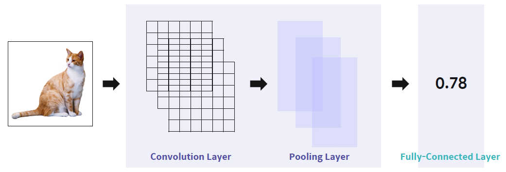

입력이미지의 특징을 추출, 분류하는 과정으로 동작

### Convolution Layer

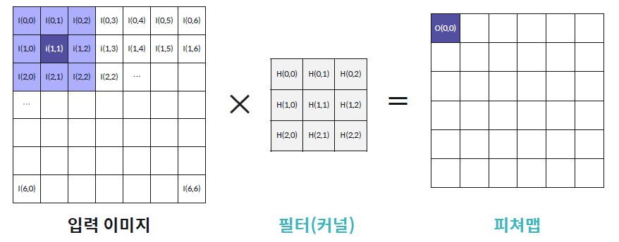

이미지에서 어떠한 특징이 있는 지를 구하는 과정

필터가 이미지를 이동하며 새로운 이미지(피쳐맵)를 생성

### 피쳐맵의 크기 변형: Padding, Striding

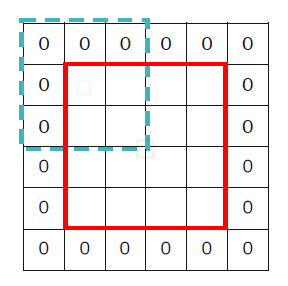

- Padding: 원본 이미지의 상하좌우에 값이 0인 픽셀들을 한 줄씩 추가. 가장자리에 있는 것을 잘 찾을 수 있게 함
- Striding: 필터를 이동시키는 거리(Stride) 설정

### Pooling Layer

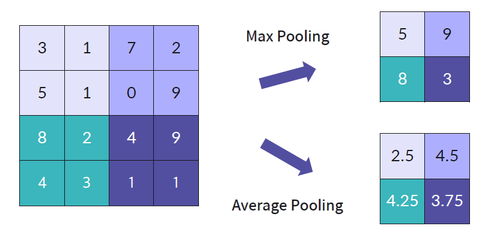

이미지의 왜곡의 영향(노이즈)를 축소하는 과정

Max Pooling을 더 많이 씀

### Fully Connected Layer

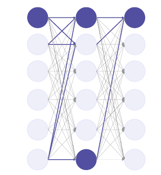

추출된 특징을 사용하여 이미지를 분류

### 분류를 위한 Softmax 활성화 함수

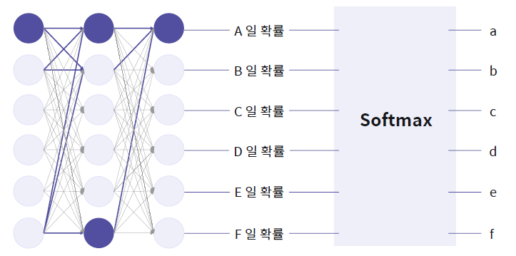

마지막 계층에 Softmax 활성화 함수 사용

a+b+c+d+e+f=1, a,b,c,d,e,f>=0

### 정리

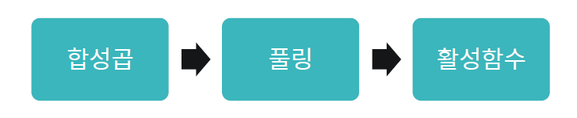

Convolution Layer는 특징을 찾아내고, Pooling Layer는 처리할 맵 크기를 줄여준다. 이를 N번 반복한다.

반복할 때마다 줄어든 영역에서의 특징을 찾게 되고, 영역의 크기는 작아졌기 때문에 빠른 학습이 가능해진다.

### 이미지 데이터 확인하기

```python
import PIL
# 이미지 불러오기
PIL.Image.open(path)
# 이미지 크기 조정하기
PIL.Image.resize(width, height)
```

#### Keras를 이용한 이미지 데이터 분류

`tf.keras.layers.Flatten()`: 2차원 데이터를 1차원 데이터로 평평하게 만들어줌

`from tensorflow.keras.utils import to_categorial`

- label을 클래스화 할 수 있는 **one-hot encoding**을 해주는 모듈
- 예시 `label = to_categorical(label, 10)`

### Keras를 이용한 CNN 모델

✅ 일반적으로 CNN 모델은 **Convolution레이어 - MaxPooling레이어** 순서를 반복해 층을 쌓다가, 마지막 MaxPooling레이어 다음에 **Flatten레이어**를 하나 쌓고, 이후 몇 개의 **Dense레이어**를 더 쌓아 완성한다.

`tf.keras.layers.Conv2D(filters, kernel_size, activation, padding)`

- 입력 이미지의 특징 즉, 처리할 특징 맵(map)을 추출하는 레이어
- `filters`: 필터(커널) 개수
- `kernel_size`: 필터(커널)의 크기
- `activation`: 활성화 함수
- `padding`: 이미지가 필터를 거칠 때 그 크기가 줄어드는 것을 방지하기 위해서 가장자리에 0의 값을 가지는 픽셀을 넣을 것인지 말 것인지를 결정 (`SAME` 혹은 `VALID`)

`tf.keras.layers.MaxPool2D(padding)`

- 처리할 특징 맵(map)의 크기를 줄여주는 레이어
- `padding`: `SAME` 혹은 `VALID`

`np.expand_dims(data, axis)`

- NumPy 배열 데이터에서 마지막 축(axis)에 해당하는 곳에 차원 하나를 추가하는 코드
- `axis`: 추가하려는 차원의 위치


## 자연어 처리를 위한 딥러닝

### 자연어 처리(NLP; Natural Language Processing)

자연어의 의미를 분석하여 컴퓨터가 처리할 수 있도록 하는 일

### 자연어 처리 Process

1. 자연어 전처리(Preprocessing)
2. 단어 표현(Word Embedding)
3. 모델 적용하기(Modeling)

### 자연어 전처리 방법

Noise canceling, Tokenizing, StopWord removal

### Noise canceling

"안녕하 세요. 반갑 스니다." => "안녕하세요. 반갑습니다."

자연어 문장의 스펠링 체크 및 띄어쓰기 오류 교정

### Tokenizing

"딥러닝 기초 과목을 수강하고 있습니다." => [''딥', '러닝', '기초', '과목', '을', '수강', '하고', '있습니다', '.']

문장을 <u>토큰(Token)</u>으로 나눔. 토큰은 어절, 단어 등으로 목적에 따라 다르게 정의

##### 토큰화를 위한 Twitter 라이브러리

`from konlpy.tag import Twitter`

- 한국어 자연어 처리를 위한 konlpy라이브러리에서 Twitter 모듈을 불러오기. 형태소 분석기.

`Twitter.morphs(sentence)`

- 한국어 문장인 `sentence`를 형태소에 따라 분할하기

`Twitter.pos(sentence)`

- 한국어 문장인 `sentence`를 형태소와 그에 따른 품사에 따라 분할하기

### StopWord removal

한국어 StopWord 예시: 아, 휴, 아이구, 아이쿠, 아이고, 쉿, 그렇지 않으면, 그러나, 그런데, 하지만, ...

불필요한 단어를 의미하는 불용어(StopWord) 제거


## 워드 임베딩(Word Embedding)

### 워드 임베딩(Word Embedding)

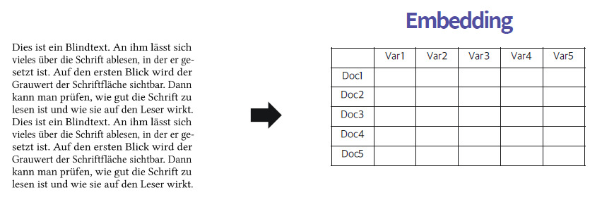

비정형 데이터를 정형 데이터로 바꾸는 작업

### 워드 임베딩의 종류

**Count-based Representations**

- Bag of Words
- One-hot encoding
- Document term matrix

**Distributed Representations**

- Word2vec

### Bag of Words

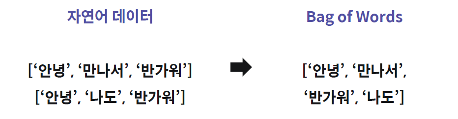

자연어 데이터에 속해있는 단어들의 가방. 요새는 Word2vec을 더 많이 사용함.

### One-hot encoding

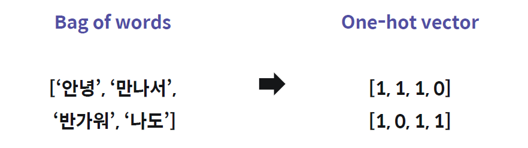

학습 데이터의 모든 토큰을 크기로 한 벡터에서 해당 문장에 토큰이 존재하는지 확인

##### One-hot encoding을 위한 Keras

`from tensorflow.python.keras.preprocessing.text import Tokenizer`

`tokenizer.fit_on_texts(sentence)`

- 들어온 `sentence` 리스트에 존재하는 리스트 요소(단어)마다 고유 인덱스를 붙이는 작업을 하는 메소드

`tokenizer.word_index`

- 위 작업의 결과를 딕셔너리 형태로 반환하는 메소드

`tokenizer.texts_to_sequences(sentence)`

- 문자열을 정수 인덱스의 리스트로 변환 후 반환하는 메소드

`tf.one_hot(sen, len(word_dict))`

- 들어온 리스트 `sen`을 텐서플로우를 사용하여 one-hot encoding 하는 메소드
- one-hot vector의 총 길이는 `word_dict` 안의 word의 총 개수

### Document term matrix

`정부가 발표하는 물가상승률과 소비자가 느끼는 물가상승률은 다르다.`

`('정부': 0, '가': 1, '발표': 2, '하는': 3, '물가상승률': 4, '과': 5, '소비자': 6, '느끼는': 7, '은': 8, '다르다': 9)`

`[1, 2, 1, 1, 2, 1, 1, 1, 1, 1]`

One-hot encoding 결과에 빈도수 정보를 추가

- 빈도수를 이용해 유사도를 비교할 수 있음


### Word2vec

단어들을 의미상으로 <u>유사한 단어가 벡터공간에 가까이 있도록</u> Mapping 시키는 작업을 의미

특정 함수를 통해 우리가 원하는 차원으로 단어의 벡터를 Embedding 함 

- 단순히 빈도를 이용하여 비교하는 것이 아닌 단어들과의 관계를 고려하여 유사도를 비교하거나 할 수 있음

### Word2vec 예시 - 중심 단어와 주변 단어

`내가 어떻게 해야 그대를 잊을 수 있을까`

`‘내’, ‘가’, ‘어떻게’, ‘해야’, ‘그대’, ‘를’, ‘잊을’, ‘수’ ‘있을’, ‘까’`

- "<u>비슷한 단어는 비슷한 맥락(위치)에서 나온다</u>"

##### CBOW 방식

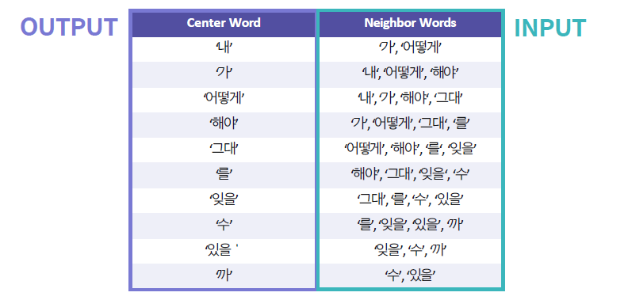

- 주변 단어(Context Words)로 중심 단어(Center Word)를 예측하도록 학습

##### Skip-gram 방식

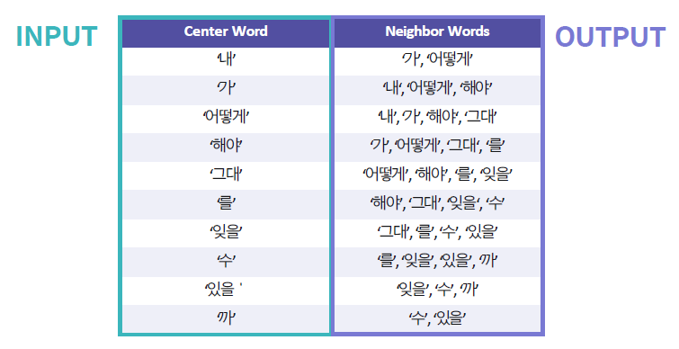

- 중심 단어(Center Word)로 주변 단어(Context Words)를 예측하도록 학습

### Word2Vec을 위한 Python 라이브러리

`from gensim.models import word2vec`

`word2vec.Word2Vec(data, size, min_count, window, sg)`

- `data`: 리스트 형태의 데이터
- `size`: 문자 벡터 차원 수
- `min_count`: 사용할 단어의 최소 빈도수
- `window`: 고려할 앞뒤 단어 수
- `sg`: 0 - CBOW, 1 - Skip-gram

`model.wv.index2word`

- Word2Vec 모델인 `model`에 리스트 데이터 `data`를 넣은 결과를 반환해주는 메서드


## 순환 신경망(RNN; Recurrent Neural Network)

### MLP(Multi-layer Perceptron) 기반 신경망의 자연어 분류 방식

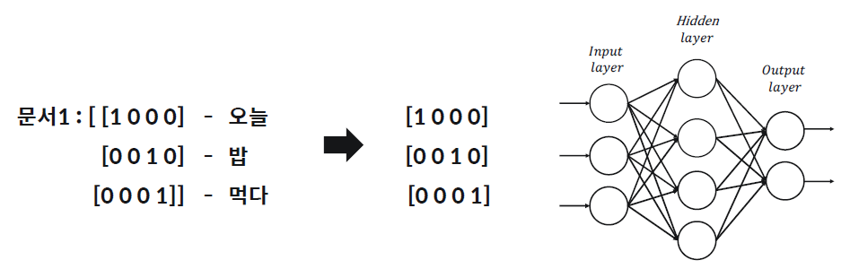

- 자연어 문장을 기존 MLP 모델에 적용시키기에는 한계가 있음

- 많은 경우 문장은 <u>순서가 바뀌면 의미가 달라짐</u>

### 자연어 분류를 위한 순환 신경망(RNN)

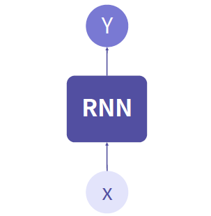

- 입력 노드는 단 하나 (주로 one-hot vector 입력)

### RNN의 입출력 구조

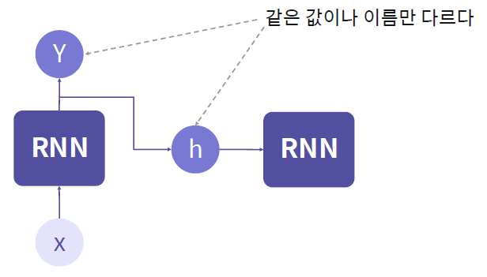

- 출력 값을 두 갈래로 나누어 신경망에게 '기억'하는 기능을 부여

### RNN 기반 자연어 분류 예시 

ex) input: [[수업], [이], [너무], [재밌어]] label: [1] (0: 부정, 1: 긍정)

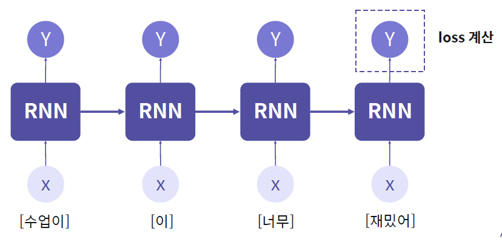

- 뒤로 가면서 이전의 요소들을 고려하여 뒤의 내용들을 예측
- 이전 데이터를 현재 데이터의 계산에 반영
- 수업 -> 수업이 -> 수업이 너무 -> 수업이 너무 재밌어

### 간단한 RNN 코드 예시

```python
def rnn(inputs, input_size, output_size, bias = False):
    
    input_size = len(inputs[0])
    
    state = np.zeros((output_size,))
    
    w = np.ones((output_size, input_size))
    
    u = np.ones((output_size, output_size))
    
    b = np.random.random((output_size,))
    
    if not bias:
        b = np.zeros((output_size,))
    
    outputs = []
    
    for _input in inputs:
        
        _output = np.tanh(np.dot(w, _input) + np.dot(u, state) + b)
        outputs.append(_output)
        state=_output
        
    return np.stack(outputs, axis=0)
```

### Keras를 이용한 RNN 모델

일반적으로 RNN 모델은 입력층으로 **Embedding레이어**를 먼저 쌓고, **RNN레이어**를 몇 개 쌓은 다음, 이후 **Dense레이어**를 더 쌓아 완성한다.

`tf.keras.layers.Embedding(input_dim, output_dim, input_length)`

- 들어온 문장을 단어 임베딩(embedding)하는 레이어
- `input_dim`: 들어올 단어의 개수
- `output_dim`: 결과로 나올 임베딩 벡터의 크기(차원)
- `input_length`: 들어오는 단어 벡터의 크기

`tf.keras.layers.SimpleRNN(units, activation)`: 단순 RNN 레이어

`tf.keras.layers.LSTM(units, activation)`: LSTM 레이어

`tf.keras.layers.GRU(units, activation)`: GRU 레이어

- `units`: 레이어의 노드 수
- `activation`: 활성화 함수 (default: `tanh`)

