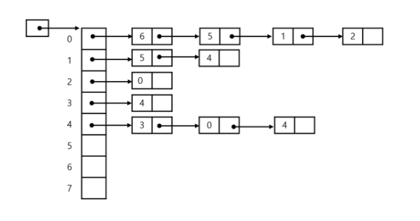

# Graph

> 정점(Vertex)들의 집합과 이들을 연결하는 간선(Edge)의 집합으로 구성된 자료구조

- 선형 자료구조나 트리로 표현하기 어려운 N대N 관계를 가지는 원소들을 표현하기 용이함
- 트리도 그래프이다


## 그래프 유형

- 무향 그래프(undirected graph)
- 유향 그래프(directed graph)
- 가중치 그래프(weighted graph)
- 사이클 없는 방향 그래프(DAG, directed acyclic graph)


## 그래프 표현

> 인접 행렬, 인접 리스트, 간선 리스트

#### 인접 행렬

- 두 정점을 연결하는 간선의 유무를 행렬로 표현
- 행 번호와 열 번호는 그래프의 정점에 대응
- 두 정점이 인접되어 있으면 1, 그렇지 않으면 0

- 무향 그래프
  - i번째 행의 합 = i번째 열의 함 = Vi의 차수
- 유향 그래프
  - i번째 행의 합 = Vi의 진출 차수
  - i번째 열의 합 = Vi의 진입 차수


#### 인접 리스트



- 각 정점에 대한 인접 정점들을 순차적으로 표현
- 하나의 정점에 대한 인접 정점들을 각각 노드로 하는 연결 리스트로 저장
- 정점의 개수 만큼의 Node 타입의 헤드로 이루어진 연결리스트 만들기 

```
무향 그래프 노드 수 = 간선의 수 * 2
각 정점의 노드 수 = 정점의 차수
```

```
유향 그래프 노드 수 = 간선의 수
각 정점의 노드 수 = 정점의 진출 차수
```


#### 간선 리스트

- 두 정점에 대한 간선 그 자체를 객체로 표현하여 리스트로 저장
- 간선을 표현하는 두 정점의 정보를 나타냄(시작 정점, 끝 정점, 가중치)

