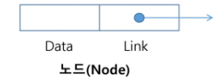
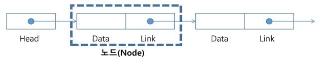
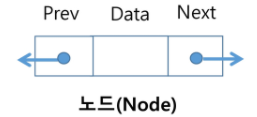
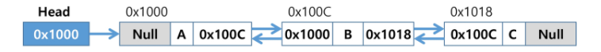
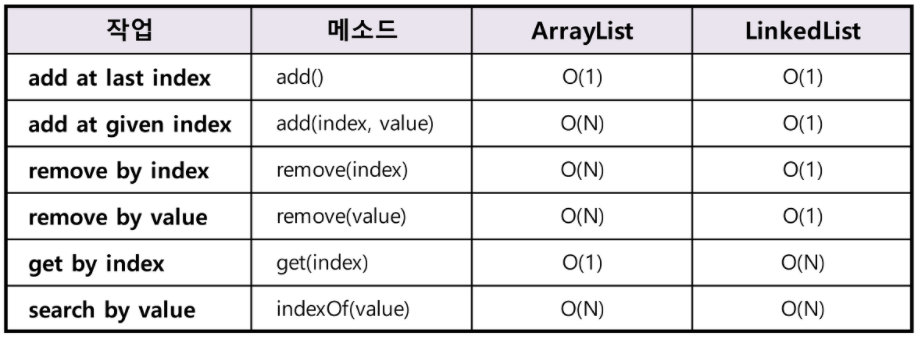

# List

> 순차 리스트, 연결 리스트

- 순서(원소를 관리하는 순서)를 가진 데이터의 집합을 가리키는 추상자료형
- 동일한 데이터를 가지고 있어도 상관없다
- 구현 방법에 따라 크게 두 가지로 나뉜다
  - 순차 리스트 : 배열을 기반으로 구현된 리스트
  - 연결 리스트 : 메모리의 동적 할당을 기반으로 구현된 리스트


## 순차 리스트

#### 구현 방법

- 1차원 배열에 항목들을 순서대로 저장한다
- 데이터의 종류와 구조에 따라 구조화된 자료구조를 만들어 배열에 저장할 수도 있다


#### 데이터 접근

- 배열의 인덱스를 이용해 원하는 위치의 데이터에 접근할 수 있다


#### 삽입 및 삭제

- 삽입 연산 : 삽입 위치 다음의 항목들을 뒤로 이동해야 한다
- 삭제 연산 : 삭에 위치 다음의 항목들을 앞으로 이동해야 한다


#### 문제점

- 단순 배열을 이용해 구현하는 경우, 자료의 삽입/삭제 과정에서 원소들을 이동시키는 작업이 필요하다
- 원소의 개수가 많고 삽입/삭제 연산이 빈번하게 일어날수록 작업에 소요되는 시간이 크게 증가한다
- 배열의 크기가 정해져 있는 경우 실제 사용되는 메모리보다 크게 할당하여 메모리 낭비를 초래할수도 있고, 반대로 할당된 메모리보다 많은 자료를 사용해 새로 배열을 만들어 복사해야하는 경우가 발생할 수 있다.


## 연결 리스트 (Linked List)

> 단순 연결 리스트, 이중 연결 리스트, 원형 연결 리스트

#### 특성

- 자료의 논리적인 순서와 메모리 상의 물리적인 순서가 일치하지 않고, 개별적으로 위치하는 원소들을 연결해 하나의 전체적인 자료구조를 이룬다
- 링크르 통해 원소에 접근하므로, 순차 리스트처럼 물리적인 순서를 맞추기 위한 작업이 필요하지 않다
- 자료구조의 크기를 동적으로 조정할 수 있어, 메모리의 효율적인 사용이 가능하다


#### 기본 구조



- 노드
  - 연결 리스트에서 하나의 원소를 표현하는 building block
  - Data 필드
    - 원소의 값을 저장
    - 저장할 원소의 종류나 크기에 따라 구조를 정의하여 사용함
  - Link 필드
    - 다음 노드의 reference 값을 저장

- 헤드
  - 연결 리스트의 첫 노드에 대한 참조값을 가지고 있음


### 단순 연결 리스트 (Singly Linked List)

#### 연결 구조



- 노드가 하나 링크 필드에 의해 다음 노드와 연결되는 구조
- 헤드가 가장 앞의 노드를 가리키고, 링크 필드가 연속적으로 다음 노드를 가리킨다
- 링크 필드가 `null`인 노드가 연결 리스트의 가장 마지막 노드이다


#### 삽입

- 공백 리스트에 새로운 노드 삽입
  1. 삽입할 새로운 노드 생성, Data 저장
  2. Head의 새로운 노드의 참조값을 저장
- 공백이 아닌 리스트에 새로운 노드 삽입
  1. 삽입할 새로운 노드 생성, Data 할당
  2. 새로운 노드의 Link에 삽입할 위치의 앞 노드(preNode)의 Link를 저장
  3. preNode의 Link에 새로운 노드의 참조값을 저장


#### 삭제

1. 삭제할 노드의 이전 노드(preNode)의 Link에 삭제할 노드의 Link를 저장


:heavy_check_mark: 노드를 하나씩 탐색하는 반복문 (**Java**)

```java
for(Node currNode = head; currNode != null; currNode = currNode.link)
```


### 이중 연결 리스트

#### 특성



- 양쪽 방향으로 순회할 수 있도록 노드를 연결한 리스트
- 두 개의 링크 필드와 한 개의 데이터 필드로 구성


#### 연결 구조




#### 삽입

1. 삽입할 새로운 노드 생성, Data 저장
2. 새로운 노드의 Next에 삽입할 위치의 앞 노드(prenode)의 Next를 저장, Prev에 preNode의 참조값을 저장
3. prenode의 Next에 새로운 노드의 참조값을 저장


#### 삭제

1. 삭제할 노드의 이전 노드(preNode)의 Next에 삭제할 노드의 Next를 저장
2. 삭제할 노드의 다음 노드(nextNode)의 Prev에 삭제할 노드의 Prev를 저장


## Java의 리스트

> List Interface를 구현한 ArrayList, LinkedList를 이용해 각각 순차 리스트와 연결 리스트를 구현할 수 있음

- ArrayList와 LinkedList는 아래와 같은 시간 복잡도를 가짐
  - 시간 복잡도를 고려해 처리하려는 작업에 맞는 클래스를 사용해야 한다


