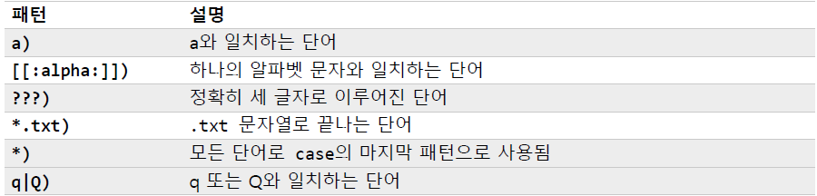

# Shell Script

> Shell이 수행해야 할 명령들의 집합
>
> Hello, world!, 변수, 출력, 입력, 연산, 분기문, 반복문, 배열, 함수, 위치 매개변수, 시그널

- 확장자를 반드시 사용할 필요는 없으나 관례적으로 `.sh` 확장자를 사용


## Hello, world!

```bash
#!/bin/bash
# this is comment
echo "Hello, world!"
```

- 해쉬뱅 (SheBang)
  - 쉘 스크립트 작성 시, 반드시 `#!`로 시작해야 하며 이를 해쉬뱅이라 함
  - 현재 파일이 쉘 스크립트라는 것을 알려주는 지시자 역할
  - 해쉬뱅 다음으로 스크립트를 실행할 인터프리터를 명시해야 함
  - 프로그램을 명시할 때, 반드시 절대 경로를 사용

#### 주석

```bash
# this line is comment
```

- `#`으로 시작하는 라인  


#### 스크립트 실행

- 스크립트 작성 후, 독립실행을 하려면 실행 권한을 설정해야 함
- `chmod` 명령어를 이용해 실행 권한 부여

```bash 
chmod 777 hello.sh
chmod u+x hello.sh
```

#### 스크립트 종료

- 쉘에서 명령어의 종료 상태를 저장하기 위해 `?` 특수 변수를 사용

```bash
echo $?
```

- 스크립트에서는 마지막에 실행된 명령어에 의해 결정
- `exit <number>` 명령어를 사용해 종료 상태를 지정할 수 있음
- 종료 상태 값
  - 0 - 정상 종료
  - 127 - 명령어를 찾지 못함
  - 스크립트 실행 중에 시그널에 의해 종료된 경우, 128에 시그널 값이 더하여 저장
    - `ctrl + c`로 종료된 경우 130


## 변수

#### 변수

데이터 또는 값을 저장할 수 있는 메모리 공간

- 쉘 스크립트는 타입이 존재하지 않으며, 기본적으로 <u>문자열</u>로 처리
- 변수 이름 규칙
  - 알파벳, 숫자, 밑줄만 사용
  - 첫 글자는 반드시 알파벳 또는 밑줄
  - 공백 및 구두점 사용 X
- `=` 대입 연산자는 앞, 뒤에 <u>공백이 없어야 함</u>
- `$` 붙여 참조


## 출력

#### echo

```bash
echo
```

- 문자열 출력 후 개행을 함
  - 개행을 하지 않으려면 `-n` 옵션

#### printf

```bash
printf "<format>" <arguments>
```

- 줄바꿈을 위해 개행문자 `\n` 삽입해야 함

- % 변환 지정자

  - `d`: 부호를 가진 10진수
  - `f`: 부동 소수점 수 형태
  - `o`: 8진수 형태
  - `s`: 문자열 형태
  - `x`: 16진수 형태
  - `X`: 16진수 형태, 대문자
  - `%`: 상수 기호 % 출력

- 변환 지정자에 다수의 선택 요소들이 추가될 수 있음

  - `%[flags][width][.precision]conversion_specification`

  


## 입력

#### read

표준 입력으로 들어온 내용을 한 줄씩 읽어옴

```bash
read [-options] [variables]
```

- 선언된 변수 개수보다 더 많은 단어가 입력되면 나머지 단어들은 마지막 변수에 저장

- 옵션
  - `-n <num>`: 입력된 줄 전체 대신 num 수의 문자만을 읽어옴
  - `-p <prompt>`: prompt 문자열을 이용해 입력을 위한 프롬프트를 띄운다
  - `-s`: 묵음 모드. 문자를 입력할 때마다 해당 문자를 다시 표시하지 않음. 비밀번호 입력에 사용


## 연산

#### 산술 연산

변수에 문자열로 저장된 값을 산술 연산에 사용하려면 정수형 변수를 선언해야 함

- `declare`, `let`
- `expr`, `[]`, `(())`
- -2,147,483,648 ~ 2,147,483,647
- 부동 소수점은 지원하지 않음


#### declare

```bash
declare
ex) declare -i result=0
    result=5+5      # 표현식에 공백 사용 X
    result="5 + 5"  # 큰 따옴표를 사용하면 공백은 분리자로 사용되지 않음
    result=$n1+$n2  # 변수를 사용한 연산 가능 
    result=2#1111   # 2진수
    result=8#17     # 8진수
    result=16#f     # 16진수
```

- `-i` 옵션을 사용해아 하며, 반드시 정수만 저장해야 한다
- 수식 사이에 공백을 사용할 수 없음
- 32 bit signed integer

#### let

```bash
let <var>=<expr>
ex) let result=4%3
    let result=2**10
    let 'ret = 1 + 1'   # 공백을 사용하려면 ' 또는 " 사용
    num=0
    let num+=2          # 복합 대입 연산자
    let result=++num    # 단항 연산자
    let ret=2\>0        # 비교 연산자. 백슬래시나 따옴표를 사용해야 함
    let ret=2!=0
```

- 수식 사이에 공백을 사용할 수 없음
- 계산된 결과를 반드시 변수에 저장해야 함


#### expr

```bash
expr <expression>
ex) result=$(expr 2 + 2)
    expr 9 \* 9    # 곱셈 기호에 백슬래시 붙이기
    expr 2 \> 1    # 부등호도 백슬래시 붙이기
    expr 1 == 1
    expr 1 \| 0    # 논리합
    expr 1 \& 0    # 논리곱
```

#### []

```bash
$[<expression>]
ex) result=$[2 * 2]
    result=$[var++]       # 변수에 $를 붙이지 않아도 됨
    result=$[var1 > var2]
```

- 수식을 좀 더 편리하게 처리

#### (())

```bash
((<expression>))
ex) num=0
    ((num = num + 1))
    ((num += 1))
    ((ret = 10 >= 1))
    result=$((2 ** 10))
    result=$((var1 * var2))
```

- 산술 연산을 위한 전용 문법. 문자열은 다루지 않고 오직 숫자만 처리
- 내부에 알파벳으로 된 단어가 나타나면 변수로 해석
- 큰 따옴표나 작은 따옴표 사용 X


#### bc

```bash
bc
# 파이프를 이용
echo $(echo "scale=4; 3.44 / 5" | bc)
echo $(echo "scale=4; $var1 / $var2" | bc)
# here document 이용
bc << EOF
scale=4
3.44 / 5
EOF
# pi 계산
radius=2
echo $(bc << EOF
scale=5
3.14 * $radius * $radius
EOF)
```

- 쉘에서 <u>부동 소수점을 처리</u>할 수 있음

- `scale` 내장 변수로 소수점 이하 자릿수 출력을 결정. 기본값은 0

- 다음을 인식

  - 숫자 (정수, 부동 소수점)
  - 변수 (단순 변수, 배열)
  - 주석
  - 수식
  - 프로그래밍 문법
  - 함수

  

## 문자열 처리

#### expr

##### 문자열 길이 계산

```bash
expr length <string>
```

##### 특정 문자의 위치 계산 

- 인덱스 값은 1부터 시작

```bash
expr index <string> <characters>
ex) expr index "hello" "oe"
```

##### 부분 문자열 추출

- 인덱스 값은 1부터 시작

```bash
expr substr <string> <start> <length>
ex) expr substr "ABCDEFGHIJK" 2 4
```


#### {}

##### 문자열 길이 계산

```bash
${#<var>}
```

##### 부분 문자열 추출

- 길이를 명시하지 않으면 끝까지 추출

```bash
${<var>:<start>:<length>}
```

##### 부분 문자열 삭제

```bash
# 앞에서부터 가장 짧게 일치하는 부분 문자열 삭제
${<var>#<substr>}
# 앞에서부터 가장 길게 일치하는 부분 문자열 삭제
${<var>##<substr>}
ex) str="ABCDEFABCDEF123"
    echo ${str#A*F}
    echo ${str##A*F}
# 뒤에서부터 가장 짧게 일치하는 부분 문자열 삭제
${<var>%<substr>}
# 뒤에서부터 가장 길게 일치하는 부분 문자열 삭제
${<var>%%<substr>}
ex) str="123ABCEFABCDEF"
    echo ${str%A*F}
    echo ${str%%A*F}
```

##### 부분 문자열 치환

```bash
# 처음 일치하는 부분 문자열을 치환 문자열로 치환
${<str>/<substr>/<replace>}
# 일치하는 모든 문자열을 치환문자열로 치환
${<str>//<substr>/<replace>}
# 가장 앞에서 일치하는 문자열을 치환
${<str>/#<substr>/<replace>}
# 가장 뒤에서 일치하는 문자열을 치환
${<str>/%<substr>/<replace>}
```


## 분기문

#### if

##### test문 이용 - 가독성이 떨어짐

```bash
if test $REPLY -eq 0; then
    echo "number is zero"
fi
```

- `test`에서 사용되는 연산자
  - `-eq`, `-ne`, `-gt`, `-ge`, `-lt`, `-le`

##### [] 이용

```bash
if [ $REPLY -eq 0 ]; then
    echo "number is zero"
fi
```

##### 산술 명령어 (()) 이용

```bash
if (( (($REPLY % 2 )) == 0 )); then
    echo "even"
else
    echo "odd"
fi
```

##### 합성 명령어 [[]] 이용

- 정규 표현식을 사용할 수 있음

```bash
if [[ ! "$REPLY" =~ ^-?[0-9]+$ ]]; then
    echo "input is not an integer"
    exit 1
fi
```

##### 기타 명령어

- test가 아닌 다른 명령어가 올 수 있으며, 리턴 값이 0이면 실행

```bash
if pwd; then
    echo "It worked"
fi
```


#### if-elif-else

```bash
if [ $REPLY -gt 0 ]; then
    echo "number is positive"
elif [ $REPLY -lt 0 ]; then
    echo "number is negative"
else
    echo "number is zero"
fi
```


#### 문자열 비교

- test가 제공하는 문자열 비교 연산

```bash
-n str    # str이 빈 문자열이 아니면 참
-z str    # str이 빈 문자열이면 참
str1 = str2 혹은 str1 == str2  # str1과 str2가 같다면 참
str1 != str2                  # str1과 str2가 다르면 참
```

#### 파일 비교

- test가 제공하는 파일 비교 연산

```bash
-b FILE  # FILE이 블럭 디바이스이면 참
-c FILE  # FILE이 문자 디바이스이면 참
-S FILE  # FILE이 소켓 디바이스이면 참
-e FILE  # FILE이 존재하면 참
-s FILE  # FILE이 존재하고 그 크기가 0보다 크면 참
-f FILE  # FILE이 존재하고 정규 파일이면 참
-L FILE  # FILE이 심볼릭 링크이면 참
-d FILE  # FILE이 디렉토리이면 참
-p FILE  # FILE이 파이프이면 참
-r FILE  # 현재 사용자가 읽을 수 있는 FILE이면 참
-w FILE  # 현재 사용자가 쓸 수 있는 FILE이면 참
-x FILE  # 현재 사용자가 실행할 수 있는 FILE이면 참 
FILE1 -nt FILE2  # FILE1이 FILE2보다 최근 파일이면 참 (newer than)
FILE1 -ot FILE2  # FILE1이 FILE2보다 오래된 파일이면 참 (older than)
```

#### 논리 연산자


```bash
if [ $REPLY -ge 13 -a $REPLY -le 19 ]; then
    echo "teenager"
else
	echo "not teenager"
fi
```


#### case

```bash
case $REPLY in
	0) echo "0"
		exit;;
	1) echo "1"
		exit;;
	2) echo "2"
		exit;;
	*) echo "default"
		exit;;
esac
```

- switch-case문과 유사

- 패턴 예시

  


#### 삼항 연산자

```bash
expr1 ? expr2 : expr3
ex) var=10
    (( var > 0 ? ++var : --var ))
    (( var > 0 ? (var+=1) : (var-=1) )) # 수식 내에서 값을 할당하려면 괄호를 사용
```


## 반복문

#### while

```bash
cnt=1
while (( $cnt <= 5 )); do
    printf "%d: hello, world\n" $cnt
    let ++cnt
done
```

#### break, continue

```bash
i=0
while true; do
    let ++i
    if ((i > $REPLY)); then
        break
    fi
        
    if (( (i % 2) == 1 )); then
        continue
    fi
    echo "even"
done
```

#### until

- while과 반대로 동작

```bash
i=1
until (( i > 5 )); do
    let ++i
done
```

#### for

```bash
for variable in list; do
    commands
done
```

```bash
for i in 1 2 3 4 5 6 7 8 9; do
    echo "$i: hello, world"
done
```

```bash
fruits="apple orange banana mango"
for i in $fruits; do
    echo $i
done
```

```bash
for i in $(cat test.sh); do
    echo $i
done
```

```bash
for (( i=0; i<5; ++i )); do
    echo "$i: hello, world"
done
```


## 배열

#### 배열

- bash는 제한적으로 단일 배열만 제공
- 인덱스와 그에 대응하는 원소

#### 선언

```bash
name=(value1 value2 ...)
name[subscript]=value

# 소괄호 사용
arr1=(1024 "one" $(pwd) $USER)
# 대괄호 사용, 번호 할당
arr2=([10]="zero" [0]="one" [33]="two")
# 대괄호 사용
arr3[0]="zero"
arr3[1]="one"
arr3[2]="two"
```

#### 참조

```bash
${name[index]}

# 배열 이름은 첫번째 원소
echo $animals
# 별표 사용하면 모든 원소를 하나의 문자열로 처리
echo ${animals[*]}
# 초기화가 안되면 빈 값을 출력
echo ${animals[100]}
# @, #을 조합해 배열 원소의 개수 출력
echo ${#animals[@]}
```

#### 삭제

```bash
unset
```

- 특정 원소를 삭제하거나 배열 자체를 삭제


## 함수

#### 선언

```bash
function <function name> {
    <commands>
    return
}
```

#### 호출

```bash
<function name>
```

#### 변수

- 지역 변수 선언 시, 반드시 `local` 키워드를 사용해야 함
- 아니면 전역 변수로 선언 됨 

#### 매개 변수

```bash
display() {
    # $0: 스크립트의 이름을 저장
    echo $0
    # 전달된 값이 순서대로 저장
    echo $1 $2 $3
    # 전달된 매개 변수의 개수를 #변수에 저장
    echo $#
}
display "apple" "orange" "banana"
```

- 매개 변수의 개수가 10개가 넘어갈 경우 `{}`를 이용하여 호출

#### shift

```bash
display() {
    while [ -n "$1" ]; do
        echo -n "$1 "
        shift
    done
    echo
}
```

- `shift`: 위치 매개변수의 전체 값들을 하나씩 왼쪽으로 이동시킴
- 매개 변수를 반복적으로 처리하기 위해 사용

#### 매개 변수 처리

```bash
$*  # arg1, arg2, arg3, ...
```

- 인자로 전달된 값을 위치 매개변수 목록으로 확장

```bash
$@  # arg1, arg2, arg3, ...
```

- 인자로 전달된 값을 위치 매개변수 목록으로 확장

```bash
"$*"  # "arg1, arg2, arg3, ..."
```

- 위치 매개변수를 하나의 문자열("$1 $2 $3 ...")로 처리함

```bash
"$@"  # "arg1", "arg2", "arg3", ...
```

- 위치 매개변수를 각각의 문자열("$1" "$2" "$3" ...)로 처리함

#### 재귀 호출

- 재귀 함수는 권장되지 않음
  1. 가독성이 떨어짐
  2. 지역 변수 사용으로 인한 메모리 사용량 증가
  3. 자신을 다시 사용하므로 성능 상의 오버헤드 증가

#### 위치 매개변수 (Positional parameter)

- 스크립트 파일 실행 시 사용된 옵션들을 처리하기 위한 변수

```bash
# $ ./test_script.sh a b c d e f g h i j

echo $0                          # shell script의 이름
echo $1 $2 $3 $4 $5 $6 $7 $8 $9  
echo ${10}                       # 10번째 이상
echo "argc:" $#                  # 위치 매개변수의 개수

echo $*                          # 모든 매개변수 한 번에
```

- `shift`를 이용해 하나씩 왼쪽으로 이동시킬 수 있음

#### 옵션 처리

```bash
getopts <option string> <var>
```

- 위치 매개변수에 존재하는 옵션을 하나씩 처리

```bash
# $ ./test_script.sh -a -bc
while getopts "abc" opt; do
    case $opt in
        a) echo "옵션 -a";;
        b) echo "옵션 -b";;
        c) echo "옵션 -c";;
        *) echo "잘못된 옵션";;
    esac
done
```

