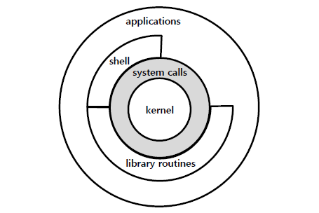
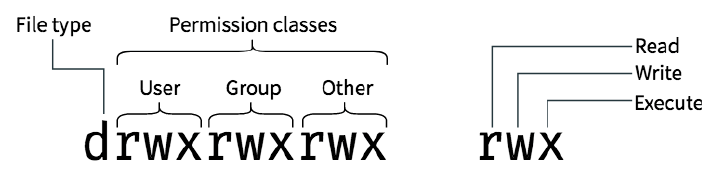
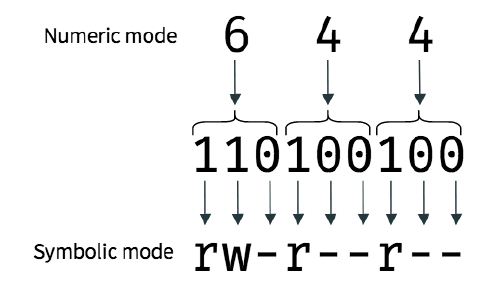
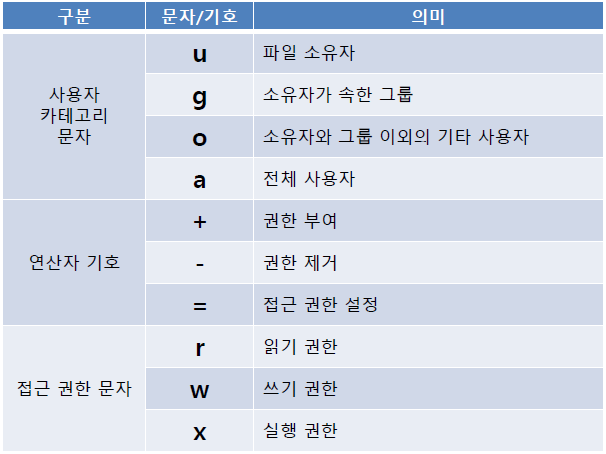
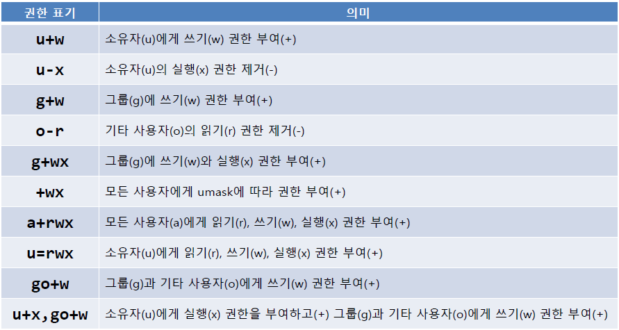
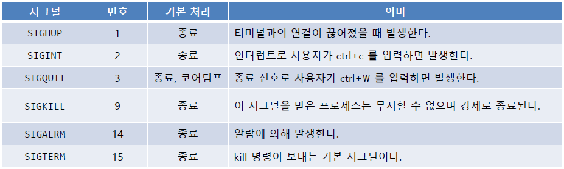
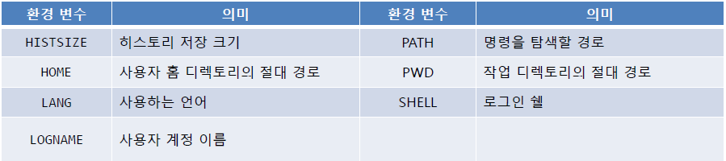

# Linux Basic

> 리눅스 기초: 쉘의 이해와 사용


## 들어가기

### Unix OS

- 범용 다중 사용자 방식의 시분할 운영체제
- AT&T Bell Lab 개발자들이 주축이 되어 개발
- 초기 유닉스는 상업적으로 판매될 수 없어 소스코드와 함께 버클리 대학에 무상 제공
- AT&T 유닉스는 SysV 계열로 발전
- Solaris, HP-UX, AIX, SCO Unix, Ultrix, NeXTSTEP 등 다양한 변종으로 발전
- POSIX로 표준화
  - Portable Operating System Interface


### 실습 환경 설정

##### 가상 머신 설치

가상 머신 (virtual machine)

- 가상의 하드웨어를 사용하여 운영 체제 안에 도 다른 운영체제를 설치할 수 있도록 도와주는 프로그램

- 종류: vmware의 player, oracle의 <u>virtualbox</u>, ...

##### Ubuntu 설치

Ubuntu 20.04 LTS 이미지 파일(.iso) 필요

- 용량이 크기 때문에 설치 경로는 웬만하면 시스템 폴더(C:) 말고 다른 곳으로 

- 메모리는 권장 2GB 이상, 사이즈는 20GB Dynamically allocated
- VDI 파일

##### virtualbox 설정

- 클립보드 공유, 드래그 앤 드롭 양방향
- 프로세서 2개
- 비디오 메모리 128mb
- Host-only Adapter 추가 


### 단축키

터미널 창 띄우기 `ctrl + alt + t`

터미널 탭 띄우기 `ctrl + shift + t`

터미널 창/탭 닫기 `ctrl + shift + w`


## 명령어

#### 명령어 개념

일반적으로 실행 가능한 프로그램(앱)


#### 명령어 입력

명령어는 공백이나 탭으로 구분되는 하나 이상의 단어로 시작하고, 마지막에 엔터를 입력해야 함 (개행 문자로 끝나야 함)


#### 다수 명령어 실행

shell prompt 상에서 2개 이상의 명령어를 실행하고 싶다면, 명령어를 구분하기 위한 구분자로 `;`를 사용


#### 명령어 히스토리

shell prompt 상에서 입력한 명령어를 다시 보여 주는 기능

- 방향키 위, 아래를 이용해 하나씩 볼 수 있음
- `history` 명령어를 이용해 확인 가능
  - `!<명령어 번호>` 입력으로 해당 명령어 실행
  - `!!` 입력으로 마지막 명령어 실행 


#### 명령어 옵션

- `-<option>`

- 다수의 옵션을 사용할 수 있음
  - `ls -a -l -h`
  - 여러 개를 붙여서 쓸 수 있음. 예를 들면, `ls -alh`
- long option `--all` 


#### 명령어 인자

명령어와 옵션이 아닌 단어(token)을 인자(argument)


#### 명령어 도움말

`<command> --help`


### 기본 명령어

`clear`, `ctrl + l` 화면 지우기

`date` 날짜-시간 확인하기

`cal` 달력

- `cal <month> <year>`

`exit`  종료

`pwd` 


#### 명령어의 종류

파일로 존재하는 실행 프로그램

- C/C++ 언어로 작성된 프로그램처럼 컴파일 된 바이너리 형식의 파일 또는 Shell, Perl, Python, Ruby와 같은 스크립트 언어로 만든 프로그램
- Shell에 내장되어 있는 명령어. bash는 다수의 내장 명령어를 지원 (cd, ...)
- Shell 함수
- 별칭으로 다른 명령어로부터 사용하여 새롭게 정의된 명령어


#### 명령어 타입 출력

```bash
type
```


#### 실행 프로그램의 위치 확인

```bash
which
```


#### 명령어의 도움말 확인 

```bash
help <command>
```

- 내장 명령어의 도움말

```bash
<command> --help
```

- 일반적인 명령어의 도움말


#### man 명령어

```bash
man <command>
```

프로그램 매뉴얼 페이지 (manual)

- 8개의 섹션으로 도움말을 나누어 관리함
  1. 사용자 명령어
  2. 커널 시스템콜 API
  3. C 라이브러리 API
  4. 장치 노드 및 드라이버와 같은 특수 파일
  5. 파일 포맷
  6. 스크린 세이버와 같은 게임이나 미디어 파일
  7. 그 외 여러 종류
  8. 시스템 관리용 명령어

#### man 명령어의 검색

`apropos 명령어`

- man 명령어가 제공하는 도움말이 매우 방대하여 검색의 어려움이 있음
- man 명령어가 제공하는 도움말에 대해 검색을 수행할 수 있도록 

`whatis 명령어`

- man 명령어에 대한 간략 정보 출력

#### uniq

`uniq 파일명`

- 입력된 파일에 대해 중복된 행이 연속되어 있을 때 한 행만 남기고 삭제하는 명령어
- 옵션
  - `-c` 중복된 행의 개수를 출력
  - `-d` 중복된 행에 대하여 한 행만 출력
  - `-D` 중복된 행에 대하여 모든 행을 출력
  - `-u` 중복된 행이 아닌 것만 출력

#### sort

`sort 파일명`

- 지정한 파일의 내용을 정렬할 때 사용
- 옵션
  - `-f` 영어를 정렬할 때, 대소문자 구별 안함
  - `-r` 출력 순서를 역순으로
  - `-o` 저장할 파일명을 명시, 명시하지 않으면 화면에 출력
  - `-k <column>` 특정 열을 기준으로 정렬, 열 번호는 1부터 시작
  - `-t` 특정 구분자를 기준으로 각 열을 구분
  - `-n` 열을 수로 해석해 달라는 의미
    - `sort -t ';' -k 4 -n /etc/passwd`

#### wc

`wc 파일명`

- 입력된 파일에 대하여 단어의 개수를 출력하는 명령어
- 옵션
  - `-c` 문자 수만 보여줌
  - `-m` 캐릭터 수만 보여줌
  - `-l` 라인 수만 보여줌
  - `-w` 단어 수만 보여줌
  - `-L` 가장 긴 줄의 길이를 보여줌

#### 세미콜론

`;`을 사용하면 커맨드라인에서 2개 이상의 명령어를 실행할 수 있음

#### 새로운 명령 생성

`alias 새명령어='기존명령어'`

- 기존의 명령어를 사용해 새로운 명령어를 생성 (ex. `alias foo='cd /; ls; cd'`)
- `unalias` 명령어를 사용해 삭제


## Shell의 개념

#### Shell의 이해



- Shell이란 키보드로 입력한 명령어를 운영체제에 전달하여 그 명령어를 실행하게 하는 프로그램
- 기본적인 의미는 껍데기, 이는 사용자와 운영체제의 내부(커널) 사이의 인터페이스를 감싸는 층
- 일반적으로 <u>command line</u>, <u>graphic shell</u> 두 종류로 분류됨
- command line은 운영체제 상에서 CLI(Command Line Interface)를 제공하는 반면, graphic shell은 GUI(Graphic User Interface)를 제공


#### Bash

- Bourne Again Shell
- 최초의 Unix Shell 프로그램인 sh의 확장판
- GNU 운영체제와 리눅스 등 운영 체제에 기본 쉘로 탑재


#### Shell Prompt

- CLI(Command Line Interface)
- `username@hostname:directory$`
- prompt 마지막 글자가 `$`가 아니라 `#`일 경우, 관리자 권한을 가진 사용자로 로그인 했음을 의미


## 파일 시스템

#### 파일 시스템

- File system이란 컴퓨터에서 파일이나 자료를 쉽게 발견 및 접근할 수 있도록 보관 또는 조직하는 체제를 의미
- 리눅스에서 일반적으로 사용되는 파일 시스템은 ext(extended file system, 확장 파일 시스템), Stephen Tweedie가 제작하여 1992년 4월 발표함
- 종류로 ext, ext2, ext3, ext4가 있음

#### 파일 시스템 구조

- 계층적인 디렉토리 구조로 파일을 구성함
- 트리 형식으로 디렉토리(Windows에서 폴더)를 구성하고, 각 디렉토리에는 파일이나 다른 디렉토리가 포함될 수 있음
- 파일 시스템의 최상위 디렉토리(`/`)를 root 디렉토리라고 하며, 파일들과 하위 디렉토리를 포함하고 있음
- Windows와 달리 Linux 시스템에서는 단일 파일 시스템으로 관리함

#### 사용자 디렉토리(폴더)

현대의 운영체제는 다중 사용자의 개념을 제공

사용자 디렉토리란 각 사용자에게 개별적으로 부여된 고유한 공간

- Windows: 홈 폴더 (home folder)
  - `C:\Users\username`
- Linux: 홈 디렉토리 (home directory)
  - `/` : root
  - `/home/username`
  - 사용자가 터미널 상에서 로그인을 하면 사용자의 작업 디렉토리를 홈 디렉토리로 이동
  - 일반 사용자를 위하여 읽고 쓰기 권한이 부여된 유일한 공간 

#### 현재 작업 디렉토리 출력

```bash
pwd
```

- 사용자가 위치해 있는 지점을 현재 디렉토리라고 함

#### 현재 작업 디렉토리 변경

```bash 
cd <path>
```

- 현재 작업 중인 디렉토리를 변경
- 절대 경로, 상대 경로 모두 사용

##### 홈 디렉토리 이동

```bash
cd
cd ~
```

##### 하위 디렉토리 이동

```bash
cd ./Desktop
```

- 상대 경로를 사용하지 않으면 현재 디렉토리 안에서 해당 디렉토리를 찾음

##### 직전 디렉토리 이동 

```bash
cd -
```


#### 절대 경로, 상대 경로 

##### path

- 파일 시스템에서 디렉토리나 파일의 위치를 표현하기 위한 방법
- 파일과 디렉토리 또는 디렉토리와 디렉토리의 이동 경로

##### 절대 경로

- `/`를 기준으로 특정 디렉토리 또는 파일까지의 경로

##### 상대 경로

- 현재 작업 디렉토리로부터 다른 디렉토리 또는 파일까지의 경로
- `.` 현재 작업 디렉토리, `..` 현재의 상위 디렉토리

#### 디렉토리 내용 확인

 **디렉토리의 내용 확인**

```bash
ls
```

- ls 다음에 절대 경로명 또는 상대 경로명을 사용할 수 있음
- 옵션
  - `-a`: 모든 파일 보기. 숨김 파일까지 표시.
  - `-d`: ls 명령어에 디렉토리를 명시하면 해당 디렉토리 자체가 아닌 디렉토리 내용을 출력. 이 때, 이 옵션을 사용하면 디렉토리 내용이 아닌 디렉토리 자체를 출력
  - `-l`: 좀 더 자세한 정보를 출력
  - `-h`: 폴더 용량을 보기 좋게 출력
  - `-r`: 출력 결과를 역순으로 표시 
  - `-S`: 파일 크기 순으로 정렬
  - `-t`: 파일 수정 시간 순으로 정렬
  - `-F`: 파일 경로 `/`까지 표시 

**디렉토리의 상세한 내용 확인**

```bash
ll
```

- `ls -al`와 동일

#### 파일 전체 내용 확인

```bash
cat
```

- 텍스트 파일 전체를 확인 (concatenate의 약자, 본래에는 여러 파일을 엮어서 출력하기 위한 명령어)
- 옵션
  - `-n`: 줄 번호를 붙임
  - `-b`: 텍스트가 있는 줄에만 번호를 붙임
  - `-T`: 탭 문자를 `^I`로 표시
- 파일 내용이 긴 경우 스크롤해가며 봐야함

#### 파일을 페이지 단위로 확인

```bash
more
```

- 텍스트 파일을 화면 단위로 확인
- 자주 사용되는 키
  - `spacebar`, `f` : 다음 페이지 이동
  - `b`: 이전 페이지 이동
  - `enter`: 라인 단위로 이동
  - `/<string>`: 아래 방향으로 문자열 검색, `n`으로 다음 검색
  - `q`: 종료

#### 파일 내용 확인 

```bash
less
```

- 텍스트 파일을 볼 때 가장 많이 사용
- 자주 사용되는 키 
  - `PgUp`, `b`: 한 페이지 위로
  - `PgDn`, `spacebar`: 한 페이지 아래로
  - `↑`: 한 줄 위로
  - `↓`: 한 줄 아래로
  - `G`: 텍스트 파일 맨 마지막으로
  - `1G`, `g`: 텍스트 파일 맨 처음으로
  - `/<string>`: 아래 방향으로 문자열 검색, `n`으로 다음 검색
  - `h`: 도움말 보기
  - `q`: 프로그램 종료

#### 파일의 일부 내용 출력

```bash
head
```

- 파일의 첫 10줄 출력

```bash
tail
```

- 파일의 마지막 10줄 출력
- `-n` 명령어를 이용해 출력할 행의 개수를 조정할 수 있음
  - `head -n 5 .bashrc`

#### 파일 종류 확인

```bash
file
```

- 파일의 종류 또는 정보를 확인
- 리눅스에서는 확장자의 개념이 없음

#### 참고

- 장치 파일은 유닉스 계열 운영체제에서 하드웨어를 관리하기 위해 제공되는 일종의 특수 파일
- 파일 입출력 시스템 콜을 사용해 장치 드라이버와 상호작용 할 수 있게 해줌
- 파일명에 공백을 포함할 수 있다
- 파일명은 대소문자를 구분 


## 파일과 디렉토리

#### 와일드카드

- shell은 파일에 대한그룹을 지정할 수 있도록 특수한 문자를 제공하는데, 이를 와일드카드 또는 글로빙(globbing)이라 함
- shell이 제공하는 와일드카드
  - `*` 0개 이상의 모든 문자
  - `?` 1개의 모든 문자
  - `[characters]` characters 문자셋에 포함된 문자
  - `[!characters]` characters 문자셋에 포함되지 않은 문자
  - `[[:class]]` 지정된 문자 클래스에 포함된 문자
- 와일드카드를 단순 문자로 해석하게 하려면 앞에 `/`를 붙이기
- 자주 사용되는 문자 클래스
  - `[:alnum:]` 모든 알파벳과 숫자 문자
  - `[:alpha:]` 모든 알파벳 문자 
  - `[:digit:]` 모든 숫자
  - `[:lower:]` 모든 소문자
  - `[:upper:]` 모든 대문자
- 예시
  - `echo /usr/bin/z*p`
  - `echo /usr/bin/??`
  - `[a-z]`, `[a-zA-Z]`

#### 디렉토리 생성

`mkdir`

- 파일명에 공백 포함 가능 `''`로 묶어주기, 권장하지 않음

#### 파일 및 디렉토리 복사

`cp`

- `cp file1 file2`: file1을 file2에 덮어쓰고, 없으면 새로 생성
- `cp file1 file2 dir1`: file1, file2를 dir1에 복사, dir1은 미리 존재해야 함
- `cp dir1/* dir2`: dir1의 모든 파일은 dir2에 복사, dir2는 미리 존재해야 함
- `cp -r dir1 dir2`:  dir1의 모든 파일을 dir2에 복사, dir2가 없으면 생성됨

#### 파일 이동 및 이름 변경

`mv`

- 파일을 이동하는 경우, 파일 이름을 변경하는 경우
- `mv file1 file2`: file1을 file2로 이름 변경, file2가 이미 있는 경우 덮어씀
- `mv file1 file2 dir`:  file1, file2를 dir1로 이동, dir1은 미리 존재해야 함
- `mv dir1 dir2`: dir1을 dir2로 이동, dir2가 없다면 이름만 변경

#### 파일 및 디렉토리 삭제

`rm`

- `-r` 재귀적으로 디렉토리 삭제
- `-f` 존재하지 않는 파일에 대하여 확인 메시지 없이 삭제 
- `rm file1` file1 완전히 삭제
- `rm -r file1 dir1` file1, dir1 및 하위 내용 모두 삭제
- `rm -rf *`

`rmdir`은 비어있는 디렉토리에만 사용 가능

`rm` 사용 시 먼저 테스트 해보는 것이 좋음

- `rm * .html`을 쓰려는 경우 `ls * .html`을 써보기

#### 하드 링크, 심볼릭 링크

##### 하드 링크

같은 파일에 다른 이름(alias)를 부여하는 개념 `ln 파일명 링크명`

- 하드 링크는 파일 시스템 외부에 있는 파일을 참조할 수 없으며, 같은 디스크 파티션에 있는 파일만 참조 가능

- 하드 링크는 디렉토리를 참조할 수 없음
- `.`, `..` 는 하드 링크로, 예외적으로 허용됨

##### 심볼릭 링크

하드 링크의 한계를 극복하기 위해 도입된 개념 `ln -s 파일명 링크명`

- 참조될 파일이나 디렉토리를 가리키는 텍스트 포인터가 포함된 특수한 파일을 생성

##### 링크의 개념

같은 파일에 다른 이름(별칭)을 부여하는 개념 

링크의 개념이 없을 경우, 여러 문제가 발생

- 예) 특정 파일의 이름을 변경하는 경우
  - 원래 파일의 복사본을 만들고 기존에 있던 파일을 삭제하는 방식으로 진행
  - 링크를 사용하면 복사, 제거에 대한 오버헤드가 없이 파일의 이름을 변경할 수 있음


## Redirection

### 표준 스트림


프로그램과 사용자의 터미널(모니터와 키보드가 있는 단말기) 사이에 미리 연결된 <u>입출력 통로</u>

터미널의 입출력은 주로 키보드와 모니터를 통해 일어나는데, 표준 스트림은 이를 추상화 한 것

- 표준 입력 스트림: 입력을 위한 스트림, 쉘에서는 0으로 표현
- 표준 출력 스트림: 출력을 위한 스트림, 쉘에서는 1로 표현
- 표준 에러 스트림: 오류 메시지 출력을 위한 스트림, 쉘에서는 2로 표현
  - 입/출력 스트림의 경우에는 장치 별 속도를 맞추기 위한 버퍼가 존재
  - 버퍼는 프로그램이 비정상 종료되면 같이 사라지기 때문에, 에러를 출력하기 위해 에러 스트림이 존재


### Redirection

##### 리다이렉션

`명령어 > 파일명`

- `<` 입력 방향을 재지정
- `>` 출력 방향을 재지정
- `>>` 출력에 덮어쓰지 않고 덧붙인다(append)
- `2>` 오류의 방향을 재지정
- `&>` 출력과 오류를 재지정
- `>&` 오류와 출력을 재지정(권장)
- `1>&2` 출력을 오류로 내보낸다
- `2>&1` 오류를 출력으로 내보낸다

##### cat

`cat 파일명`

다수의 파일을 연결하기 위한 명령어 (concatenate)

- 와일드카드는 항상 정렬된 순서로 확장

##### Here Document

`명령어 << 마지막식별자`

- 다수의 텍스트를 명령어의 표준 입력으로 보낼 때 사용

- ex)

  ```bash
  cat << END
  hello
  world
  END
  ```


### 파이프

##### 익명 파이프

`명령어1 | 명령어2`

- 파이프는 어떤 명령에 대한 출력을 다른 명령의 입력으로 연결하는 기능
- 익명 파이프는 이름이 없는 파이프
- ex) `ls -l /usr/bin | less`

##### tee

`tee 파일명`

- 입력된 데이터를 표준 출력과 파일로 동시에 출력하는 명령어
- ex) `ls -l | tee result.txt`

##### myfifo

`mkfifo 파일명`

- 이름이 있는 파이프

- 서로 다른 프로그램 간에 통신을 할 때 사용

- ex)

  ```bash
  mkfifo myfifo
  cat > myfifo
  cat < myfifo
  ```


## 확장과 인용

### 확장

##### echo

화면에 문자열을 출력하기 위한 내장 명령어

##### 확장

- 명령어를 입력하고 엔터를 누르면 shell은 명령어를 수행하기 전에 텍스트에 몇 가지 전처리를 수행
- 특정 문자를 문자 그대로 해석하는 것이 아니라 다른 동작을 수행하도록 하는 것을 **확장**이라 함

##### 틸드 확장

- `echo ~` , `cd ~`
- 홈 디렉토리 명으로 확장

##### 매개변수 확장 

- `echo $PATH`
- `$` 문자를 사용하여 변수명을 변수가 가진 값으로 치환 또는 확장

##### 산술 확장

- `echo $((1+1))` 
- `$((수식))`을 사용하여 계산을 수행

##### 명령어 치환

- `echo $(ls)`
- `$(명령어)` 또는 역따옴표(`)를 사용하여 명령어의 출력 결과로 치환 또는 확장

##### 중괄호 확장

- `echo Number_{1..9}`, `echo Number_{1,2,3,4,5,6,7,8,9}`
- 중괄호 안에 표현된 패턴과 일치하는 텍스트 문자열로 확장
- 패턴과 패턴을 구분하기 위해 쉼표를 사용하며, 공백이 없어야 함
- 1개 이상 사용 가능, 중첩도 가능 ex) `mkdir {2009..2011}_{01..12}`

### 인용

##### 인용 부호

- `""`, `''`

##### 큰 따옴표 기호

- 공백과 탭 그리고 개행 문자를 인식
- 문자열에 대하여 큰 따옴표를 사용하면 확장 또는 기타 특수 문자들이 동작하지 않음
  - `$`, `\`, 역따옴표(`) 기호는 예외
- 큰 따옴표를 출력하려면 작은 따옴표(`'""'`)나 백슬래시(`\"`)를 사용해야 함

##### 작은 따옴표 기호

- 작은 따옴표는 모든 와일드카드의 해석을 막음
- 작은 따옴표를 출력하려면 큰 따옴표(`"''"`)나 백슬래시(`\'`)를 사용해야 함

##### 백슬래시

- 특정 문자를 shell에 의해 해석되지 않도록 하는 문자


## Permission

### 소유 권한

##### 소유

- 리눅스 보안 모델에서 사용자는 파일과 디렉토리를 소유할 수 있다
- 사용자가 파일 또는 디렉토리를 소유할 때, 그 사용자는 소유물의 접근을 제어한다
- 사용자들은 한 명 이상으로 구성된 그룹에 속할 수 있다. 같은 그룹 사용자들은 그 소유자에 의해 파일과 디레고리에 접근 권한을 얻는다
- 그룹에 접근을 허용하는 것 외에도, 소유자는 모든 사용자에게 접근 권한 일부를 줄 수 있다

##### 읽기, 쓰기, 실행



- 파일과 디렉토리의 접근 권한은 읽기(r), 쓰기(w), 실행(x) 권한으로 정의

##### File type

- `-`: 일반 파일
- `d`: 디렉토리
- `l`: 심볼릭 링크
- `c`: 문자 특수 파일
- `b`: 블록 특수 파일
- `p`: mkfifo 명령으로 만들어진 커널 파이프
- `s`: socket 파일

##### 파일과 디렉토리에 따른 퍼미션 속성

| 권한 | 파일                                                         | 디렉토리                                                     |
| ---- | ------------------------------------------------------------ | ------------------------------------------------------------ |
| 읽기 | 파일을 읽거나 복사할 수 있다.                                | ls 명령으로 디렉토리 목록을 볼 수 있다. (ls 명령의 옵션은 실행 권한이 있어야 사용할 수 있다.) |
| 쓰기 | 파일을 수정/이동/삭제할 수 있다. (디렉토리에 쓰기 원한이 있어야 한다.) | 파일을 생성하거나 삭제할 수 있다.                            |
| 실행 | 파일을 실행할 수 있다(쉘 스크립트나 실행 파일의 경우).       | cd 명령을 사용할 수 있다. 파일을 디렉토리로 이동하거나 복사할 수 있다. |

##### 파일의 권한 변경

`chmod`

- 파일이나 디렉토리의 권한을 변경

- 파일이나 디렉토리의 권한 변경은 소유자 또는 슈퍼유저(root)만 가능

- 소유권을 변경하는 방법은 8진수와 문자를 사용하는 방법이 있음

  - 8진수를 사용하는 경우 ex) `chmod 666 hello.txt`

    

  - 문자를 사용하는 경우, 예시

    

    

##### 파일의 기본 권한

- 리눅스에서는 파일이나 디렉토리를 생성할 때 기본 접근 권한이 자동적으로 설정
- 일반 파일의 경우 소유자는 읽기/쓰기 권한이 설정되고, 그룹과 기타 사용자는 읽기 권한만 설정
- 디렉토리의 경우 소유자는 읽기/쓰기/실행 권한이 설정되고, 그룹과 기타 사용자는 읽기/실행 권한만 설정

##### 기본 권한 변경

`umask 옵션 마스크값`

- 파일에 대한 기본 권한을 변경하려면 mask 명령을 사용하면 됨 
- 옵션으로 `-S`를 사용하면 마스크 값을 문자로 출력
- 기본 권한을 변경하는 일은 일반적으로는 없음, 루트 사용자에 의해 일괄적으로 행해지는 듯


### 사용자 ID 변경

##### 사용자 변경 방법 

- 로그아웃 후, 다른 사용자로 로그인
- `su` 명령 사용
- `sudo` 명령어 사용

##### su

`su [-[I]] [사용자ID]`

- 로그아웃 없이 다른 사용자로 shell을 시작하는 방법 (switching user)
- 이전 사용자의 쉘로 이동하려면 `exit` 명령 사용
- 옵션
  - `-I` 옵션은 사용자의 환경 정보를 로드하고, 작업 디렉토리를 홈 디렉토리로 변경
  - `-c` 옵션을 사용하면 단일 명령으로 실행 가능

##### sudo

- <u>root로 로그인 하지 않고 root의 권한 갖는 명령어</u>

- 새로운 shell을 시작하지 않고 다른 사용자로 명령어 실행 
- root의 비밀번호가 아닌 사용자의 비밀번호를 요구함
- `sudo passwd root`

##### 사용자 비밀번호 변경 

`passwd 사용자ID`

- 사용자ID를 생략할 경우, 자신의 ID를 변경하는 것으로 간주


## 프로세스

### 프로세스

##### 프로그램과 프로세스

<u>프로그램</u>은 일반적으로 저장 장치에 저장되어 있는 실행 코드를 뜻함 

<u>프로세스</u>는 프로그램을 구동하여 프로그램 자체와 프로그램의 상태가 메모리 상에서 실행되는 작업 단위를 지칭

- 예를 들어, 하나의 프로그램을 여러 번 구동하면 여러 개의 프로세스가 메모리 상에서 실행됨
- 리눅스는 각 프로세스를 구분하기 위해 고유한 번호를 부여하는데, 이를 프로세스 아이디(PID)라고 함

##### 프로세스 정보 확인 명령어

`ps`: 구동중인 프로세스의 목록을 확인하는 명령어

- `-e`: 커널 프로세스를 제외한 모든 프로세스 출력
- `-f`: 풀 포맷으로 보여준다. UID, PID, PPID 등이 함께 표시 

`top`: 구동중인 프로세스의 활동 정보(성능)를 출력하는 명령어


### 프로세스 제어

##### 프로세스 인터럽트

`ctrl + c`

- 프로세스에게 인터럽트를 전송하여 프로세스 종료

##### 프로세스 백그라운드

- 일반적으로 포그라운드의 개념은 사용자로부터 입력을 받을 수 있는 상태 
- shell도 기본적으로 포그라운드로 실행되므로 프롬프트를 사용하여 사용자로부터 입력을 받을 수 있다 
- 백그라운드란 사용자의 입력을 받지 않고 shell 뒤에서 실행되는 개념
- `&` 를 함께 입력하면 백그라운드에서 동작 ex) `sleep 10 &`
- 포그라운드로 전환하려면 `fg` 명령어를 사용
- 백그라운드로 실행되는 명령어를 확인하려면 `ps` 또는 `job` 명령어 사용
- 백그라운드로 전환하려면 `ctrl + z` 후 `bg` 명령어 사용 

##### 프로세스 일시 정지

`ctrl + z`

- 프로세스를 종료하지 않고 정지하는 개념
- 다시 포그라운드로 수행하려면 `fg` 명령어 사용

##### 시그널

- 프로세스에 무언가 발생했음을 알리는 메시지
- `kill -l` 명령어로 알 수 있음

##### 시그널 보내기



- `kill -2 6894`
- `kill -INT 6894`


### 환경 변수

##### 쉘 변수와 환경 변수

<u>쉘 변수</u>: 현재 쉘에서만 사용 가능하고 서브 쉘로는 전달되지 않음(지역 변수)

<u>환경 변수</u>: 현재 쉘 뿐만 아니라 서브 쉘로도 전달(전역 변수)

- 쉘의 환경을 설정하기 위한 값을 저장할 수 있도록, 쉘 변수와 환경 변수를 제공

- `printenv` 환경 변수 출력

- `set` 셀 변수를 포함하여 환경 변수를 출력

  

- `alias` 별칭을 출력

##### 쉘 변수 설정 방법

`변수명=값`

- 변수 이름은 대소문자, 숫자, 밑줄 문자를 사용, 첫 글자는 반드시 알파벳 또는 밑줄 문자
- 등호 양쪽에 공백을 사용할 수 없음

##### 환경 변수 설정

`export 변수명=값`

##### 특수 변수

쉘은 하나의 문자로 사용되는 특수 변수들을 가짐

- `$` 쉘의 PID

- `?` 최근 실행시킨 명령어의 종료 상태

##### 환경 설정 스크립트

- 로그인 하면 bash 프로그램이 시작되면서 startup files라고 하는 일련의 환경 설정 스크립트를 읽는다

##### 로그인 쉘 세션용 시작 파일

`/etc/profile`: 모든 사용자에게 적용되는 일반 환경설정

`~/.bash_profile`: 개인 사용자 시작 파일. 일반 환경설정을 확장하거나 무시할 수 있다

`~/.bash_login`: `~/.bash_profile` 파일이 없으면 이 스크립트를 읽어들임

`~/.profile`: `~/.bash_profile`, `~/.bash_login` 모두 없으면 이 파일을 읽어들임

- `source` 명령어를 사용해 수정된 스크립트 파일을 강제로 적용할 수 있음
  - ex) `source ~/.profile`