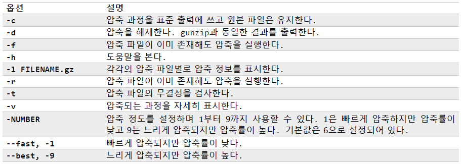
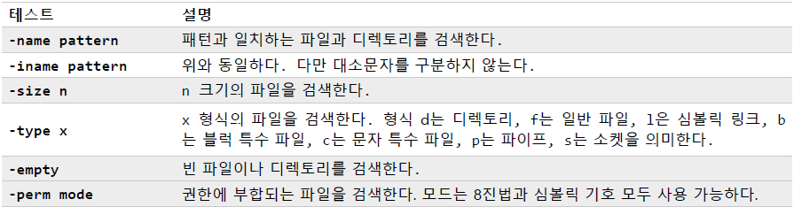
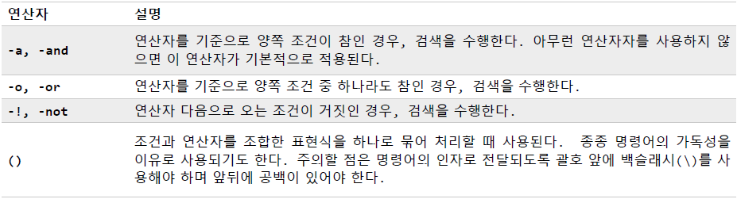
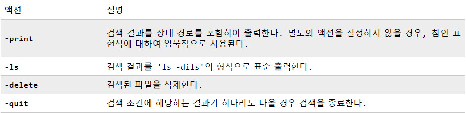
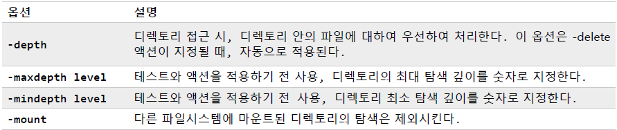
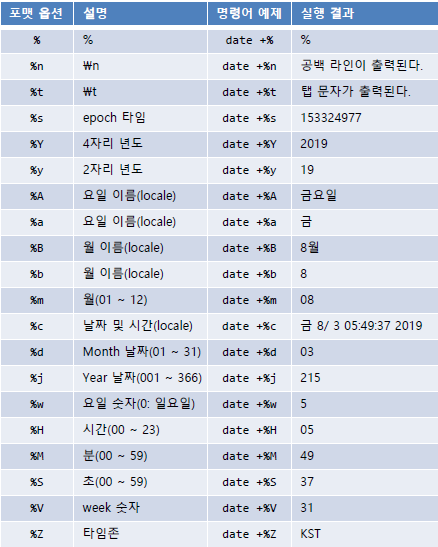

# 기타 명령어

> 패키지 관리, 네트워킹, 파일 보관 및 압축, 파일 검색, 날짜


## 패키지 관리

#### 패키지 관리란?

시스템에 소프트웨어를 설치하고 유지 및 관리하는 방법


#### 패키지 시스템

- 리눅스 배포판마다 각기 다른 패키지 시스템을 운영
- 대부분 배포판은 크게 두 진영으로 나뉨
  - 데비안(.deb): Debian, Ubuntu, Xandros, Linspire
  - 레드햇(.rpm): Fedora, CentOS, Red Hat Enterprise Linux, openSUSE, Mandrive, PCLinuxOS


#### 패키지 파일

패키지 시스템에서 소프트웨어의 가장 기본 단위를 패키지 파일이라 함

- 소프트웨어 패키지를 구성하고 있는 파일들의 압축된 형태
- 해당 프로그램을 지원하는 수많은 프로그램들과 데이터 파일들로 구성
- 설치될 파일 뿐만 아니라 해당 패키지 자체에 대한 메타 데이터를 포함
- 패키지 설치 전과 설치 후에 각각의 설정 작업을 수행하는 스크립트가 있음
- 패키지 관리자(Package maintainer)라고 하는 사람에 의해 만들어지며, 일반적으로 배포판 회사 직원


#### 저장소

패키지와 이에 대한 정보를 저장하고 있는 곳을 의미

- 저장소는 서버/클라이언트 모델로 동작
- 일반적으로 저장소는 배포판의 버전에 따라 운영


#### 의존성

패키지가 공유 라이브러리와 같은 공유 자원을 필요로 한다면 의존성이 있다고 함

- 패키지 관리 시스템은 모두 의존성 문제를 해결하기 위한 방안을 몇 가지 제공


### 일반적인 패키지 관리

#### 검색

- 데비안

```bash
apt-get update
apt-cache search <package name>
```

- 레드햇

```bash
yum search <package name>
```


#### 설치

- 데비안

```bash
apt-get update
apt-get install <package name>
```

- 레드햇

```bash
yum install <package name>
```


#### 삭제

- 데비안

```bash
apt-get remove <package name>
```

- 레드햇

```bash
yum erase <package name>
```


#### 최신 버전 업그레이드

- 데비안

```bash
apt-get update
apt-get upgrade
```

- 레드햇

```bash
yum update
```


#### 설치된 패키지 확인

- 데비안

```bash
dpkg --list
```

- 레드햇

```bash
rpm -qa
```


#### 패키지 설치 여부 확인

- 데비안

```bash
dpkg --status <package name>
```

- 레드햇

```bash
rpm -q <package name>
```


## 네트워킹

#### ping

네트워크 호스트에 신호(ECHO_REQUEST)를 보냄

```bash
ping <options> <destination address>
```

- 종료: `ctrl + c`


#### traceroute

네트워크 패킷 경로를 확인하기 위한 명령어

```bash
traceroute <destination address>
```

- 통신에 장애가 있거나 traceroute 명령을 거부하는 경우 `*`로 표시


#### ping

네트워크 호스트에 신호(ECHO_REQUEST)를 보냄

```bash
ping <option> <destination address>
```

- 옵션
  - `-q` 테스트 결과를 보여주지 않고 종합 결과만 출력


#### traceroute


#### ftp


#### ssh

텔넷처럼 원격에서 시스템에 접속할 수 있도록 하며 모든 송수신을 암호화

```bash
ssh <userid>@<host address>
```

- 텔넷은 클라이언트와 리눅스 사이에 주고받는 데이터가 암호화되지 않음


## 파일 보관 및 압축

### 파일 압축

#### gzip

하나의 파일을 압축할 때 사용되는 무손실 압축 명령어

```bash
gzip <option> <filename>
```

- 옵션

  

- GNU zip의 줄임말

- 압축이 수행되고 원본 파일은 삭제, 확장자는 `.gz`

- 손실 압축은 대표적으로 iso와 같은 이미지 파일

- `gzip` 명령은 표준 입력과 표준 출력을 재사용 할 수 있음

  - ex) `ls -l | gzip > list_output.txt.gz`


#### gunzip

`gzip`으로 압축된 파일을 해제하기 위한 명령어

```bash
gunzip <filename>
gzip -d <filename>
```


#### zcat

압축된 텍스트 파일의 내용을 보기 위한 명령어

```bash
zcat <filename>
```


### 파일 보관

#### tar

1개 이상의 파일을 하나로 묶기 위한 명령어

- tape archive의 줄임말, 백업 테이프를 만들기 위한 도구에서 유래

```bash
tar <mode, option> <directory>
ex) tar cf test.tar dir1 dir2
    tar xf test.tar
    tar tf test.tar
    tar cvfz test.tar.gz dir1/*
    tar xvfz test.tar.gz
```

- 모드
  - `c`: 파일 또는 디렉토리의 목록에서 아카이브 생성하기
  - `x`: 아카이브 해제하기
  - `r`: 아카이브 끝에 지정된 경로명을 덧붙이기
  - `t`: 아카이브 내용 보기
- 옵션
  - `f`: 파일 이름
  - `v`: 처리 과정을 표준 출력
  - `z`: 출력을 압축하기 위해 gzip으로 보냄(확장자는 `tar.gz` 또는 `tgz`를 사용)
  - `j`: 출력을 압축하기 위해 bzip2

- 반드시 모드를 먼저 쓰고 옵션을 써야 함


## 파일 검색

#### find 

다양한 옵션을 사용하여 주어진 디렉토리 내의 특정 파일을 검색하는 명령어

- 기본적으로 하위 디렉토리까지 검색

```bash
find <directory> <expression>
ex) find . -name '*.c'
    find /usr /home /tmp -name '*.html'
    find . -name '*.html' -type f
    find . -name '*.c' -or -name '*.cpp'
    find . \(-name '*.c' -or -name '*.cpp' \) -type f
    find . -type f -name '*.BAK' -delete
    find . -type f -name '*.o' -exec rm \{} \;
    find . -maxdepth 1 -name '*.c'
```

##### 테스트

- 테스트는 일종의 검색 옵션
- 

##### 연산자

- 연산자는 테스트 간의 논리적 연산을 수행하기 위해 제공되는 기능
- 

##### 액션

- find 명령의 결과를 어떻게 처리할 것인가에 대한 행위

- 미리 정의된 액션

  

- 사용자 정의 액션

  `-exec <command> \{} \;` 또는 `-exec <command> '{}' ';'`

  - 중괄호는 검색된 파일의 이름으로 치환됨
  - 세미콜론은 일치하는 파일이 발견될 때마다 실행
  - 덧셈 기호를 사용하면 일치된 파일들을 한 번에 묶어 명령어의 인자로 보냄

##### 옵션

- find 명령의 검색 범위를 설정할 때 사용

  


## 날짜

#### date

날짜나 시간을 출력 또는 설정하는 명령어

```bash
date
```

- `-d` 문자열: 원하는 날짜 또는 시간을 기술

  

