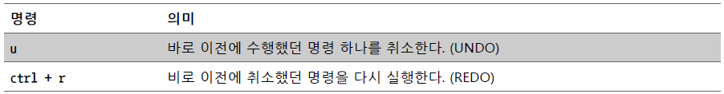

# Editors

> vi 편집기, 정규 표현식


## vi 편집기

#### 설치

- 일반적으로 모든 리눅스에 vim이 기본적으로 설치되어 있으나, 최소 기능만 가지고 있음

```bash
apt-get install vim
```

#### 실행

```bash
vi
vi <파일명>
```

#### 모드


#### 삽입 명령


#### 저장과 종료


#### 커서이동


#### 삭제


#### 복사


#### 붙여넣기


#### 잘라내기


#### 취소 및 되돌리기



#### 블럭 지정

`v`  블럭 지정 시작

`V`  라인을 블럭 지정

#### 설정 파일

```bash
vi .vimrc
```

#### 창 분할


- `ctrl + w q` 창을 하나씩 닫기

#### 문자열 치환

```bash
시작줄,끝줄s/찾을패턴/바꿀스트링/옵션
```

- ex 모드에서 사용
- 옵션
  - `g`(global): 한 줄에 패턴이 여러번 나오면 모두 바꾼다
  - `i`(ignore case): 대소문자 구분 안함
  - `c`(confirm): 검색된 모든 문자열에 대해 바꿀지 말지 물어본다


## 정규 표현식

### 정규 표현식 Regular Expression

✅ 복잡한 문자열을 처리할 때 사용하는 도구

✅ 특정 프로그래밍 언어에 종속된 문법이 아님. 문자열을 처리하는 곳이라면 폭넓게 사용 가능한 도구


### 리눅스의 정규 표현식

기본 정규 표현식(BRE)과 확장 정규 표현식(ERE)로 구분되며, 메타 문자의 범위의 차이

- 기본 정규 표현식(BRE): `^$.[]*`
- 확장 정규 표현식(ERE): `^$.[]*(){}?+|`

`grep` 명령은 기본적으로 정규 표현식을 사용

- <u>확장 정규 표현식</u>을 사용하려면 `-E` 옵션을 사용하거나 `egrep` 명령어를 사용해야 함


### grep

```bash
grep [옵션] 정규표현식 [파일]
```

유닉스를 위해 만들어진 텍스트 검색 기능을 가진 명령어

- 일치하는 패턴이 포함된 행을 출력
- 옵션
  - `-c` 패턴이 일치하는 행의 개수 출력
  - `-n` 패턴이 일치하는 행의 번호를 함께 출력
  - `-i` 검색할 때, 대소문자를 구분하지 않음
  - `-l` 패턴이 포함된 파일의 이름을 출력
  - `-L` 패턴이 포함되지 않는 파일의 이름을 출력
  - `-r` 하위 디렉토리의 파일까지 출력
  - `-w` 패턴이 단어로써 일치하는 행만 출력
  - `-v` 문자열이 제외된, 즉 문자열이 포함되어 있지 않은 라인 출력


### 메타 문자

특정한 문자 혹은 계열을 표현하는 약속된 **기호**. 특정한 규칙을 가진 여러 단어를 짧게 압축할 수 있어 편리함.

- `^` : 문자열의 시작
- `$` : 문자열의 끝
- `|` : or 조건식
- `[]` : 문자 클래스
  - `^`을 사용하여 해당 문자들을 제외한 문자들을 나타낼 수 있음
  - `-`을 사용하여 범위 안의 문자들을 나타낼 수 있음
- `\` : 이스케이프용 문자. 특별한 의미를 나타내는 기호를 문자 그대로 사용
- `.` : 모든 문자와 대응
  - c[.]t과 같이 `.`을 그대로 표현할 수 있음
- `(?i)` : 대소문자를 구분하지 않는 패턴 표현 가능


### POSIX 문자 클래스

리눅스 진영은 기존의 정규 표현식의 한계를 극복하기 위해 POSIX 문자 클래스를 제공

`[:alnum:]` 알파벳 대소문자와 숫자를 의미 [A-Za-z0-9]와 동일

`[:word:]` [:alnum:]과 같고 밑줄(_)이 추가 

`[:alpha:]` 알파벳 대소문자를 의미 [A-Za-z]와 동일

`[:blank:]` 스페이스와 탭 문자를 의미

`[:cntrl:]` 아스키 코드의 제어 문자를 의미 0-31, 127번

`[:digit:]` 숫자 0부터 9까지를 의미 [0-9]와 동일

`[:graph:]` 출력 가능한 아스키 문자를 의미하며 33-126번

`[:lower:]` 알파벳 소문자를 의미

`[:punct:]` 아스키의 구두점 기호를 의미 [-!"#$%&'()*+,./:;<=>?@\^_`{|}~]와 동일

`[:print:]` 출력 가능한 아스키 코드를 의미 [:graph:]에 스페이스 문자 추가

`[:space:]` 아스키 코드의 공백 문자를 의미 [\t\r\n\v\f]와 동일

`[:upper:]` 알파벳 대문자와를 의미

`[:xdigit:]` 16진수를 표현하는 아스키 문자를 의미 [0-9A-Fa-f]와 동일


### 수량자

동일한 글자나 패턴이 반복될 때, 그대로 정규표현식을 만들고자 하면 불편함. **수량자**를 이용하여 간단히 표현.

`\d`와 `\w`를 이용하면 각각 숫자와 문자를 <u>한 글자</u>씩 매칭. 이어지는 문자를 패턴으로 만들어 단어 단위로 매칭하고 싶을 때 수량자를 사용.

- `*` : 0개 이상
- `+` : 1개 이상
- `?` : 0개 또는 1개. 다른 수량자 뒤에 붙어 수량자의 탐욕성을 제어할 수 있음
  - 수량자는 가능한 가장 긴 문자열과 매칭하려는 특성을 가짐. `?`을 뒤에 붙여 반대의 성질을 갖게 함.
- `{n}` : n개. `\d{3}`
- `{n,m}` : n개 이상, m개 이하. 공백 없음. `\w{3, 5}`
- `{n,}` : n개 이상. `a{4,}`


### 그룹

괄호`()`는 그룹을 나타내며, 전체 패턴 내에서 하나로 묶여지는 패턴을 말한다. 그룹과 `|`를 결합한 형태, 또는 그룹 뒤에 수량자를 붙이는 패턴으로 자주 사용된다.

##### 예시

- `(s|y)ungil`은 `sungil`, `yungil`과 매칭
- `(tom|pot)ato`는 `tomato`, `potato`와 매칭
- `(base|kick){2}`은 `basebase`, `basekick`, `kickbase`, `kickkick`과 매칭

##### 재사용

한 번 만든 그룹은 재사용할 수 있다. 만들어진 순서부터 1번부터 시작하는 그룹으로 참조할 수 있으며, 매치한 그룹을 패턴 내에서 재사용하려면 `\\1`과 같이 그룹 번호를 이스케이프하여 나타내야 한다.

- `(to)ma\\1`은 `tomato`과 매칭
- `re.sub(p1, "\g<1>-****-\g<2>", text)`에서 처럼 `\g<1>`, `\g<2>`와 같은 표현을 통해 sub 함수의 대체할 문자열에서 정규식의 그룹을 참조할 수 있음

##### 비캡쳐링 그룹

파이썬 정규표현식에서 그룹으로 캡쳐한 부분이 있다면 이외의 부분들은 출력하지 않는다. **비캡쳐링 그룹**은 패턴 문자들을 묶되, 그룹 단위로 매칭되지는 않게끔 해준다.

- `(?:)`
- `(?:tom|pot)ato`를 이용하면 `findall()` 했을 때 `tomato`, `potato`를 온전히 반환

##### 그 외

`re`모듈의 `match` 객체에 속해있는 group 메서드를 이용해 매칭된 결과 중 일부 내용만을 추출할 수 있는 등 다양한 사용법이 있다.