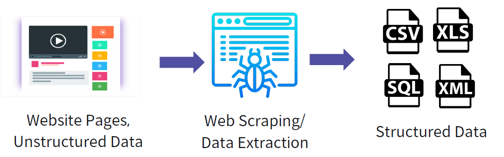
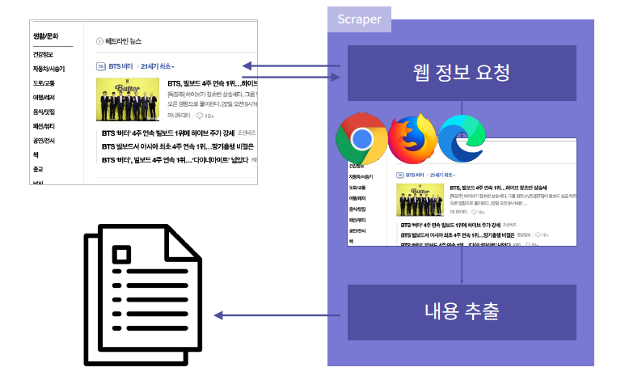
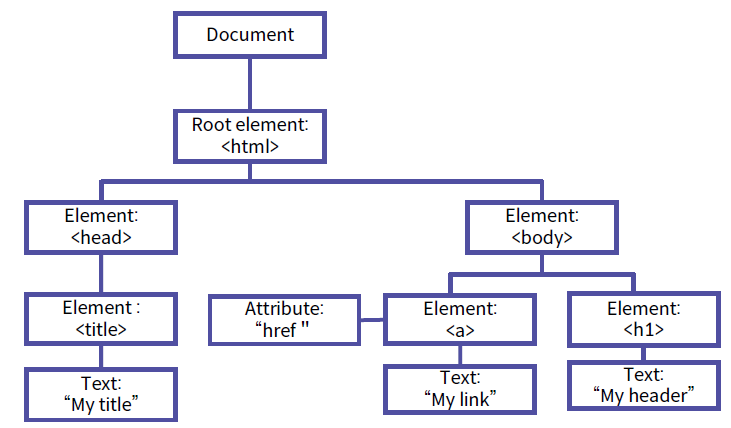

# Selenium

> 웹 스크래핑을 위한 라이브러리


## 웹 스크래핑과 Selenium

### 웹 스크래핑(Web Scraping)



웹 사이트에서 원하는 데이터를 수집하고, 가공하는 행위

### Selenium이란?

웹 테스트 자동화 도구로, 파이썬(또는 자바)에서 라이브러리로 사용

브라우저를 제어하는 기능이 있어 웹 스크래핑에 용이

### 웹 스크래핑 과정



Scraper 내에서 브라우저를 직접 실행하고, 제어할 수 있음


## Element 찾기

### 공통 설정

```python
from selenium import webdriver

driver = webdriver.Firefox()
driver.get('https://www.google.com')
...
driver.close()
```

- 해당 프로그램을 수행할 브라우저 선택 (Android, Safari, Chrome, ...)
- `close()`를 통해 메모리 할당을 해제해야 한다

```python
from selenium import webdriver

with webdriver.Firefox() as driver:
    driver.get('https://www.google.com')
    ...
```

- `with`을 이용해 `close`없이 메모리 할당을 해제할 수 있다
- 코드가 정상적으로 작동하지 않고 에러 발생시에도 꺼지지 않은 브라우저가 메모리를 점유하는 현상을 방지 (좋은 코드)

### 태그 이름으로 요소 찾기

```python
e = driver.find_element_by_tag_name('p')
print(e.text)
```

- 해당 태그를 가진 요소를 찾아 반환
- 여러 개 있다면 <u>맨 위의 요소 하나만</u> 반환
- 부모 element를 선택하면 그 안에 있는 모든 요소들을 반환

```python
e_list = driver.find_elements_by_tag_name('p')
for e in e_list:
    print(e.text)
```

- 태그에 해당하는 요소들을 리스트로 반환

```python
e = driver.find_element_by_tag_name('div').find_element_by_tag_name('p')
```

- 요소 내의 요소 선택

### class, id로 요소 찾기

```python
e = driver.find_element_by_class_name('css-1ksqhvg')
print(e.text)
```

```python
e_list = driver.find_elements_by_class_name('bold')
for e in e_list:
    print(e.text)
```

- `class`로 찾기

```python
e = driver.find_element_by_id('kor-p')
print(e.text)
```

```python
e = driver.find_elements_by_id('kor-p')
for e in e_list:
    print(e.text)
```

- `id`로 찾기

### 속성값 출력하기

```python
print(e.get_attribute('src'))
```


## XPath

> 요소의 주소

### DOM(Document Object Model)



문서 내의 모든 요소를 각 노드 간의 계층 구조로 표현

### XPath란?

XML 문서의 특정 노드에 접근하기 위한 질의어

### XPath 문법

**`/`** : 현재 위치의 자식 노드만 검색

- `/html/body/p`

**`//`** : 현재 위치의 모든 자손 노드에서 검색

- `//p`, `//div/p`

**`*`** : 경로에 있는 모든 노드를 의미(와일드 카드)

- `/html/body/*`(모든 자식 노드), `/html/body//*`(모든 자손 노드)

**`[]`** : 필터 표현식

- 인덱스, 속성 등을 통해 특정 요소를 검색할 수 있다

**`[index]`** : 검색된 노드들 중 index에 해당하는 노드 반환

- 여타 언어와 달리 1부터 시작
- `//p[1]`

**`[@attr]`** : 검색된 노드들 중 해당 속성을 가지고 있는 노드를 모두 반환

- `//p[@class]`

**`[@attr="value"]`** : 검색된 노드들 중 해당 속성과 속성값이 일치하는 노드를 모두 

- 속성값이 완벽히 일치할 때만 반환
- `//p[@class="bold"]`

**`[contains(@class, "value")]`**

- 해당 `class`가 포함되어 있는지 확인하고 싶을 때 `contains()` 사용

### XPath로 요소 찾기

```python
xpath = '/html/body/div/p'

e = driver.find_element_by_xpath(xpath)
print(e.text)
```

```python
xpath = '//p'

e_list = driver.find_elements_by_xpath(xpath)
for e in e_list:
    print(e.text)
```


## Page Element 찾기 정리

```python
from selenium import webdriver

with webdriver.Firefox() as driver:
    driver.get('https://www.google.com')
    ...
```

```python
driver.find_element_by_tag_name()
driver.find_element_by_class_name()
driver.find_element_by_id()
driver.find_element_by_xpath()

driver.find_elements_by_tag_name()
driver.find_elements_by_class_name()
driver.find_elements_by_id()
driver.find_elements_by_xpath()
```


## 브라우저 로딩 기다리기

> 무조건 기다리기, 암시적 기다리기, 명시적 기다리기

```python
with webdriver.Firefox() as driver:
    driver.get(url)
    e = driver.find_element()
```

이상적인 경우라면 `get` 메소드를 통해 웹 페이지를 로딩하고 바로 요소를 찾아야 하지만 JS로 인해 특정 요소의 로딩이 늦을 경우가 있다.

### 무조건 기다리기

```python
time.sleep(n)
```

- 파이썬 내장 라이브러리
- n초만큼 무조건 기다림
- 내가 원하는 요소가 불러와졌어도 주어진 시간을 계속 기다림 

### 암시적 기다리기

```python
implicitly_wait(n)
```

- 암시적으로 기다림 수행
- 앞으로 요소를 추출할 때 최대 n초까지 기다림
- 해당 요소의 로딩이 끝나면 즉시 기다리기를 종료하고 코드를 수행
- 한 번 설정해주면 해당 브라우저에 계속해서 사용

### 명시적 기다리기

```python
from selenium import webdriver
from selenium.webdriver.common.by import By
from selenium.webdriver.support.ui import WebDriverWait
from selenium.webdriver.support import expected_conditions as EC

with webdriver.Firefox() as driver:
    driver.implicitly_wait(10)
    driver.get(url)
    
    e = WebDriverWait(driver, 30).until(
    	EC.presence_of_element_located((By.ID, "id_name"))
    )
    ...
```

- 기다릴 요소를 명시
- 명시된 요소가 해당 방식으로 불러와질 때까지 최대 n초 기다림
- 요소는 class_name, xpath 등 다양한 방법으로 찾을 수 있음
- `presence_of_element_located`: 괄호 안의 요소가 나타날 때까지 기다림 
- `(By.ID, "id_name")`: 요소를 찾는 방법과 파라미터를 의미
  - id 외에 대표적으로 사용하는 것
    - `(By.XPATH, "xpath")`
    - `(By.CLASS, "class_name")`
    - `(By.TAG_NAME, "tag_name")`
- `element_to_be_clickable`: 해당 요소가 클릭 가능해질 때까지 기다림


## 키보드/마우스 입력

```python
from selenium.webdriver.common.keys import Keys

# id 입력
driver \
	.find_element_by_xpath('//*[@id="id"]') \
	.send_keys('my_id')

# password 입력 + 엔터
driver \
	.find_element_by_xpath('//*[@id="pw"]') \
	.send_keys('my_password' + Keys.ENTER)

# 로그인 버튼 클릭
driver \
	.find_element_by_xpath('//*[@id="log.login"]') \
	.click()
```

`send_keys`

- 해당 요소에 나열된 key sequence를 순차적으로 입력
- `m`, `y`, `_`, `i`, `d` 순서대로 입력

`Keys`

- 특수 키를 쓸 수 있게 해주는 class
- `ENTER`, `CONTROL`, `SHIFT` 등 모든 특수키가 있으며, 항상 대문자로 작성

`click`

- 해당 요소를 클릭하는 효과


## 다양한 입력, ActionChains

> 여러가지의 action을 chain처럼 엮어 수행하는 기능

```python
webdriver.ActionChains(driver) \
	.action1() \
	.action2() \
	...
	.perform()
```

```python
chains = webdriver.ActionChains(driver)

chains.action1()
chains.action2()
...
chains.perform()

chains.action1()
chains.action2()
...
chains.perform()
```

### 키보드 입력

`send_keys_to_element`

- 주어진 요소에 주어진 key sequence를 입력
- 하나의 ActionChains 내에서 여러 요소에 액션을 수행할 수 있음

`send_keys`

- 요소가 주어지지 않기 때문에, 현재 커서가 위치한 곳에서 key sequence를 입력

### 다양한 메소드

`key_down`: 버튼 누른채로 유지

`click`

`move_to_element`: 마우스 커서 이동

`pause`: n초만큼 멈췄다 뒤의 액션을 수행

`move_by_offset`: x, y축으로 주어진 수치만큼 이동
