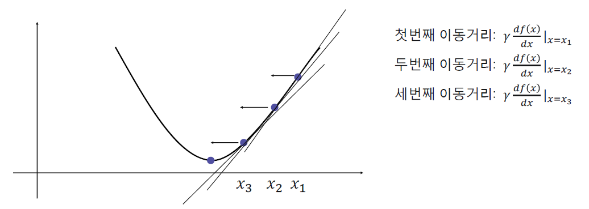

# NumPy 사용해보기

> NumPy, Indexing/Slicing, numpy 연산, 집계함수&마스킹연산


## NumPy?

> Python에서 대규모 다차원 배열을 다룰 수 있게 도와주는 라이브러리

### Why? 

데이터의 대부분은 숫자 배열로 볼 수 있다.

C++ 기반으로 만들어진 라이브러리. 연산이 빠르다.

머신러닝에서 대부분의 데이터는 행렬로 표현된다.


## NumPy 배열

### 배열 만들기

- numpy 배열은 자료형이 하나로 통일 되어야 함
  - 연산을 빠르게 하기 위해

```python
np.array([1, 2, 3, 4, 5])
# array([1, 2, 3, 4, 5])
np.array([3, 1.4, 2, 3, 4])
# array([3. , 1.4, 2. , 3. , 4. ])
np.array([[1, 2],
          [3, 4]])
# array([[1, 2],
#        [3, 4]]), 2차원 배열
np.array([1, 2, 3, 4], dtype='float')
# array([1. , 2. , 3. , 4. ]), 가장 좋은 방법
```


### 배열 데이터 타입

##### dtype

- 데이터 타입을 지정 혹은 확인 (d-type) 
- int, float, str

##### astype

- 데이터 타입 변경


### 다양한 배열 만들기

##### zeros

- 0으로 채우기
- `np.zeros(10, dtype=int)`

##### ones

- 1로 채우기
- `np.ones((3, 5), dtype=float)`

##### arange

- python의 range 함수 역할
- `np.arange(0, 20, 2)`

##### linspace

- 범위 지정, 일정한 간격으로 배열 생성
- `np.linspace(0, 1, 5)`


### 난수로 채워진 배열 만들기 (random)

##### random

- `np.random.random((2, 2))`

##### normal

- 정규 분포를 따르는 값

- `np.random.normal(0, 1, (2, 2))`

##### randint

- 랜덤 정수 

- `np.random.randint(0, 10, (2, 2))`

- `np.random.randint(5, size=(3, 5))`


### 배열 기초

- ndim : n-dim 차원

- shape : 행, 열

- size : 원소의 개수

- dtype : 타입


### 모양 바꾸기

##### reshape

- array의 shape를 변경
- `-1`을 넣을 수 있음
- `x.reshape((2, 4))`


### 이어 붙이기/나누기

##### concatenate

- axis 축을 기준으로 이어 붙임
- axis는 [0, 1, 2, 3, ...] 으로 이해하면 쉬움
- `np.concatenate([x, y], axis=0)`

##### split

- axis 축을 기준으로 분할
- `upper, lower = np.split(matrix, [3], axis=0)`


### 찾고 잘라내기 Indexing / Slicing

##### Indexing 

- (정수) 인덱스로 값을 찾아냄

##### Slicing

- 인덱스 값으로 배열의 부분을 가져옴
- `x[start: end: step]`
- 이차원배열 `x[start1: end1, start2: end2]`


## NumPy 연산

### 기본 연산

- array는 `+`, `-`, `*`, `/`에 대한 기본 연산을 지원

- 크기가 큰 배열에 대해 루프는 느리기 때문에 numpy 배열을 사용하면 용이

- 다차원 행렬 간에도 적용 가능


### 브로드캐스팅 Broadcasting

- shape이 다른 array끼리 연산
- 예를 들어, 3x3 행렬과 1x3 행렬을 더하는 경우 1x3 행렬을 3x3 사이즈로 복사해 더함


### 마스킹 연산

Boolean(True, False) array를 통해서 특정 값들을 뽑아내는 방법

```python
x = np.arange(5) 
# array([0, 1, 2, 3, 4])
x < 3
# array([True, True, True, False, False])
x > 5
# array([False, False, False, False, False])
x[x < 3]
# array([0, 1, 2])
```


### 집계함수, Reductions

- `np.sum(array, axis=0)` 처럼 축을 지정할 수 있음
- `matrix.sum(axis=0)` 처럼 python 자체의 메서드를 사용할 수 있음


**Reductions** `sum`, `min`, `max`, `argmin`, `argmax`

- `argmin/max`: 최소/최대값의 인덱스를 반환

**Logical Reductions** `all`, `any`

- `all`: Array 내의 모든 값이 True인지
- `any`: Array 내의 값이 하나라도 True인지

**Statistical Reductions** `mean`,  `median`, `std`, `var`

- 평균값, 중간값, 표준 편차값, 분산값


### 산술 연산

`+`, `-`, `*`, `/`

- <u>행렬 내 원소</u>에 대한 산술 연산


`np.dot()`

- 두 행렬의 곱셈 혹은 두 벡터의 내적(dot product)을 구할 때 사용
- 두 행렬의 크기 또는 shape이 맞지 않으면 오류가 발생

- `x * y`와 다름

```python
C = np.dot(A, B)
```


`np.linalg.norm()`

- 벡터의 norm(원점에서의 거리)을 구할 때 사용


### 비교 연산

```python
a = np.array([1, 2, 3, 4])
b = np.array([4, 2, 2, 4])

print(a == b) # [False, True, False, True]
print(a > b) # [False, False, True, False]
```


### 논리 연산

`np.logical_and()`, `np.logical_or()`

- 각각의 원소에 대한 논리 연산 수행 

```python
a = np.array([1, 1, 0, 0], dtype=bool)
b = np.array([1, 0, 1, 0], dtype=bool)

np.logical_or(a, b) # [True, True, True, False]
np.logical_and(a, b) # [True, False, False, False]
```


`np.transpose()`

- `transpose()` 또는 `T`를 이용하여 전치행렬을 구함

```python
print(A.T)
B = np.transpose(A)
```


`np.linalg.inv()`

- `inv()`는 행렬의 역행렬을 구할 때 사용
- NumPy의 선형대수학 관련 세부 패키지인 `linalg`를 사용

```python
print(np.linalg.inv(A))
```


### 다항식과 미분

`np.poly1d()` [문서](https://numpy.org/doc/stable/reference/generated/numpy.poly1d.html)

```python
p = np.poly1d([1, 2, 2]) # 다항식 인스턴스 생성

print(p) # 다항식
p(0.5) # 0.5에서의 함수값
p.r # 다항식의 해
p.c # 계수 출력
q = p.deriv() # 미분함수 선언
```


## Gradient Descent

> 경사하강법

<u>목적 함수</u>의 최소화를 목표로 최소값을 찾아가는 방법



- step size가 너무 크면 최소값으로 수렴되지 않음
- step size가 너무 작으면 수렴하는데 오래 걸림


### Gradient Descent를 사용하는 이유

1. 실제 분석에서 마주하는 함수는 굉장히 복잡하고, 2차원 그림으로 표현하지 못하는 고차원 함수들이 많음
2. 미분 계수를 컴퓨터로 구할 때 gradient descent가 더 편함
3. 데이터가 많을 때는 계산량 측면에서 더 효율적


### 예시 코드

그림의 (x, y)를 예측하는 함수 만들기. 주어진 x에 대응되는 y 예측하기

```python
import numpy as np
import matplotlib.pyplot as plt

x = np.random.rand(100)
y = 0.7 * x

# Y = Wx + b
W = np.random.uniform(0,1)
b = np.random.uniform(0,1)

step_size = 0.5

for epoch in range(100):
    y_pred = W*x + b
    
    objective = np.abs(y_pred-y).mean()
    
    w_grad = step_size * ((y_pred-y)*x).mean()
    b_grad = step_size * (y_pred-y).mean()
    
    W = W - w_grad
    b = b - b_grad
```

