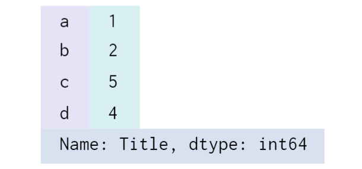
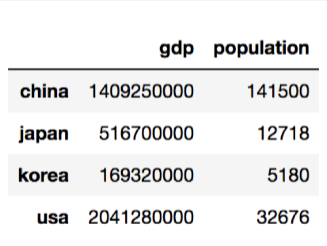
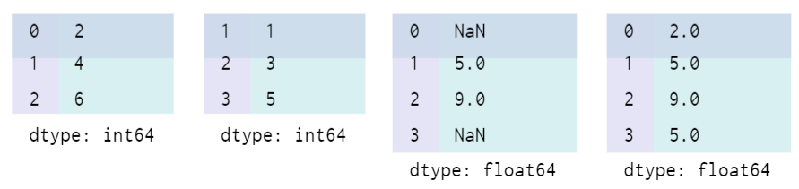
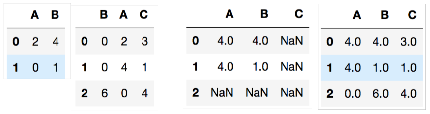

# Pandas

## Pandas?

> 데이터 분석, 데이터 처리를 쉽게 하기 위해 만들어진 파이썬 라이브러리

- Series, Dataframe과 같은 여러 데이터 구조를 생성하고 변경할 수 있도록 도와줌
- 안정적으로 대용량 데이터들을 쉽게 처리할 수 있음
- Array 계산에 특화된 NumPy를 기반으로 설계


## Series

### 생성



```python
import pandas as pd
data = pd.Series([1, 2, 3, 4])
data = pd.Series([1, 2, 3, 4], index=['a', 'b', 'c', 'd'])
data['b']
data = pd.Series([1, 2, 3, 4], index=['a', 'b', 'c', 'd'], name='Title')
```

- NumPy array가 보강된 형태
- Data와 Index를 가지고 있음 (dictionary의 key, value 구조와 유사)
- name 인자로 이름을 지정할 수 있음


### 딕셔너리로 변환

```python
population_dict = {(대충 딕셔너리 내용)}
population = pd.Series(population_dict)
population_dict = dict(population)
```


## DataFrame

> 여러 개의 Series가 모여서 행과 열을 이룬 데이터

### 생성



```python
country = pd.DataFrame({
    'population': population,
    'gdp': gdp,
})
country.index
country.columns
```

- 행을 접근할 때는 index를 이용
- 열을 접근할 때는 column을 이용


### 딕셔너리로 변환 

```python
country['gdp']
```


### 연산자 활용

```python
gdp_per_capita = country['gdp'] / country['population']
country['gdp_per_capita'] = gdp_per_capita
```


### 데이터 프레임을 저장

```python
country.to_csv('./country.csv')
country.to_excel('country.xlsx')

country = pd.read_csv('./country.csv')
country = pd.read_excel('country.xlsx')
```


### DataFrame Indexing / Slicing

##### .loc (label-location)

명시적인 인덱스를 참조하는 인덱싱/슬라이싱

```python
country.loc['china'] # Name이 china가 됨
country.loc['japan':'korea', :'population'] # 행(Index), 열(Column)
```

- 기존의 인덱싱과 달리 끝범위([start:end]에서 end)를 포함

##### .iloc (integer-location)

파이썬 스타일 정수 인덱스 인덱싱/슬라이싱

```python
country.iloc[0]
country.iloc[1:3, :2] # 행(Index), 열(Column)
```

- 기존의 인덱싱과 같이 끝범위(end)를 포함하지 않음


### 새 데이터 추가/수정

```python
dataframe = pd.DataFrame(columns=['이름', '나이', '주소'])
dataframe.loc[0] = ['박성일', '28', '서울']
dataframe.loc[1] = {'이름': '일성', '나이': 26, '주소': '안양'}
dataframe.loc[1, '이름'] = '박성'
```


### 행, 열 삭제

```python
# 행 삭제
dataframe.drop(1)
# 열 삭제
dataframe.drop('열 이름', axis=1)
del dataframe['열 이름']
```


### 새로운 컬럼 추가

```python
dataframe['전화번호'] = np.nan
# '전화번호' column에 모두 NaN(np.nan)을 집어넣음
dataframe.loc[0, '전화번호'] = '01077783323'
len(dataframe)
```


### 컬럼 선택하기

```python
dataframe['이름']
dataframe[['이름', '주소', '나이']]
```

- 컬럼 이름이 하나만 있다면 Series

- 리스트로 들어가 있다면 DataFrame


### 형 변환하기

```python
dataframe.astype(int)
dataframe.str.replace(',', '').astype(int)
```


### 문자 교체

```python
dataframe.str.replace(old, new)
```

- `str`을 써줘야 함


### 각 칼럼의 데이터 통계 확인하기

```python
dataframe.describe()
```

- `include=all`


### 변수들의 상관관계

```python
dataframe.corr()

# seaborn을 이용해 heatmap 그리기
fig = plt.figure(figsize=[20,20])
ax = sns.heatmap(train.corr(),annot=True,square=True)
```

- 0.3 이상이면 상관관계가 높은 편으로 판단


### 누락된 데이터 체크

```python
dataframe.isnull()
dataframe.notnull()
dataframe.info()
```

- boolean 형식으로 변환하여 확인

```python
dataframe.dropna()
dataframe['전화번호'] = dataframe['전화번호'].fillna('전화번호 없음')
```

- na는 결측치(not available)를 의미
- 결측치를 제거 (.dropna)
- 결측치를 대치 (.fillna)


### Series 연산

```python
A = pd.Series([2, 4, 6], index=[0, 1, 2])
B = pd.Series([1, 3, 5], index=[1, 2, 3])
A + B
A.add(B, fill_value=0)
```



- 결측치를 더하면 NaN값을 출력
- add 메서드의 fill_value를 이용하면 결측치를 대치해서 계산할 수 있음


### DataFrame 연산

add, sub, mul, div

```python
A = pd.DataFrame(np.random.randint(0, 10, (2, 2)), columns=list('AB'))
B = pd.DataFrame(np.random.randint(0, 10, (3, 3)), columns=list('BAC'))
A + B
A.add(B, fill_value=0)
```



- NaN 계산은 Series 연산과 같음


### 집계함수

numpy array에서 사용했던 sum, mean 등의 집계함수를 동일하게 사용할 수 있음

```python
data = {
    'A': [i+5 for i in range(3)]
    'B': [i**2 for i in range(3)]
}
df = pd.DataFrame(data)
df['A'].sum()
df.sum()
df.mean()
```


## DataFrame 정렬하기

### 값으로 정렬하기

```python
df.sort_values('col1')
df.sort_values('col1', ascending=False)
```

```python
# 복수의 정렬 기준
df.sort_values(['col2', 'col1'])
df.sort_values(['col2', 'col1'], ascending=[True, False])
```

