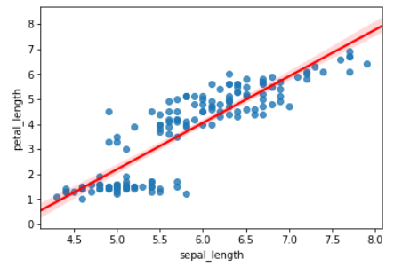
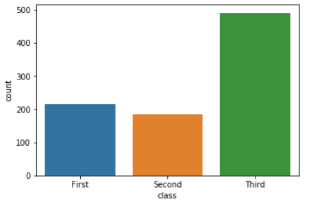
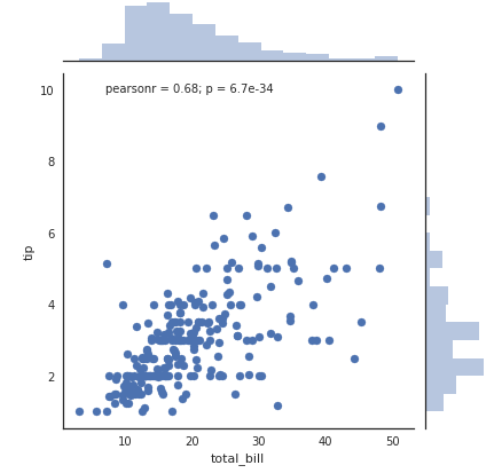

# Seaborn

> 데이터를 시각화하는 파이썬 라이브러리
>
> https://seaborn.pydata.org/index.html


### 라이브러리 import 및 데이터 불러오기

```python
# Seaborn 라이브러리 import 하기
import seaborn as sns

# iris 데이터 불러오기
df = sns.load_dataset('iris')

# 전체 데이터에서 처음 5개의 row 데이터 표시
df.head()
```

- seaborn의 `load_dataset()` 또는 pandas의 `read_csv()` 함수를 사용해 데이터를 로드


### 산점도와 분포 근사 선 그래프 그리기 - regplot()

- 데이터의 위치인 산점도를 출력해주는 것 뿐만 아니라 분포를 근사하는 선도 함께 출력할 수 있는 함수
- 대표적인 파라미터
  - `x`: x축에 해당하는 데이터
  - `y`: y축에 해당하는 데이터
  - `color`: 색상을 설정
  - `line_kws`: 근사선의 특성 설정 (딕셔너리)
  - `scatter_kws`: 데이터 점들의 특성 설정 (딕셔너리)

```python
import matplotlib.pyplot as plt

sns.regplot(x=df['sepal_length'], y=df['petal_length'], line_kws{'color': 'red'})
plt.show()
```




### 빈도수 막대그래프 그리기 - countplot()

- 각 카테고리 값 별로 빈도수를 표시하는 막대그래프를 출력
- 대표적인 파라미터
  - `x`: 열 이름 (String)
  - `data`: 시각화를 위한 데이터 (Pandas DataFrame)

```python
import seaborn as sns

titanic = sns.load_dataset('titanic')
ax = sns.countplot(x='class', data=titanic)
plt.show()
```




### 산점도와 히스토그램 그래프 그리기 - jointplot()

- 산점도와 히스토그램을 함께 출력
- 대표적인 파라미터
  - `x`, `y`: 열과 행 이름 (String)
  - `data`: 시각화를 위한 데이터 (Pandas DataFrame)
  - `kind`: 차트 종류 (기본은 scatter)

```python
sns.set(style="white") # 배경 색상 설정

tips = sns.load_dataset('tips')

g = sns.jointplot(x='total_bill', y='tip', data=tips)
plt.show()

# reg (regression + scatter) : 근사선
g = sns.jointplot('total_bill', 'tip', data=tips, kind='reg')
plt.show()
```


