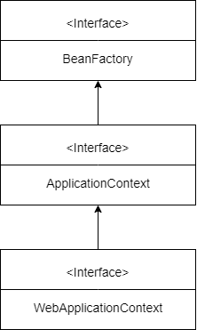
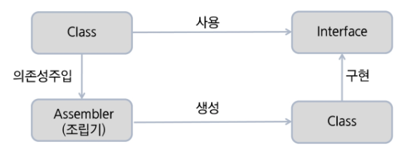

# 2. IoC (Inversion of Control)

> 객체의 라이프사이클을 Container에게 위임하여 처리하는 방식

### 2-1. Container

- 객체의 생성, 사용, 소멸에 해당하는 라이프사이클을 담당
- 라이프사이클을 기본으로 애플리케이션 사용에 필요한 주요 기능을 제공

### 2-2. IoC Container

- 컨테이너가 코드 대신 오브젝트에 대한 제어권을 갖고 있음
- 스프링 컨테이너는 IoC 컨테이너라고 부르기도 함
- IoC를 담당하는 컨테이너는 Bean Factory, Application Context가 있음

### 2-3. Bean

- 스프링이 IoC방식으로 관리하는 오브젝트를 '<u>Bean</u>'이라고 한다
- 스프링이 직접 생성과 제어를 담당하는 오브젝트만을 Bean이라고 부른다

### 2-3. Bean Factory / Application Context

- Bean들의 life cycle을 관리하는 의미로 '<u>Bean Factory</u>'라고 한다 

- Bean Factory에 여러 컨테이너 기능을 추가하여 <u>Application Context</u>라고 하며, 일반적으로는 Application Context를 사용한다

  

### 2-4. IoC 개념

- 객체의 라이프사이클을 Container에게 위임하여 처리

- 이는 객체 간 결합도를 떨어뜨려 유지보수성을 높여주는 역할을 한다
- 객체 간의 강한 결합을  Bean Factory(또는 Assembler) 를 통해 결합도를 낮춘다
  - Bean Factory는 Factory를 호출함으로써, 팩토리에 의존하게 됨
  - Assembler를 사용하고 이에 의존성을 주입(<u>Dependency Injection</u>)함으로써, 어떤것에도 의존하지 않는 형태가 됨

