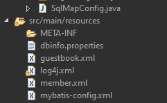

# 1. MyBatis


### 1-1. MyBatis

##### 개요

- Java 객체와 SQL문 사이의 자동 맵핑 기능을 지원하는 프레임워크
- 개발자가 익숙한 SQL을 그대로 이용하면서 JDBC 코드 작성의 불편함을 제거해주고, 도메인 객체나 VO 객체(DTO)를 중심으로 개발 가능
- 기존 JDBC 과정에서 자동으로 할 수 없는 것(DB연결 정보 설정, SQL문 생성, 입력 값 세팅, 반환 타입 설정)을 제외한 다른 것들을 자동으로 수행해준다.


##### 특징

- 쉽고 코드가 간결하다
- SQL문과 프로그래밍 코드가 분리된다
- 다양한 프로그래밍 언어로 구현 가능하다


### 1-2. MyBatis 설정하기

**Document :** https://mybatis.org/mybatis-3/index.html



- xml을 이용해 SqlSessionFactory 빌드하기 (SqlMapConfig.java)

  ```java
  package com.ssafy.util;
  
  import java.io.IOException;
  import java.io.Reader;
  import org.apache.ibatis.io.Resources;
  import org.apache.ibatis.session.SqlSession;
  import org.apache.ibatis.session.SqlSessionFactory;
  import org.apache.ibatis.session.SqlSessionFactoryBuilder;
  
  public class SqlMapConfig {
  
      private static SqlSessionFactory factory;
  
      static {
          try {
              String resource = "mybatis-config.xml";
              Reader reader = Resources.getResourceAsReader(resource);
              factory = new SqlSessionFactoryBuilder().build(reader);
          } catch (IOException e) {
              e.printStackTrace();
          }
      }
  
      public static SqlSession getSqlSession() {
          return factory.openSession();
      }
  
  }
  ```

  

- Configuration XML파일 (mybatis-config.xml)

  ```xml
  <?xml version="1.0" encoding="UTF-8" ?>
  <!DOCTYPE configuration PUBLIC "-//mybatis.org//DTD Config 3.0//EN" "http://mybatis.org/dtd/mybatis-3-config.dtd">
  
  <configuration>
  	<properties resource="dbinfo.properties"></properties>
  	
  	<typeAliases>
  		<typeAlias type="com.test.guestbook.model.MemberDto" alias="member"/>
  		<typeAlias type="com.test.guestbook.model.GuestBookDto" alias="guestbook"/>
  	</typeAliases>
  	
  	<environments default="development">
  		<environment id="development">
  			<transactionManager type="JDBC"/>
  			<dataSource type="POOLED">
  			<property name="driver" value="${driver}"/>
  			<property name="url" value="${url}"/>
  			<property name="username" value="${username}"/>
  			<property name="password" value="${password}"/>
  			</dataSource>
  		</environment>
  	</environments>
  	
  	<mappers>
  		<mapper resource="member.xml" />
  		<mapper resource="guestbook.xml" />
  	</mappers>
  </configuration>
  ```

  - `<environment>`에서 JDBC를 설정한다. RDBMS 연결에 필요한 driver, url, id, pw 정보는 dbinfo.properties에서 받아와 사용한다. Java의 Map 계열의 Properties 클래스이지만 파일이기 때문에 key와 value 모두 문자열로 이루어진다.

    ```
    driver=com.mysql.cj.jdbc.Driver
    url=jdbc:mysql://127.0.0.1:3306/testweb?serverTimezone=UTC&useUniCode=yes&characterEncoding=UTF-8
    username=test
    password=test
    ```

  - `<typeAlias>`에서 이후에 parameterType이나 resultType으로 설정할 dto 클래스의 가명(alias)을 설정한다.

  - `<mapper>`에서 class/url/resource로 sql을 실행할 xml 파일을 설정한다.


- SQL문을 실행할 mapper XML 파일 (guestbook.xml)

  ```xml
  <mapper namespace="com.ssafy.guestbook.model.dao.GuestBookDao">
  
  	<sql id="searchcondition">
  		<if test="word != null and word != ''">
           	<if test="key == 'subject'">
           		and subject like concat('%', #{word}, '%')
           	</if>
           	<if test="key != 'subject'">
           		and ${key} = #{word}
           	</if>
           </if>
  	</sql>
  	
  	<select id="listArticle" parameterType="map" resultType="guestbook">
  		 select g.articleno, g.userid, g.subject, g.content, g.regtime, m.username
           from guestbook g, ssafy_member m
           where g.userid = m.userid
           <include refid="searchcondition"></include>
           order by g.articleno desc
           limit #{start}, #{spp}
  	</select>
  	
  	<select id="getTotalCount" parameterType="map" resultType="int">
  		select count(articleno)
  		from guestbook
  		<where>
          <include refid="searchcondition"></include>
  		</where>
  	</select>
  	
  </mapper>
  ```
  
  - `#{<key>}`를 이용해 parameterType으로 들어오는 map 객체의 값을 sql문에 대입한다.
  - `${}`를 이용해 컬럼을 지정한다.
  - `<include>`를 이용해 반복되는 조건을 불러온다.
  - `<where>`를 이용하면 조건에 있는 and 앞에 where이 없을 때 자동으로 where로 바꿔준다.

