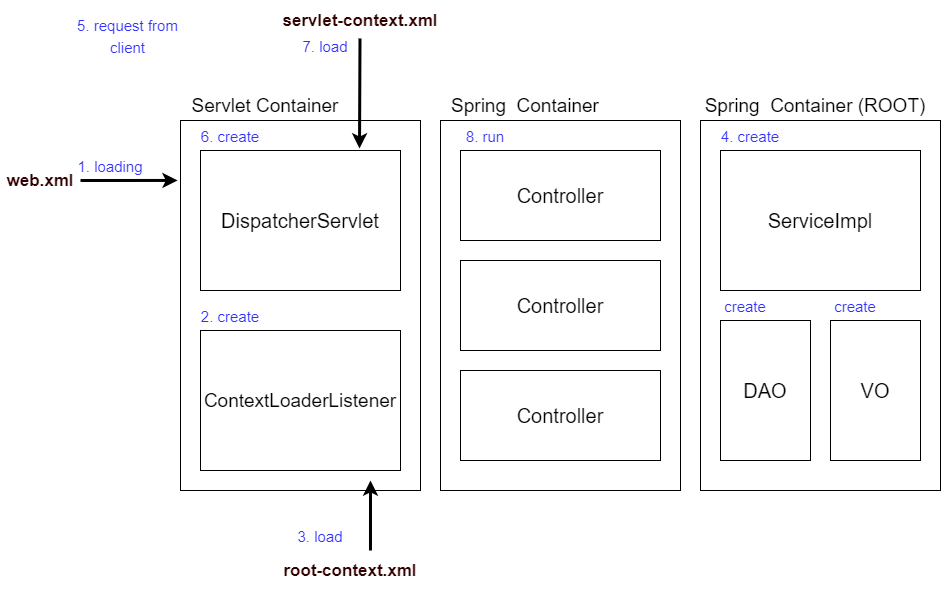

# 6. Spring Web MVC 정리

> 스프링에서 웹 프로젝트가 실행되는 순서, xml 파일들의 용도 구분

### 6-1. Spring에서 웹 프로젝트가 실행되는 순서

1. Tomcat의 서버가 실행되고 web.xml 읽어들임
2. web.xml에 등록되어 있는 ContextLoaderListener가 생성
3. 생성된 ContextLoaderListener가 root-context.xml을 로드
4. root-context.xml에 등록되어 있는 스프링 컨테이너가 구동되고, 이 때 개발자가 작성한 비즈니스 로직(Service) 부분과 DB 로직(DAO), VO(DTO) 객체들이 생성
5. 클라이언트로부터 요청이 들어옴
6. DispatcherServlet이 생성되고 Front Controller의 역할을 수행하며, 실질적인 작업은 HandlerMapping(컨트롤러 매핑), ViewResolver(view 매핑)에서 이루어짐
7. DispatcherServlet은 servlet-context.xml을 로드
8. 응답에 맞는 컨트롤러들이 동작하여 알맞은 작업을 처리

### 6-2. 각 xml 파일의 용도 구분

- pom.xml : maven 설정 파일 정보
- web.xml : 프로젝트에 대한 설정 
  - context-param, listener : root-context.xml 연결
  - servlet, init-param : servlet-context.xml 연결
  - filter
- servlet-context.xml : 웹과 직접적으로 관련되어 있는 객체 및 설정
  - context-param - controller
  - viewResolver
  - interceptor
  - file-upload/download
  - resources
- root-context.xml : 웹과 직접적인 연관이 없는 객체 및 설정
  - dataSource
  - AOP
  - myBatis 관련 설정
    - sqlSession
    - sqlSessionFactoryBean
    - typeAliases
    - mapper
    - transactionManager

