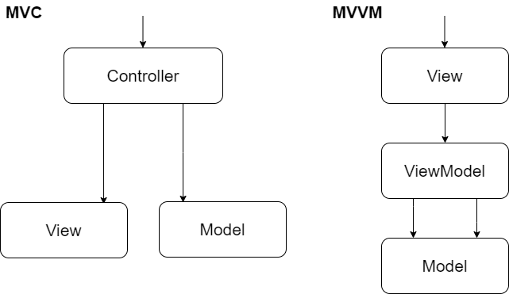
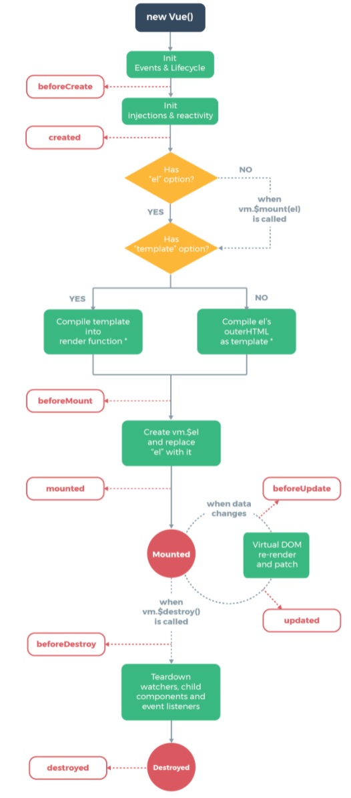

# Vue.js

> 프론트엔드 프레임워크


### Vue.js란?

사용자 인터페이스를 만들기 위한 <u>프레임워크</u>이다. 다른 프레임워크보다 배우기 쉬워 초심자에게 적합하다고 평가받으며, React와 Angular의 장점들을 가져와 더 빠르고 가볍게 만든 프레임워크라고 한다.

- 점진적인 프레임워크 : 라이브러리 기능 + 프레임워크 기능
- 라이브러리 기능 : 화면 단 데이터 표현에 관한 기능들을 중점적으로 지원
- 프레임워크 기능 : 라우터, 상태관리, 테스팅 등을 쉽게 결합할 수 있는 형태로 제공


### 프레임워크를 사용하는 이유

React와 같은 라이브러리, Vue.js와 같은 프레임워크로 할 수 있는 일들은 바닐라 JS로 구현할 수 있다.

그럼에도 아래와 같은 이유로 프레임워크를 사용한다.

1. 데이터의 변화를 화면에 적용하기 쉽다 (선언형)
2. 컴포넌트화 하기 쉽다 (컴포넌트 기반)


##### 데이터의 변화를 화면에 적용하기 쉽다

- 데이터의 변화에 따라 다른 요소들이 변화해야 한다면 바닐라 JS의 경우 변화에 따른 변경 작업들을 작성해줘야 한다

- React에서는 state를, Vue.js에서는 data를 변경하기만 하면 DOM이 알아서 업데이트 된다

- 다음은 [React 소개 페이지](https://ko.reactjs.org/)에 적혀있는 글이다.

  > React는 상호작용이 많은 UI를 만들 때 생기는 어려움을 줄여줍니다. 애플리케이션의 각 상태에 대한 간단한 뷰만 설계하세요. 그럼 React는 데이터가 변경됨에 따라 적절한 컴포넌트만 효율적으로 갱신하고 렌더링합니다.


##### 컴포넌트화 하기 쉽다

- 쉽게 디자인이나 기능을 토대로 큰 웹사이트를 작은 부분으로 나누어 놓은 것을 컴포넌트라고 부른다

- 큰 웹 사이트를 작은 부분으로 나누어 개발하기 용이하다

- 반복적으로 컴포넌트를 사용해야 하는 경우 바닐라 JS보다 더 보기 좋게 코드를 작성할 수 있다

  > 스스로 상태를 관리하는 캡슐화된 컴포넌트를 만드세요. 그리고 이를 조합해 복잡한 UI를 만들어보세요.


### Vue.js의 장점

Angular의 데이터 바인딩 특성과 React의 가상 돔 기반 렌더링 특징을 모두 가지고 있다.

1. 배우기 쉽다.
2. React와 Angular의 장점을 가지고 있으면서, 성능이 우수하고 빠르다.


### Vue.js의 동작 원리

- <u>가상 DOM</u>으로 화면 요소를 변경 및 조작하고 최종 결과물을 DOM 트리에 반영한다


### 가상 DOM

##### 정의

- DOM 트리를 모방한 가벼운 JS 객체를 통해 직접 DOM을 핸들링하지 않고 자바스크립트가 HTML을 렌더링 하는 방법

##### 사용 이유

- 실제 DOM을 수정하는 과정은 JS에서 메모리 상의 객체를 수정하는 것 보다 오래 걸림
- DOM을 반복적으로 직접 조작 → 브라우저 렌더링 횟수 증가 → PC자원 소모 증가


### MVVM 패턴


- Model + View + ViewModel
- Model : 순수 자바스크립트 객체
- View : 웹페이지의 DOM
- ViewModel : Vue의 역할




- 기존에는 자바스크립트로 view에 해당하는 DOM에 접근함거나 수정하기 위해 jQuery와 같은 라이브러리를 이용
- Vue는 view와 Model을 연결하고 자동으로 바인딩 하므로 양방향 통신을 가능하게 함


### Vue.js 설치

- `<script>` include (Download, CDN)
- NPM
- CLI


### Chrome Extension

- Vue.js devtools
  - 크롬에서 디버깅 할 수 있음


### Vue Instance 생성

```vue
<script>
	new Vue({
        el: '#app',
        data() {
            return {
                message: 'Hello Vue!',
            }
        }
    })
</script>
```

##### 속성

- `el`: Vue가 적용될 요소 지정
- `data`: Vue에서 사용되는 정보 저장. 객체 또는 함수 형태
- `template`: 화면에 표시할 html, css 등의 마크업 요소를 정의하는 속성
- `methods`: 화면 로직 제어와 관계된 method를 정의하는 속성. 이벤트 처리나 화면 동작과 관련된 로직을 추가
- Life cycle에 맞춰 실행되는 함수들


### Vue Instance의 유효 범위

- el 속성에 


### Life Cycle



##### Life Cycle Hook

- beforeCreate : Vue Instance가 생성되고 각 정보의 설정 전에 호출
- created : Vue Instance가 생성된 후 데이터들의 설정이 완료된 후 호출
- beforeMount : 마운트가 시작되기 전에 호출
- mounted : 지정된 element에 Vue Instance 데이터가 마운트 된 후에 호출
- beforeUpdate : 데이터가 변경될 때 virtual DOM이 랜더링
- updated : Vue에서 관리되는 데이터가 변경되어 DOM이 업데이트 된 상태
- beforeDestroy : Vue Instance가 제거되기 전에 호출
- destroyed : Vue Instance가 제거된 후 호출


### Vue 객체 내의 변수에 접근하기

```vue
<script>
  const vm = new Vue ({
    el: '#app',
    data() {
      return {
        ...
      }
    },
    methods() {
      ...
    },
  })
</script>
```

- 위와 같이 Vue 인스턴스에 이름을 붙이고 `vm.method()` 혹은 `vm.variable`로 내부 변수나 메서드에 접근할 수 있다.


### 참고 자료

- https://ko.reactjs.org/

- https://coding-start.tistory.com/213

- https://shorturl.at/gyHR3