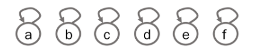
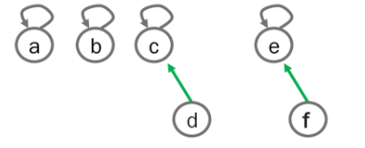
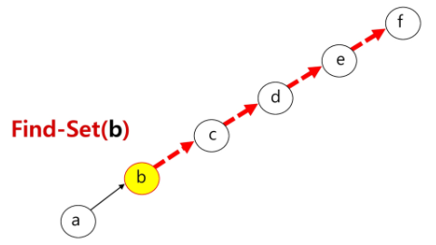

# Disjoint Set

> 서로소 집합

- 서로간의 교집합이 없다
- 집합에 속한 하나의 특정 멤버(<u>대표자</u>)를 통해 각 집합들을 구분


#### 서로소 집합을 표현하는 방법

- 연결 리스트
- 트리


#### 서로소 집합 연산

- `Make-Set(x)` : 유일한 멤버 x를 포함하는 새로운 집합을 생성

```
Make-Set(x)
	p[x] <- x
```

- `Find-Set(x)` : x를 포함하는 집합을 찾는 연산

```
Find-Set(x)
	IF x == p[x] return x
	Else return Find-Set(p[x])
```

- `Union(x, y)` : x와 y를 포함하는 두 집합을 통합하는 연산

```
Union(x, y)
	IF Find-Set(y) == Find-Set(x) RETURN;
	p[Find-Set(y)] <- Find-Set(x)
```


## 연결리스트로 표현하기

- 같은 집합의 원소들은 하나의 연결리스트로 관리한다
- 연결리스트의 맨 앞의 원소를 집합의 대표 원소로 삼는다
- 각 원소는 집합의 대표원소를 가리키는 <u>링크</u>를 갖는다


## 트리로 표현하기

- 하나의 집합을 하나의 트리로 표현한다
- 자식 노드가 부모 노드를 가리키며 대표자가 된다


#### 연산

- Make-Set

  

- Union

  

- Find

  


#### 연산의 효율을 높이는 방법

- Rank를 이용한 Union
  - 각 노드는 자신을 루트로 하는 subtree의 높이를 Rank라는 이름으로 저장한다
  - 두 집합을 합칠 때 rank가 낮은 집합을 rank가 높은 집합에 붙인다
- Path compression
  - `Find-Set`을 행하는 과정에서 만나는 모든 노드들이 직접 root를 가리키도록 포인터를 바꾸어준다
  - `return parent[x] = Find-Set(parent[x])`

