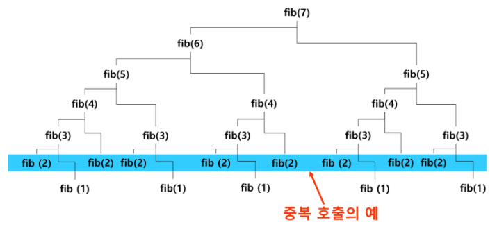
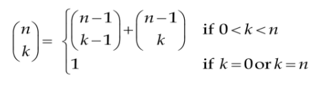
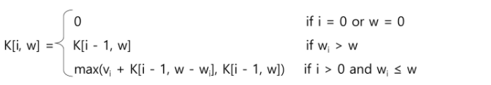
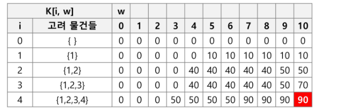

# Dynamic Programming 1

> 동적 계획법


#### 피보나치 수열

- 0과 1로 시작하고 이전의 두 수의 합을 항으로 하는 수열

- f(0) = 0, f(1) = 1, f(i) = f(i-1) + f(i-2) for i>=2

- 재귀함수 구현

  ```
  fibo(n)
  	IF n < 2 : RETURN n
  	ELSE : RETURN fibo(n-1) + fibo(n-2)
  ```

  - 재귀 함수로 구현할 경우 엄청난 중복 호출이 존재

  

#### 메모이제이션 (memoization)

- 프로그램을 실행할 때 이전에 계산한 값을 메모리에 저장해서 매번 다시 계산하지 않도록 하여 전체적인 실행 속도를 빠르게 하는 기술

- memoization을 적용한 피보나치 재귀 알고리즘

  - 이미 계산이 되었는지 판단. 그렇다면 메모된 값 사용 / 그렇지 않다면 계산 후 메모하여 저장

  ```
  memo를 위한 배열을 할당하고 모두 0으로 초기화
  memo[0]은 0, memo[1]은 1로 초기화
  
  fibo1(n)
  	IF n >= 2 AND memo[n] = 0
  		memo[n] = fibo1(n-1) + fibo(n-2)
  	RETURN memo[n]
  ```

- 추가적인 메모리 공간이 필요

- 재귀 함수 호출로 인한 시스템 호출 스택을 사용하게 되어 실행 속도 저하 및 오버플로우가 발생할 수 있음


## 동적 계획법

#### 정의

- 먼저 작은 부분 문제들의 해를 구하고 이를 이용해 보다 큰 크기의 부분 문제들을 해결하여, 최종적으로 원래 주어진 문제를 해결하는 알고리즘 설계 기법
- 그리디 알고리즘과 같이 최적화 문제를 해결하는 알고리즘 (최대, 최소 + 경우의 수)
- 주어진 문제가 최적화의 원칙을 만족해야만 동적 계획법을 효율적으로 적용할 수 있음


#### 중복 부분문제 구조

- DP는 문제의 순환적인 성질 때문에 이전에 계산되어졌던 작은 문제의 해가 다른 어딘가에서 필요하게 되는데 이를 위해 DP에서는 이미 해결된 작은 문제들의 해를 어떤 공간(table)에 저장


#### 최적 부분문제 구조

- **최적화의 원칙**이란 어떤 문제에 대한 해가 최적일 때 그 해를 구성하는 작은 문제들의 해 역시 최적이어야 한다는 것.
- 최장경로 문제와 같이 최적화의 원칙이 적용되지 않은 경우에는 DP를 사용할 수 없음
  - 최장경로 문제는 효율적으로 풀 수 있는 방법이 없어 완전탐색 해야함


#### 분할 정복과 동적 계획법의 비교

- 분할정복 
  - 연관 없는 부분 문제로 분할 - 최적 부분 문제 구조가 아님
  - 부분 문제를 재귀적으로 해결한다.
  - 부분 문제의 해를 결합(combine)한다.
  - merge sort, quick sort
  - 하향식 방법 (top-down)

- DP
  - 부분문제들이 연관이 없으면 적용할 수 없다. 즉 부분 문제들은 더 작은 부분 문제들을 공유한다. 
  - 부분 문제들 사이에 의존적 관계가 존재하는데 이러한 관계는 문제에 따라 다르고, 대부분의 경우 뚜렷이 보이지 않아서 함축적인 순서라고 한다.
  - 모든 부분 문제를 한 번만 계산하고 결과를 저장하여 재사용한다.
  - 상향식 방법 (bottom-up)


#### ✔ 3단계 DP 적용 접근 방법

- 최적해 구조의 특성을 파악하라
  - 문제를 부분 문제로 나눈다.

- 최적해의 값을 재귀적으로 정의하라
  - 부분 문제의 최적해 값에 기반하여 문제의 최적해 값을 정의한다.
- **상향식** 방법으로 최적해의 값을 계산하라
  - 가장 작은 부분 문제부터 해를 구한 뒤 테이블에 저장한다
  - 테이블에 저장되어 있는 부분 문제의 해를 이용하여 점차적으로 상위 부분 문제의 최적해를 구한다.


## 동적 계획법 응용

#### 피보나치 수 DP 적용

1. 문제를 부분 문제로 분할한다
2. 점화식으로 정의한다
3. 가장 자근 부분 문제부터 해를 구한다. 그 결과는 테이블에 저장하고, 테이블에 저장된 부분 문제의 해를 이용하여 상위 문제의 해를 구한다.

```
fibo_dp (n)
	f[0] <- 0
	f[1] <- 1
	FOR i in 2->n
		f[i] <- f[i-1] + f[i-2]
	RETURN f[n]
```

- DP 알고리즘이 수행 속도가 더 빠름
  - 재귀 알고리즘과는 달리 중복 계산이 없음
  - 또한 반복문을 사용하기 때문에 함수 호출이 발생하지 않음
  - 반복문의 반복 횟수가 시간 복잡도


#### 동전 거스름 돈 구하기

- 동전의 종류는 1원, 4원, 6원이 있을 때, n원을 거슬러 주려고 한다. 최소 몇 개의 동전을 거슬러 주면 될까?
- 3종류의 동전 각각에 대해 재귀적으로 해결

```
1원 동전 한 개 + n-1원에 대한 최적해
4원 동전 한 개 + n-4원에 대한 최적해
6원 동전 한 개 + n-6원에 대한 최적해
위 세가지 해 중 최적해를 선택
```


#### 이항 계수 구하기

- (x + y)^n의 전개식에서 각 항의 계수는 nCk
- 조합 계산식은 n! 또는 k!의 계산량이 많아 조합식 대신 아래와 같은 수식을 사용한다.

```
bino(n, k)
B[][]
FOR i in 0 -> n
	FOR j in 0 -> minimum(i, k)
		IF j=0 OR j=i
			B[i][j] <- 1
		ELSE
			B[i][j] <- B[i-1][j-1] + B[i-1][j]
RETURN B[n][k]
```


#### 0-1 Knapsack 문제

- n개의 물건과 각 물건 i의 무게 wi와 가치 vi가 주어지고, 배낭의 용량은 W일 때, 배낭에 담을 수 있는 물건의
  최대 가치를 찾는 문제. 단, 배낭에 담은 물건의 무게의 합이 W를 초과하지 말아야 하고, 각 물건은 1개씩만 있다.
- K[i, w] : 물건 1~j까지만 고려하고, (임시) 배낭의 용량이 w일 때 최대 가치

- 상향식으로 문제를 해결하기 위해서는 어떤 값이 쓰일지 모르니 모든 경우에 대해 값을 구해놓아야 한다.
- 가방에 물건을 채워서 담는 상향식으로 문제를 푼다면 이전 과정의 결과들을 이용해야 하므로 1차원이 아닌 2차원 배열을 사용해야 함
- 1차원 배열로 사용할 경우 w를 감소시키며 배열을 갱신하면 가능

```
K[n, W]

FOR i in 0->n : K[i, 0] <- 0
FOR w in 0->W : K[0, w] <- 0

FOR i in 1->n
	FOR w in 1->W
		IF w_i > w
			K[i, w] <- K[i-1, w]
		ELSE
			K[i, w] <- max(v_i + K[i-1, w-w_i], K[i-1, w])
RETURN K[n, W]
```

- 2차원 배열의 각각의 행은 i행까지의 물건들을 고려한 최적해이며, i-1번째까지의 최적해들과 새로운 해를 비교하며 배열을 채워나간다.

