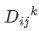
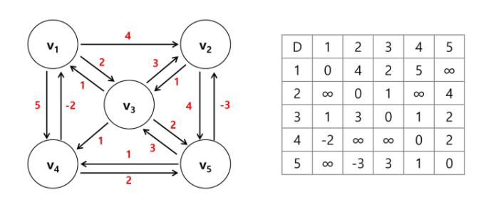

# Dynamic Programming 2

> 최장 증가 수열, 모든 쌍 최단경로


## 최장 증가 수열 (Longest Increasing Subsequence, LIS)

#### Brute-force

- 수열의 모든 부분 집합을 구해 그 부분 집합이  증가 수열인지 판별한다.
- 부분집합 알고리즘을 이용하기 때문에 시간 복잡도가 O(2^n)으로 매우 크다.


#### DP 접근 방법1

- 입력 : 숫자열 a1, a2, ... , an
- LIS(i) : a1, a2, ... , ai에서 최장 부분 수열의 길이
- Case1 : LIS(i)가 ai를 포함하지 않는다면, LIS(i) = LIS(i-1)
- Case2 : LIS(i)가 ai를 포함한다면, LIS(i) = (i를 끝으로 하는 최장 부분 수열)
    - ai보다 크기가 작은 aj를 모두 검색하고 그 중 최대값을 찾아 1을 증가시켜 LIS(i)에 저장

    - LIS() 중에서 최대값을 `찾기`

```
FOR  i in 1 -> n
	LIS[i] = 1
	FOR j in 1 -> i-1
		IF aj < ai AND LIS[i] < 1+LIS[j]
			LIS[i] = 1 + LIS[j]
RETURN max LIS[]
```


#### DP 접근 방법2

- 입력의 숫자들을 하나씩 체크하면서 LIS를 실시간으로 만들어감

- LIS의 각 자리에 올 수 있는 값의 최솟값을 갱신하며 최장 증가 수열이 될 가능성을 최대로 유지

- LIS(i) : i는 LIS의 길이. LIS(i)는 i번째 자리에 올 수 있는 숫자 중 가장 작은 값

- 삽입 포인트를 찾기 위해 LIS 배열의 맨 처음부터 탐색하는 것이 아니라 이진 탐색으로 O(nlogn)의 복잡도로 구현할 수 있음

- 이진 탐색 
  - 정렬 되어있는 배열에서 특정한 값을 찾아내는 알고리즘
  - 배열 중간에 있는 임의의 값(중간 값)을 선택해 찾고자 하는 값 x와 비교
  - x가 중간 값보다 작으면 좌측의 데이터를, x가 중간 값보다 크면 우측의 데이터를 찾는다.
  - x가 중간 값과 같아질 때까지 위 과정을 반복

	```java
	// 찾으려는 key가 arr에 없을 경우, 그 key가 있었어야 하는 자리에 대해 -(insert point)-1 을 리턴
	Arrays.binarySearch(arr, key);
	// from과 to가 주어지는 경우 key가 arr에 없을 때, 그 구간안에 key가 있어야 할 자리에 대해 
	// -(insert point)-1 을 리턴 
	Arrays.binarySearch(arr, from, to, key);
	```


## 모든 쌍 최단 경로

#### Brute-force

- 한 정점에서 다른 정점으로의 모든 경로를 구한 뒤, 그들 중에서 최단 경로를 찾는다.
- 그래프가 n개의 정점을 가지고 있고, 완전 그래프라고 가정했을때, 한 정점에서 다른 정점까지 가는 경로 중 두 정점을 제외한 모든 정점을 지나쳐 가는 경우만 생각해 보아도 (n-2)!개의 경로가 존재
- 비효율적


#### Floyd-Warshall

- 다익스트라를 정점의 수만큼 사용하면 시간 복잡도는 O(n^3)
- Floyd-Warshall 알고리즘도 시간 복잡도는 O(n^3)으로 같지만 구현이 매우 간단함


###  

- 정점 {1, 2, ..., k}만을 경유 가능한 정점으로 고려하여, 정점 i로부터 j까지의 모든 경로 중 가장 짧은 경로의 거리
- 단, 1부터 k까지의 모든 정점을 반드시 경유하는 경로를 의미하는 것이 아님


```
D[i][j] = 정점 i에서 정점 j로의 최소 비용
// 경 출 도
AllPairsShortest(D[][])
  FOR k in 1 -> n  // 경유지
    FOR i in 1 -> n	(단, i != k)	// 출발지점
      FOR j in 1 -> n (단, j != k, j != i)	// 도착지점
        D[i][j] <- min(D[i][k] + D[k][j], D[i][j])
```

- k != i, k != j이고 k=0인 경우, 정점 0은 그래프에 없으므로 어떤 정점도 경유하지 않는다는 것을 의미.따라서 (D_ij)^0은 입력으로 주어지는 선분 (i, j)의 가중치이다.
  - 따라서 모든 쌍 i와 j에 대하여 (D_ij)^k를 계산하는 것이 가장 작은 부분 문제들.
  - new D[i, j] = MIN(old D[i, j], old D[i, k] + old D[k, j])
- 3차원 배열을 활용하면 메모리를 많이 차지하기 때문에 2차원으로 사용. 출발지와 경유지, 경유지와 도착지가 다르기 때문에 직전 값과 갱신하려는 값이 서로 영향을 주지 않음
- 간선의 가중치가 음수를 포함하는 경우 고려하는 정점에 따라 자기 자신으로 가는 가중치의 합이 음수가 될 수 있기 때문에 출발지!=경유지!=도착지 임을 확인해야 함
- 출발정점에서 도착정점으로 갈 수 없는 경우 D에 매우 큰 값을 넣기. 단, 오버플로우가 날 수 있으므로 조건을 보고 적당히 큰 값을 지정해야 함

- D의 초기값 설정 예



