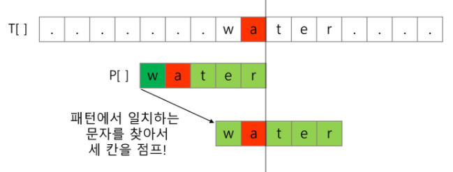
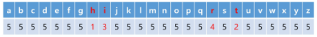
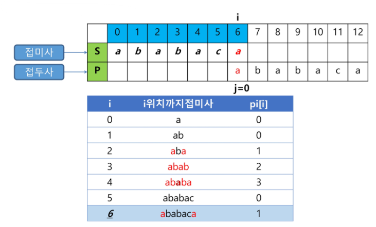
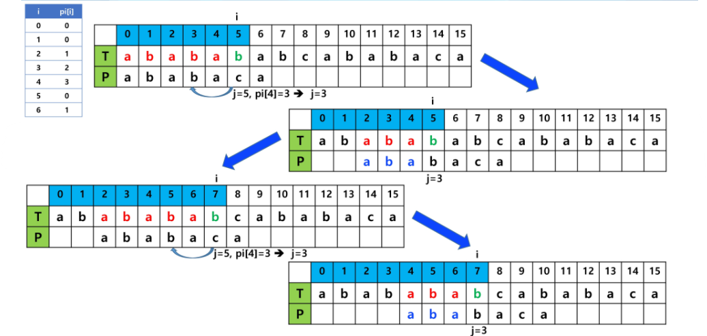

# String

> 문자열 관련 알고리즘
>
> 문자열 패턴 매칭, 라빈-카프 알고리즘, 보이어 무어 알고리즘, KMP 알고리즘


## 문자열 패턴 매칭

#### 예시

- 다음과 같이 200개의 문자로 이루어진 문자열 X 안에 10개의 문자로 이루어진 문자열 Y가 존재하는지 찾아보자
- X = TGTTAACCAAGGAATGGATCTGTGTCGTTCCACGTTCGAAGGCCTTTTCTGATGAAATGAAGATAGGTTTCAACTCCACAGGTTATTGTGGTATGATCTTAACCAAAAATGATGAAGTTTTCTCCAAGATTACTGAAAAACCTGAATTGATTAACGATATCTTATTGGAATGTGGTTTCCCAAACACTTCTGGTCAAAAACC
- Y = CTTATTGGA
- 문자를 앞에서부터 하나씩 비교하는 경우 시간 복잡도는 O(XY)


#### 패턴 매칭에 사용되는 알고리즘

- 고지식한 패턴 검색 알고리즘
- 라빈-카프 알고리즘
- 보이어-무어 알고리즘
- KMP 알고리즘


#### Brute Force

- 본문 문자열을 처음부터 끝까지 차례대로 순회하면서 패턴 내의 문자들을 일일이 비교하는 방식
- 시간 복잡도는 **O(MN)**
  - 최악의 경우 텍스트의 모든 위치에서 패턴을 비교해야 하므로


## 라빈-카프 알고리즘

- 문자열 검색을 위해 해시 값 함수를 이용
  - 하나의 해쉬에 여러 대상이 연결될 수 있음 (Collision)
    - 하나의 해쉬에 대응되는 대상을 List로 관리 (Closed addressing)
- 패턴 내의 문자들을 일일이 비교하는 대신에 패턴의 해시 값과 본문 안에 있는 하위 문자열의 해시 값만을 비교
- 최악의 시간 복잡도는 O(MN)이지만 **평균적으로는 선형에 가까운 빠른 속도**를 가지는 알고리즘


#### 아이디어

1. 패턴의 해쉬 값을 계산
   - 적절한 Hash Function에 따라 계산
2. 찾고자 하는 문자열에서 4자리씩 해쉬값을 계산
   - 한 글자씩 이동하며 패턴 길이만큼 읽어서 해쉬 값을 계산하지 않음
   - 새로 추가되는 문자와 그 전에 읽었던 값을 이용해 해쉬 값을 계산 (Sliding Window)


#### 고려사항

- 처음 해쉬 값을 구할 때는 찾고자 하는 문자열에서 패턴 길이만큼 읽어서 구한다
- 패턴이 문자열이며 길이가 커지면 길이를 일정 자리수로 맞추기 위해 mod 연산을 취해준다
- 따라서 해쉬 값이 일치하더라도 실제 패턴이 일치하지 않을 수 있기 때문에 해쉬 값이 일치하면 문자열 일치를 검사해야 한다. (Collision)


## 보이어 무어 알고리즘

- 오른쪽에서 왼쪽으로 비교
- 오른쪽 끝에 있는 문자가 불일치하고 이 문자가 패턴 내에 존재하지 않는 경우, 이동 거리는 무려 패턴의 길이 만큼이 됨

- 최악의 시간 복잡도는 O(MN)이지만 **최선의 시간 복잡도는 O(N/M)**이며 **평균적으로는 가장 빠른 속도**를 가지는 알고리즘


- 오른쪽 끝에 있는 문자가 불일치하고 이 문자가 패턴 내에 존재할 경우

  

- skip 배열 만들기

  - skip[ch] : 본문 ch 문자에서 패턴 불일치가 발생했을때 본문 포인터의 skip 횟수

  - 중복 문자가 있으면 마지막으로 나온 중복 문자를 기준으로 skip 횟수를 결정

  - "rithm" 패턴 문자열의 skip 배열

    


## KMP 알고리즘

> Knuth-Morris-Pratt Algorithm

- 불일치가 발생한 텍스트 문자열의 앞 부분에 어떤 문자가 있는지를 미리 알고 있으므로, 불일치가 발생한 앞 부분에 대하여 다시 비교하지 않고 매칭을 수행
- 패턴을 전처리하여 부분일치 테이블 배열 pi[k]를 구해서 잘못된 시작을 최소화함
  - pi[k] : 처음부터 k인덱스까지를 끝으로 하는 부분 문자열에서 접두사와 접미사가 일치하는 최대 길이
- 시간 복잡도 **O(M+N)**


#### 구현

- 부분일치 테이블 배열 만들기
  - 매칭이 실패했을 때 패턴 포인터가 돌아갈 곳을 계산하는 과정
  - 패턴에서 접미사 포인터 i와 접두사 포인터 j
  - i가 0일때의 인덱스를 제외한 각 인덱스마다 맨 앞부터 해당 인덱스까지의 부분 문자열 중 접두사와 접미사가 일치하는 최대 길이로 계산해서 작성



- 텍스트에서 패턴의 포함 여부 확인하기

  - T[i]와 P[j]가 일치하면 각각 1씩 증가
  - T[i]와 P[j]가 일치하지 않으면 j = P[j-1]

  


```
// 부분 일치 테이블 만들기
FOR i in 1 -> P.len, j=0
	WHILE j>0 && P[i] != P[j]
		j = pi[j-1]
	IF P[i] == P[j]
		pi[i] = ++j

// T에서 P 찾기
FOR i in 0 -> T.len, j=0
	WHILE j>0 && T[i] != P[j]
		j = pi[j-1];
	IF T[i] == P[j]
		IF j == P.len - 1
			j = pi[j]
		ELSE
			j++
```

