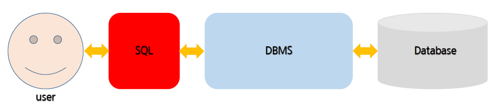

# RDBMS & SQL

## RDBMS

- 관계형 데이터베이스 시스템 (Oracle, MySQL, MsSQL, ...)

- 테이블 기반 DBMS
  - 데이터를 테이블 단위로 관리
    - 하나의 테이블은 여러개의 컬럼으로 구성
  - 중복 데이터를 최소화 시킴 - '정규화'
    - 같은 데이터가 여러 컬럼 또는 테이블에 존재하는 경우 데이터 수정 시 문제 발생 가능성 높아짐
  - 여러 테이블에 분산되어 있는 데이터 검색 시 테이블 간의 관계(`join`)를 이용하여 필요한 데이터를 검색


## SQL (Structured Query Language)



#### 정의

- Database에 있는 정보를 사용할 수 있도록 지원하는 언어
- 모든 DBMS에서 사용 가능
- 대소문자를 구별하지 않음 (단, 데이터의 대소문자는 구분)


#### 종류

- DML (Data Manipulation Language)
  - 테이블에 새로운 행을 입력, 기존의 행을 변경하고 제거
  - `INSERT`, `SELECT`, `UPDATE`, `DELETE`
- DDL (Data Definition Language)
  - 데이터 구조를 생성, 변경, 제거
  - `CREATE`, `ALTER`, `DROP`, `RENAME`
- DCL (Data Control Language)
  - 데이터 베이스와 구조에 대한 접근 권한을 제공하거나 제거 
  - `GRANT`, `REVOKE`
- 관리
  - `COMMIT`     : 실행한 Query를 최종적으로 적용
  - `ROLLBACK` : 실행한 Query를 마지막 `commit` 전으로 취소시켜 데이터를 복구


#### DDL

- 데이터베이스 생성

```mysql
# collation : 저장된 값들을 비교할 때 사용하는 규칙의 집합
# utf8mb4, utf8mb4_general_ci : 다국어 처리 + 이모지
create database <database name>
default character set <value> collate <value>;
```

- 데이터베이스 변경

```mysql
alter database <database name>
default character set <value> collate <value>;
```

- 데이터베이스 삭제

```mysql
drop database <database name>
```

- 데이터베이스 사용

```mysql
use <database name>
```


#### Data type

- 문자형 `CHAR`, `VARCHAR`, `TEXT`
- 숫자형 `INT`
- 날짜형 `DATETIME`, `TIMESTAMP`
- 이진 데이터 `BINARY`


#### 테이블 생성

```mysql
create table <table name> (
	<column name1> Type [optional attributes]
    <column name2> Type
    ...
    <column nameN> Type
);
```

- optional attributes
  - NOT NULL
  - UNIQUE
  - UNSIGNED
  - AUTO INCREMENT
  - PRIMARY KEY : 중복된 값을 허용하지 않은 컬럼. 주로 row를 구분하기 위해 사용
  - FOREIGN KEY : 특정 테이블의 Primary Key 컬럼에 저장되어 있는 값만 저장
  - DEFAULT
  - CHECK


#### DML

- INSERT

```mysql
INSERT INTO <table name> (col_val1, col_val2, ..., col_valN)
VALUES  (col_val1, col_val2, ..., col_valN),
		(col_val1, col_val2, ..., col_valN);
```

- UPDATE

```mysql
UPDATE <table name>
SET col_name1 = col_val1, [col_name2 = col_val2, ..., col_nameN = col_valN]
WHERE conditions;
```

- DELETE

```mys
DELETE from <table name>
WHERE conditions;
```

- SELECT

```mysql
# FROM -> SELECT
SELECT *
FROM employees;

# all은 생략 가능
SELECT all department_id
FROM employees;

# distinct는 select 바로 다음에 와야 함
SELECT distinct employee_id
FROM employees;

# columns
SELECT employee_id, first_name, salary
FROM employees;

# alias
# as는 생략 가능, 중간에 공백이 들어가면 ""로 묶어주기
SELECT employee_id as 사번, first_name 이름, salary "급여", salary * 12 "연 봉"
FROM employees;

# null 값은 처리가 필요
SELECT employee_id as 사번, first_name 이름, salary "급여", 
	   salary * 12 "연 봉", commission_pct, (salary + salary * commission_pct) * 12,
	   (salary + salary * IFNULL(commission_pct, 0)) * 12
FROM employees;

# case when then
# 데이터는 '', alias는 ""
SELECT employee_id, first_name, salary,
	   case when salary > 15000 then '고액연봉'
	   		when salary > 8000 then '평균연봉'
	   		else '저액연봉'
	   end "연봉등급"
FROM employees;

# AND, OR, NOT
# null이 있을 경우 주의하기 (true AND null = null), (false OR null = null)
SELECT employee_id, first_name, salary
FROM employees
WHERE department_id = 50
AND salary >= 7000;

SELECT employee_id, first_name, salary
FROM employees
WHERE NOT (department_id != 50
OR department_id != 60
OR department_id != 70);

SELECT employee_id, first_name, salary
FROM employees
WHERE NOT department_id in (50, 60, 70);

# IS NULL
SELECT employee_id, first_name, salary
FROM employees
WHERE department_id is null;

# LIKE - 이름에 'x'가 들어가는 사원
SELECT employee_id, first_name, salary
FROM employees
WHERE first_name LIKE '%x%';

# LIKE - 이름의 끝에서 세 번째 자리에 'x'가 들어가는 사원
SELECT employee_id, first_name, salary
FROM employees
WHERE first_name LIKE '%x__';

# ORDER BY (ASC : ascending(기본값), DESC : descending)
SELECT employee_id, first_name, salary
FROM employees
ORDER BY department_id, salary DESC;
```


#### 내장 함수

- 숫자 관련 함수

```mysql
# dual : dummy table
select abs(-5), abs(0), abs(+5)
from dual;

# ABS : 절대값
# CEILING : 올림
# FLOOR   : 내림
# ROUND   : 자릿수를 기준으로 반올림
# TRUNCATE: 자릿수를 기준으로 버림
# POW     : x의 y승
# GREATEST: 가장 큰 수
# LEAST   : 가장 작은 수
```

- 문자 관련 함수

```mysql
# ASCII
# CONCAT(문자열1, 문자열2, ...)
# INSERT(문자열, 시작위치, 길이, 새로운문자열)
# REPLACE(문자열, 기존문자열, 바뀔문자열)
# INSTR(문자열, 찾는 문자열)
# MID(문자열, 시작위치, 개수)
# SUBSTRING(문자열, 시작위치, 개수)
# LTRIM(문자열)
# RTRIM(문자열)
# TRIM(문자열)
# LCASE or LOWER
# UCASE or UPPER
# LEFT
# RIGHT
# REVERSE
```

- 날짜 관련 함수
```mysql
# NOW or SYSDATE or CURRENT_TIMESTAMP
# CURDATE or CURRENT_DATE
# CURTIME or CURRENT_TIME
# DATE_ADD(날짜, interval 기준 값)
# DATE_SUB(날짜, interval 기준 값)
# YEAR(날짜)
# MONTH(날짜)
# MONTHNAME(날짜)
# DAYNAME(날짜)
# DAYOFMONTH(날짜)
# DAYOFWEEK(날짜) : 일요일(1)부터 시작
# WEEKDAY(날짜)   : 월요일(0)부터 시작
# WEEK(날짜)
# FROM_DAYS(날수)
# TO_DAYS(날짜)
# DATE_FORMAT(날짜, '형식')
```
- 논리 관련 함수

```mysql
# IF(논리식, 값1, 값2)
# IFNULL(값1, 값2) : 값1이 NULL이면 값2로 대치, 아니면 값1 리턴
# NULLIF(값1, 값2) : 값1==값2이면 NULL, 아니면 값1 리턴
```

- 그룹 함수

```mysql
# COUNT
# SUM
# AVG
# MAX
# MIN
```


#### Transaction

> 데이터베이스의 상태를 변화시키는 일종의 작업 단위를 의미

- 트랜잭션 도구
  - START TRANSACTION
    - COMMIT, ROLLBACK이 나올 때까지 실행되는 모든 SQL
  - COMMIT
    - 모든 코드를 실행
  - ROLLBACK
    - START TRANSACTION 실행 전 상태로 되돌림
  - SAVEPOINT
    - 중간에 COMMIT 또는 ROLLBACK 할 포인트를 정할 수 있음


- 테이블 삭제
  - DROP TABLE
    - 테이블 자체를 지움
    - rollback 불가능
  - TRUNCATE
    - rollback 불가능
  - DELETE FROM
    - rollback 가능


##### GROUP BY 절

- SELECT 문에서 GROUP BY 절을 사용하여 쿼리된 테이블의 행을 그룹으로 묶는다
- 데이터베이스는 선택 목록의 집계 함수를 각 행 그룹에 적용하고 각 그룹에 대한 단일 결과 행을 반환한다

```mysql
select department_id, avg(salary)
from employees
group by department_id
having avg(salary) > 7000;
```


