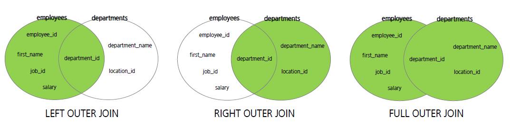

# Join & Subquery

## Join

#### 정의

- 둘 이상의 테이블에서 데이터가 필요한 경우 테이블 조인이 필요
- 일반적으로 조인 조건을 포함하는 WHERE 절을 작성해야 함
- 조인 조건은 일반적으로 각 테이블의 PK 및 FK로 구성


#### 종류

- INNER JOIN, OUTER JOIN (LEFT, RIGHT)

- NATURAL JOIN, CROSS JOIN (FULL JOIN, CARTESIAN JOIN)


#### 주의

- 어느 테이블을 먼저 읽을지 결정하는 것이 중요 (처리량, 작업량이 달라짐)

- INNER JOIN : 어느 테이블을 먼저 읽어도 결과가 달라지지 않음.  MySQL 옵티마이저가 순서를 조절
- OUTER JOIN : 반드시 OUTER가 되는 테이블을 먼저 읽어야 함 


#### INNER JOIN

- 가장 일반적인 JOIN의 종류이며 교집합이다.
- Equi-Join이라고도 하며, N개의 테이블 조인 시 N-1개 조인 조건이 필요함.

```mysql
SELECT alias1.COL1, alias1.COL2, ..., alias2.COLN
FROM table1 AS alias1 INNER JOIN table2 AS alias2  # alias는 사용하지 않아도 됨
ON alias1.column = alias2.column;				   # ON절에는 조인조건. USING도 사용가능
```


#### NATURAL JOIN

- 이름이 같은 column을 알아서 합쳐주는 JOIN
- 이름이 같은 column이 여러가지 일 경우 주의해서 사용해야 함

```mysql
SELECT COL1, COL2, ..., COLN
FROM table1 NATURAL JOIN table2;
```


#### OUTER JOIN



- LEFT, RIGHT, FULL로 구분됨
  - FULL은 mySQL에서 지원하지 않음. LEFT, RIGHT, UNION을 이용해 구현
- 한쪽에는 col 데이터가 존재하는데 다른 쪽에는 col 데이터가 없는 경우, 이 경우에 JOIN 조건에 걸리지 않아 데이터가 누락되는 경우가 있는데 이런 문제점을 해결하기 위해 사용

```mysql
SELECT COL1, COL2, ... COLN
FROM table1 LEFT OUTER JOIN table2
ON or USING;
```


#### SELF JOIN

- 같은 테이블끼리 JOIN. 자기 자신을 참조함

```mysql
SELECT alias1.COL1, alias1.COL2, ..., alias2.COLN
FROM table1 AS alias1 INNER JOIN table1 AS alias2  # alias는 사용하지 않아도 됨
ON alias1.column = alias2.column;
```


#### Non-Equi JOIN

- 조건이 동등하지 않은 JOIN


## SUBQUERY

#### 정의

- 다른 쿼리 내부에 포함되어 있는 SELECT문
- 서브 쿼리를 포함하는 쿼리를 외부 쿼리(outer query) 또는 메인 쿼리라고 부르며, 서브쿼리는 내부 쿼리(inner query)라고도 부른다.


#### 종류

- 중첩 서브 쿼리(Nested Subquery) 
  - WHERE 문제 작성하는 서브 쿼리
  - 단일 행, 다중 행, 다중 컬럼
- 인라인 뷰(Inline View)
  - FROM 문에 작성하는 서브 쿼리
- 스칼라 서브 쿼리(Scalar Subquery)
  - SELECT 문에 작성하는 서브 쿼리


#### 주의 사항

- 비교 연산자의 오른쪽에 기술해야 하고 반드시 괄호로 감싸져 있어야 한다.
- 단일 행(`<`, `>`, `=`) 또는 다중 행(`in`, `any`, `all`) 비교 연산자와 함께 사용된다.
- `SELECT`, `FROM`, `WHERE`, `HAVING`, `ORDER BY`, `VALUES`, `SET` 에 사용 가능


#### Nested Subquery

- 단일 행 - 서브쿼리의 결과가 단일 행을 리턴

```mysql
select department_id, department_name
from departments
where location_id = (
                    select location_id
                    from locations
                    where binary upper(city) = upper('seattle')
                    );
```

- 다중 행 - 서브쿼리의 결과가 다중 행을 리턴: `IN`, `ANY`, `ALL`

```mysql
select employee_id, first_name, salary, department_id
from employees
where salary > any (
					select salary
					from employees
					where department_id = 30
					);
# 상호연관 서브 쿼리(ex. min(salary)를 이용)는 매 번 서브 쿼리의 결과를 반환해 메인 쿼리의 값과
# 비교하기 때문에 any()를 사용하는 것보다 성능이 저하된다.
```

- 다중 컬럼 - 서브 쿼리의 결과가 다중 열을 리턴

```mysql
select employee_id, first_name
from employees
where (salary, department_id) in (
								select salary, department_id
								from employees
								where commission_pct is not null and manager_id = 148
								);
```


#### Inline View

- FROM 절에 사용되는 서브 쿼리
- 서브 쿼리가 FROM 절에 사용되면 View 처럼 결과가 동적으로 생성된 테이블로 사용 가능

```mysql
select e.employee_id, e.first_name, e.salary, e.department_id
from (
		select distinct department_id
		from employees
		where salary < (select avg(salary) from employees)
	) a join employees e
on e.department_id = a.department_id;
```

- limit 활용 (MySQL) 

```mysql
select employee_id, first_name, salary
from employees
order by salary desc limit 10, 5;
# 한 페이지에 몇 개의 항목을 출력하는 경우 TopN 질의보다는 MySQL의 limit을 활용하면 더 간편함
```


#### Scalar Subquery

- SELECT 절에 있는 서브 쿼리
- 한 개의 행만 반환

```mysql
select e.employee_id, e.first_name, job_id,
		(select department_name from departments d where e.department_id = d.department_id) department_name
from employee e
where job_id = 'IT_PROG';
# 상호 연관 서브 쿼리 - 속도가 느림
```


#### CREATE, INSERT, UPDATE, DELETE

- CREATE : SELECT로 불러온 정보로 새로운 테이블을 만들 수 있음

```mysql
create table emp50
select * from employees
where department_id = 50;
```

- INSERT : SELECT로 불러온 정보를 다른 테이블에 삽입

```mysql
insert into emp_blank (manager_id, location_id)
select manager_id, location_id from employees
where department_id = 80;
```

- UPDATE 

```mysql
update emp50
set sal = sal + 500
where sal < (select avg(salary) from employees);
```

- DELETE

```mysql
delete from emp50
where sal < (select avg(salary) from employees);
```

