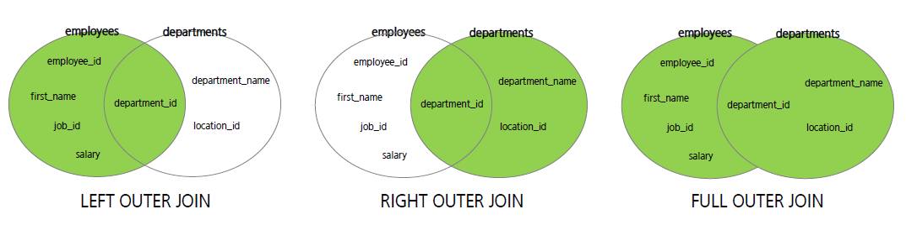

# Join & Subquery

## Join

#### 정의

- 둘 이상의 테이블에서 데이터가 필요한 경우 테이블 조인이 필요
- 일반적으로 조인 조건을 포함하는 WHERE 절을 작성해야 함
- 조인 조건은 일반적으로 각 테이블의 PK 및 FK로 구성


#### 종류

- INNER JOIN, OUTER JOIN (LEFT, RIGHT)

- NATURAL JOIN, CROSS JOIN (FULL JOIN, CARTESIAN JOIN)


#### 주의

- 어느 테이블을 먼저 읽을지 결정하는 것이 중요 (처리량, 작업량이 달라짐)

- INNER JOIN : 어느 테이블을 먼저 읽어도 결과가 달라지지 않음.  MySQL 옵티마이저가 순서를 조절
- OUTER JOIN : 반드시 OUTER가 되는 테이블을 먼저 읽어야 함 


#### INNER JOIN

- 가장 일반적인 JOIN의 종류이며 교집합이다.
- Equi-Join이라고도 하며, N개의 테이블 조인 시 N-1개 조인 조건이 필요함.

```mysql
SELECT alias1.COL1, alias1.COL2, ..., alias2.COLN
FROM table1 AS alias1 INNER JOIN table2 AS alias2  # alias는 사용하지 않아도 됨
ON alias1.column = alias2.column;				   # ON절에는 조인조건. USING도 사용가능
```


#### NATURAL JOIN

- 이름이 같은 column을 알아서 합쳐주는 JOIN
- 이름이 같은 column이 여러가지 일 경우 주의해서 사용해야 함

```mysql
SELECT COL1, COL2, ..., COLN
FROM table1 NATURAL JOIN table2;
```


#### OUTER JOIN



- LEFT, RIGHT, FULL로 구분됨
  - FULL은 mySQL에서 지원하지 않음. LEFT, RIGHT, UNION을 이용해 구현
- 한쪽에는 col 데이터가 존재하는데 다른 쪽에는 col 데이터가 없는 경우, 이 경우에 JOIN 조건에 걸리지 않아 데이터가 누락되는 경우가 있는데 이런 문제점을 해결하기 위해 사용

```mysql
SELECT COL1, COL2, ... COLN
FROM table1 LEFT OUTER JOIN table2
ON or USING;
```


#### SELF JOIN

- 같은 테이블끼리 JOIN. 자기 자신을 참조함

```mysql
SELECT alias1.COL1, alias1.COL2, ..., alias2.COLN
FROM table1 AS alias1 INNER JOIN table1 AS alias2  # alias는 사용하지 않아도 됨
ON alias1.column = alias2.column;
```


#### Non-Equi JOIN

- 조건이 동등하지 않은 JOIN


