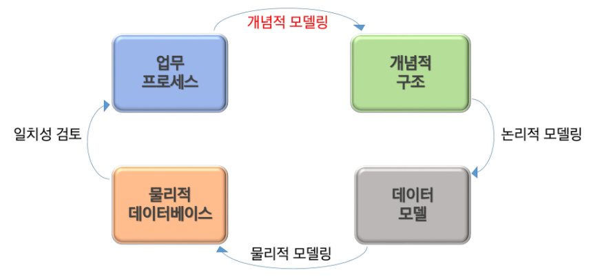

# Database Modeling

- 정보화 시스템을 구축하기 위해 어떤 데이터가 존재하는지 또는 업무에 필요한 정보는 무엇인지 분석하는 방법.
- 관계형 데이터베이스는 '표'의 개념을 사용해서 데이터를 구성하는 방법을 사용

#### 개념적 데이터베이스 모델링

> 업무 분석 단계에서 얻어진 내용을 토대로 **개체(Entity)**를 추출하고, Entity 내에 **속성(Attribute)**을 구성하며, Entity간의 관계를 정의해서 **ER-Diagram**을 정의하는 단계

- 개체 (Entity)
  - 사용자와 관계가 있는 주요 객체로, 업무 수행을 위해 데이터로 관리 되어져야 하는 사람, 사물, 장소, 사건 등을 말함
  - 개체를 찾는 법
    - 영속적으로 존재하는 것
    - 새로 식별이 가능한 데이터 요소를 가짐
    - 개체는 반드시 속성을 가져야 함
    - 명사적 표현

- 속성 (Attribute)
  - 저장할 필요가 있는 실체에 관한 정보
  - 개체의 성질, 분류, 수량, 상태, 특성 등을 나타내는 세부 사항
  - 개체에 포함되는 속성은 10개 내외로 하는 것이 바람직함
  - 최종 DB 모델링 단계를 통해 테이블의 컬럼으로 활용
  - 속성의 유형
    - 기초 속성 : 원래 갖고 있는 속성으로 현업에서 기본적으로 사용되는 속성
    - 추출 속성 : 기초 속성으로부터 계산(가공)에 의해 얻어질 수 있는 속성
    - 설계 속성 : 실제로 존재하지 않으나 시스템의 효율성을 도모하기 위해 임의로 부여하는 속성
- 식별자
  - 한 개체 내에서 인스턴스를 유일하게 구분할 수 있는 단일 속성 또는 속성 그룹.

#### 논리적 데이터베이스 모델링

> ER-Diagram을 Mapping rule을 적용해 관계형 데이터베이스 이론에 입각한 스키마를 설계하는 단계와 필요하다면 이를 이용해 정규화하는 단계로 구성

- 정규화
  - Attribute

