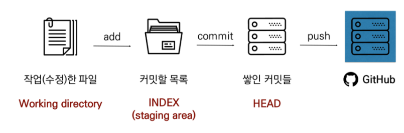

# command

> git 기본 명령어 정리




> 로컬(Local)에 있는 파일들을 add, commit, push를 통해 원격 저장소(remote)에 업로드한다.


### 생성

##### init

- 현재 폴더를 git으로 관리하겠다!
- 현재 폴더에 `.git` 폴더를 생성
- 최초 한번만 실행하는 명령어
- 프로젝트 단위에서 실행

```bash
$ git init
```


##### config

```bash
$ git config --global user.email <email>
$ git config --global user.name <username>
```


### 확인

##### status

- 현재 git이 관리하고 있는 파일들의 상태를 보여주는 명령어

```bash 
$ git status
```


##### log

- 커밋의 히스토리를 보여주는 명령어

```bash
$ git log
```


### 관리 (로컬)

##### add

- working directory에서 staging area에 파일을 업로드하는 명령어
  - `.` : 현재 폴더, 하위 폴더, 하위 파일 모두 

```bash
$ git add <filename>
# $ git add .
```


##### restore

- stage 되어있는 파일들을 빼는 명령어

```bash
$ git restore --staged <file>
```


##### commit

- staging area에 올라온 파일들을 하나의 커밋으로 만들어 주는(스냅샷 찍는) 명령어

```bash
$ git commit -m "commit message"
```


### 관리 (원격)

##### remote add

- 원격 저장소 주소를 로컬에 저장하는 명령어
  - nickname에는 일반적으로 `origin`

```bash
$ git remote add <nickname> <url>
```


##### push

- 원격 저장소로 로컬의 커밋 기록을 업로드하는 명령어

```bash
$ git push <nickname> <branch name>
```


##### clone

```bash
$ git clone <repository link>
```


#####  pull

```bash
$ git pull origin master
```


