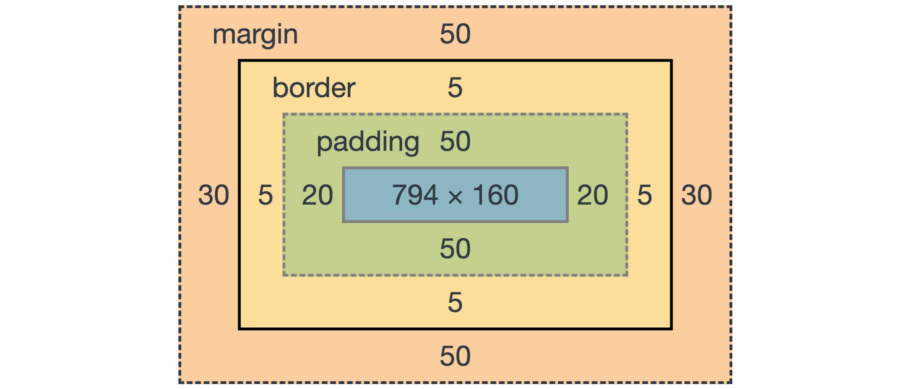

# CSS basics

> Cascading Style Sheets
>
> 사용자에게 문서(html)를 표시하는 방법을 지정하는 언어


## 기본

#### CSS

- CSS 구문은 선택지와 함께 열림
- 선택자를 통해 스타일을 지정할 html 요소를 선택
- 중괄호 안에서는 속성과 값, 하나의 쌍으로 이루어진 선언을 진행
- 각 쌍은 선택한 요소의 속성, 속성에 부여할 값을 의미
  - 속성(property) : 어떤 스타일 기능을 변경할지 결정
  - 값(Value) : 어떻게 스타일 기능을 변경할지 결정


#### 정의 방법

1. 인라인(inline)
2. 내부 참조(embedding) - `<style>`
3. 외부 참조(link file) - 분리된 CSS 파일


#### 주석

- `<!--annotation-->`


## 단위

#### 크기

- px (픽셀)
  - 모니터 해상도의 한 화소인 '픽셀'을 기준
  - 픽셀의 크기는 변하지 않기 때문에 고정적인 단위
- %
  - 백분율 단위
  - 가변적인 레이아웃에서 자주 사용
- em
  - (바로 위, 부모 요소에 대한) 상속의 영향을 받음
  - 배수 단위, 요소에 지정된 사이즈에 상대적인 사이즈를 가짐

- rem 
  - (바로 위, 부모 요소에 대한) 상속의 영향을 받지 않음
  - 최상위 요소(html)의 사이즈를 기준으로 배수 단위를 가짐 (root는 html을 가리킴)
  - html의 기본 픽셀은 16px
- viewport
  - 웹 페이지를 방문한 유저에게 바로 보이게 되는 웹 컨텐츠 영역
  - 주로 스마트폰이나 테블릿 디바이스의 화면을 일컫는 용어로 사용됨
  - 글자 그대로 디바이스의 viewport를 기준으로 상대적인 사이즈가 결정됨
  - vm, vh, vmin, vmax


#### 색상

1. 색상 키워드
   - 대소문자를 구분하지 않음
   - red, blue, black과 같은 특정 색을 직접 글자로 나타냄
2. RGB 색상
   - 16진수 표기법 혹은 함수형 표기법을 사용해서 특정 색을 표현하는 방식
3. HSL 색상
   - 색상, 채도, 명도를 통해 특정 색을 표현하는 방식

```html
p { color: black; }
p { color: #000; }
p { color: #000000; }
p { color: rgb(0, 0, 0); }
p { color: hsl(120, 100%, 0); }

/* *a는 alpha(투명도)가 추가된것 */
p { color: rgba(0, 0, 0, 0.5); }
p { color: hsla(120, 100%, 0.5); }
```


## 선택자, 결합자

> html 문서에서 특정한 요소를 선택하여 스타일링 하기 위해 사용되는 선택자와 결합자

#### 선택자 (selector)

- id 선택자는 문서 내 유일한 항목에 적용
- 클래스 선택자는 문서 내 여러 항목들에 적용

```html
<style>
  /* 전체 선택자 */
  * {
    color: red;
  }

  /* 요소 선택자 */
  h2,
  h3 {
    color: orange;
  }
</style>
```

```html
<style>
  /* 클래스 선택자 */
  .green {
    color: green;
  }

  /* id 선택자 */
  #purple {
    color: purple;
  }

  /* 자식 결합자 */
  .box > p {
    font-size: 30px;
  }

  /* 자손 결합자 */
  .box p {
    color: blue;
  }
</style>
```


#### 결합자 (combinators)

##### 자손 결합자

- selectorA 하위 모든 selectorB 요소

##### 자식 결합자

- selectorA 바로 아래의 selectorB 요소

##### 일반 형제 결합자

- selectorA의 형제 요소 중 뒤에 위치하는 selectorB 요소를 모두 선택

##### 인접 형제 결합자

- selectorA의 형제 요소 중 바로 뒤에 위치하는 selectorB 요소를 선택


```html
<!--자손 결합자--> A B { }
<!--자식 결합자--> A > B { }
<!--일반 형제 결합자--> A ~ B { }
<!--인접 형제 결합자--> A + B { }
```


#### CSS 적용 우선순위 (cascading order)

1. 중요도 (Importance)
   - !important
2. 우선 순위 (Specificity)
   - 인라인 > id 선택자 > **class 선택자**, 속성 선택자, pseudo-class > 요소 선택자 pseudo-element
3. 소스 순서
   - 나중에 선언된 것을 우선으로 


#### CSS 상속

- 속성 중에는 상속이 되는 것과 되지 않는 것들이 있다.
- 상속 되는 것 예시
  - Text 관련 요소(font, color, text-align), opacity, visibility 등
- 상속 되지 않는 것 예시
  - Box model 관련 요소(width, height, margin, padding, border, box-sizing, display)
  - position 관련 요소(position top/right/bottom/left, z-index) 등


```
:nth-child() : 모든 자식 중 n번째를 찾아서 지정 타입과 매치할 경우 스타일을 적용
:nth-of-type() : 지정 타입의 n번째를 찾아서 스타일을 적용
```


## Box-model

> 모든 html 요소는 box 형태로 되어있으며, 하나의 box는 네 부분으로 이루어짐

#### box model 구성



- margin : 테두리 바깥의 외부 여백. 배경색을 지정할 수 없다.
- border : 테두리 영역
- padding : 테두리 안쪽의 내부 여백. 요소에 적용된 배경색, 이미지는 padding까지 적용
- content : 글이나 이미지 등 요소의 실제 내용
- margin과 padding은 border의 바깥쪽과 안쪽이라는 점에서 차이를 느낄 수 있음


##### margin

```css
.margin {
  margin-top: 10px;
  margin-right: 20px;
  margin-bottom: 30px;
  margin-left: 40px;
}

<!--shorthand로 표현 가능-->
<!--상하좌우-->
.margin-1 {
    margin: 10px;
}
<!--상하,좌우-->
.margin-2 {
    margin: 10px 20px;
}
<!--상,하,좌우-->
.margin-3 {
    margin: 10px 20px 30px;
}
<!--상,하,좌,우-->
.margin-4 {
    margin: 10px 20px 30px 40px;
}
```

##### padding

```css
.margin-padding {
  margin: 10px;
  padding: 30px; 
}
```

##### border

```css
.border {
  border-width: 2px;
  border-style: dashed;
  border-color: black;
}

<!--shorhand로 표현 가능-->
.border {
    border: 2px dashed black;
}
```


#### box-sizing

- 기본적으로 모든 요소의 box-sizing은 content-box
  - Padding을 제외한 순수 contents 영역만을  box로 지정
- 다만, 우리가 일반적으로 영역을 볼 때는 border 까지의 너비를 100px 보는 것을 원함
  - box-sizing을 border-box로 지정

```css
.box-sizing {
    box-sizing: border-box;
}
```


#### 마진 상쇄

- 두 개의 블럭이 상하로 위치했을때, 각각의 margin 값 중 큰 마진값으로 결합되는 현상
- 좌우로는 마진상쇄가 이뤄지지 않음


## Display

> html 요소들을 시각적으로 어떻게 보여줄지 결정하는 속성
>
> 모든 요소는 네모이고, 어떻게 보여지는지(display)에 따라 문서의 배치가 달라질 수 있다

#### display: block

- 줄바꿈이 일어나는 요소
- 화면 크기 전체의 가로 폭(100%)을 차지한다.
- 블록 레벨 요소 안에 인라인 레벨 요소가 들어갈 수 있음
- 블록 레벨 요소 :  div / ul, ol, li / p / hr / form 등


#### display: inline

- 줄 바꿈이 일어나지 않는 행의 일부 요소
- content 너비만큼 가로 폭을 차지한다.
- width, height, margin-top, margin-botton을 지정할 수 없다.
- 상하 여백은 line-height로 지정한다.
- 인라인 레벨 요소 : span / a / img / input, label / b, em, i , strong 등


#### display: inline-block

- block과 inline 레벨 요소의 특징을 모두 갖는다.
- inline 처럼 한 줄에 표시 가능하며,
- block처럼 width, height, margin 속성을 모두 지정할 수 있다.


#### display: none

- 해당 요소를 화면에 표시하지 않는다. (공간조차 사라진다.)
- 이와 비슷한 `visibility: hidden`은 해당 요소가 공간은 차지하나 화면에 표시만 하지 않는다.


## Position

> 문서 상에서 요소를 배치하는 방법을 지정

#### static

- 모든 태그의 기본 값(기준 위치)
- 일반적인 요소의 배치 순서에 따름 (좌측 상단)
- 부모 요소 내에서 배치될 때는 부모 요소의 위치를 기준으로 배치 됨


#### relative

- 상대 위치
- 자기 자신의 static 위치를 기준으로 이동
- 레이아웃에서 요소가 차지하는 공간은 static 일 때와 같음


#### absolute

- 절대 위치
- 요소를 일반적인 문서 흐름에서 제거 후 레이아웃 공간을 차지하지 않음
- static이 아닌 가장 가까이 있는 부모/조상 요소를 기준으로 이동 (없는 경우 body에 붙는 형태)
- 부모/조상 요소를 먼저 만들고 사용해야 함


#### fixed

- 고정 위치
- 요소를 일반적인 문서 흐름에서 제거 후 레이아웃에 공간을 차지하지 않음
- 부모 요소와 관계없이 viewport를 기준으로 이동
- 스크롤 시에도 항상 같은 곳에 위치함


#### absolute의 특징

- 원래 위치해 있었던 과거 위치에 있던 공간은 더 이상 존재하지 않음
- 즉, 다른 모든 것과 별개로 독자적인 곳에 놓임
- 페이지의 다른 요소의 위치와 간섭하지 않는 격리된 사용자 인터페이스 기능을 만드는데 활용
  - 팝업 정보상자, 제어 메뉴, 롤오버 패널, 페이지 어느 곳에서나 끌어서 놓기 할 수 있는 유저 인터페이스 페이지 등 

